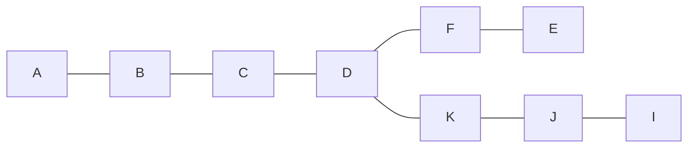

(Links:: [[Computer Networks]])
# 5.6`fas:CheckCircle`
Sketch a network topology different from the one in Fig. 5-10 for which including the next hop does not solve the count-to-infinity problem if node A fails.
# 5.12 `fas:CheckCircle`
In Fig. 5-13, the Boolean OR of the two sets of ACF bits are 111 in every row. Is this just an accident here, or does it hold for all networks under all circumstances?

Yes it does, since if the packet buffer wasn't sent over one of the neighbouring routers, then they haven't received the distance information. This means the router itself that receives this packet buffer must send it onwards to those that don't have this information, everyone but those who sent the information (ACK flags)
# 5.18 `fas:CheckCircle`
Compute a multicast spanning tree for router C in the following network for a group with members at routers A, B, C, D, E, F, I, and K.

# 5.24 `fas:CheckCircle`
A possible solution to the problem above involves shaping the file transfer traffic so that it never exceeds a certain rate. You decide to shape the traffic so that the sending rate never exceeds 20 Mbps. Should you use a token bucket or a leaky bucket to implement this shaping, or will neither work? What should the drain rate of the bucket be?

Neither would work, since they only limit the long-term rate of a flow but short-term bursts will still work. This means we cannot regulate the maximum sending rate, but only the amount of time that a device is able to send at the maximum sending rate.
# 5.30 `fas:CheckCircle`
A router can process 2 million packets/sec. The load offered to it is 1.5 million packets/sec on average. If a route from source to destination contains 10 routers, how much time is spent being queued and serviced by the router?

$T=\frac{1}{\mu}\times\frac{1}{1-\lambda\mu}=\frac{1}{2000000}\times \frac{1}{0,25}=2\mu sec$
$10\times T=20\mu sec$
# 5.36 `fas:CheckCircle`
Two IPv6-enabled devices wish to communicate across the Internet. Unfortunately, the path between these two devices includes a network that has not yet deployed IPv6. Design a way for the two devices to communicate.

A common way to solve this problem is to wrap (or encapsulate) the entire packet (including the IPv6 header) inside an IPv4 header and send this packet over an IPv4 network. This is also called tunneling.
# 5.42 `fas:CheckCircle`
Many companies have a policy of having two (or more) routers connecting the company to the Internet to provide some redundancy in case one of them goes down. Is this policy still possible with NAT? Explain your answer.

Yes this is still possible. The company will have two (or more) registered IP addresses for of the NAT's. The only important thing is that packages going out of one NAT should not go into another, since they don't have access to the same address table.
# 5.48 `fas:CheckCircle`
A person who lives in Boston travels to Minneapolis, taking her portable computer with her. To her surprise, the LAN at her destination in Minneapolis is a wireless IP LAN, so she does not have to plug in. Is it still necessary to go through the entire business with home agents and foreign agents to make email and other traffic arrive correctly?

No.
DHCP servers dynamically distribute new IP addresses to newly connected devices, and the NAT box at the place where the person is will add their IP address and port to the address table when connecting to a service on the internet. They usually also give the address of root name servers required when using SMTP or HTTP.

---
References: