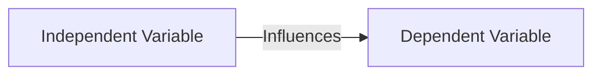

(Links:: [[Human Computer Interaction]])
# Why we conduct experiments
- Scientists want to understand *cause* and *effect*
	- When *metal* is heated it *expands*
- To make *predictions*
	- The metal in this bridge *needs space to expand* in hot weather
- To test *hypothesis*
	- My keyboard allows faster input than yours
	- Users make less errors using my keyboard, then yours
- Observe users using the user interface and collecting data will **not** be sufficient
## Causation versus Correlation
- Participants rated the system easy to use, because
	- they actually find the system easy to use?
	- they want to support you in your research?
	- they were overwhelmed by the system's novelty?
	- the Dutch football team won the world cup yesterday?
	- -> Mere observation will **not** help to find the answer
- Experiments are (probably the only reliable) means to find the answer
	- They can isolate cause and effect!
	- Knowing cause and effect allows informed design
# What a hypothesis is
- Describes the assumed relation between at least two variables
	- Keyboard A allows users to perform input faster
- Variables can be any attribute or property of humans, objects or systems
- Hypothesis:
	- "If X, then Y"

- Hypothesis have to be measurable

> [!examples] Hypothesises
> 1. Good Driver: Years driving without an accident
> 2. xy improves the usability of the interface: High ratings on the usability questionnaire
> 3. xy increases the awareness of the driver for the current driving situation: Faster response to events in the driving simulator (e.g. braking car / pedestrian crosses road)

- Validity: are the correct measurements used?
# How to operationalise a hypothesis
- **Literature review**
	- Consensus in a scientific community
		- **Efficiency**: Task completion time
		- **Accuracy**: Error rate
	- Results are comparable
	- Might not exist for new concepts
	- Standardized questionnaires
		- Nasa-TLX (task load)
		- AttrakDiff (UX interactive UIs)
		- SUS (Usability)
- **Define it for your experiment**
	- "For this experiment, we define driving experience as years of driving a car."
	- Harder to compare to other results
	- Unambiguous
# Independent and dependent variables
**Dependent Variables**
- Efficiency - Task completion time
- Accuracy - error rate
- Learnability
- Workload

**Independent Variables**
- Technology 
	- Various Interaction devices
	- Various Interfaces
- User Characteristics
	- Age
	- Experience
- Context of use
	- Physical environment
	- Social environment

> [!question] How to manipulate a single aspect only?
> In theory: by keeping all other factors stable
> - Environment, weather, intelligence, mood, ...
> - BUT, people, situations, ... are never identical!

**Uncontrolled variables** (confound variables): change the independent, and dependent variables

# Confound variables
> [!question] How to identify confound variables
> - Think about possibilities
> 	- What else could influence the results
> - Review the literature
> 	- What is already known?
> - Experience
> 	- Talk to colleagues and supervisors

> [!question] How to control confound variables
> - Randomize
> - Record
> 	- Analyze it later as co-variable
> **If confound variables are not controlled, the recorded data can be unusable**

> [!question] How to manipulate a single aspect only?
> - randomization: spread participants randomly into groups
> - Run conditions and tasks in random order
> 
> |      | Mouse            | Trackpad         | Touchpad         |
> | ---- | ---------------- | ---------------- | ---------------- |
> | GUI1 | Condition$_{11}$ | Condition$_{12}$ | Condition$_{13}$ |
> | GUI2 | Condition$_{21}$ | Condition$_{22}$ | Condition$_{23}$ |
> - Conditions
> 	- Combination of independent variables
> 	- Trials: Each participant performs multiple times tasks in one condition

# Between-group design vs. within-group design
## Between-group design
- Also called independent-measures design
- Participants are assigned to one condition only

| Advantages                                                                      | Disadvantages                                      |
| ------------------------------------------------------------------------------- | -------------------------------------------------- |
| Simplicity                                                                      | Expense (time, effort, and number of participants) |
| Less chance of practice or fatigue effects                                      | Insensitiveness to experimental manipulations      |
| Useful when it is impossible for an individual to participate in all conditions |                                                    |
## Within-group design
- Also called repeated-measures design
- Participants are assigned to all conditions
- Order must be counter-balanced or randomized

| Advantages                            | Disadvantages                               |
| ------------------------------------- | ------------------------------------------- |
| Economy                               | Carry-over effects from previous conditions |
| Sensitiveness                         | Conditions need to be reversible            |
| Cancelling out individual differences |                                             |

---
References: