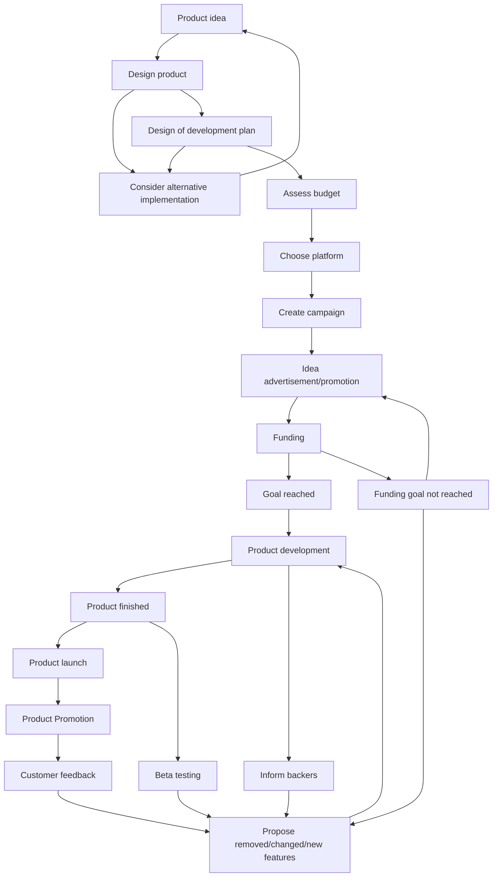
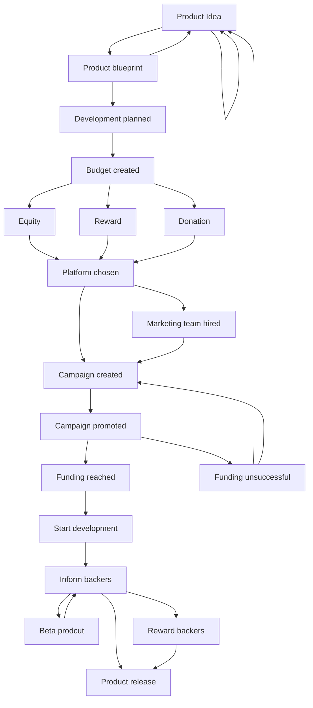

(Links:: [[Computer Organization]])
# State Diagram

- Introduction
	- detailed description of the process
	- specify the main character
- Transition State Diagram
	- Diagram 
	- What is you model M?
	- what is your set of finite state S?
	- what is your initial state So.
	- What is your set of transitions TR?
	- Explanation.
- Petri Net
	- Petri net diagram
	- Formal Description
	- Explanantion
- Reachability Graph
	- graph
	- initial state
	- terminal state
	- existence of any circular loop
	- problems
- Analysis
	- describe all the properties (terminating, boundedness, safety, deadlock freedom, dead transition, liveliness, home marking and reversibility.)
- Reflection
	- Why is the model useful?
	- Disadvantage (limitation)
	- Group Contribution.
# Petri Net
Here are some additional steps that could be part of the process for developing a new product:

1. Conducting market research: Before creating an initial idea, the team could conduct market research to identify gaps in the market or areas where there is high demand for certain types of products. This can help inform the development of a product that is more likely to be successful.
2. Creating a prototype: After the design team has developed a proposed design, they could create a prototype of the product to test its functionality and usability. This could involve creating a physical model or a digital prototype, depending on the nature of the product.
3. Testing and quality assurance: Once the development team begins developing the product, they should conduct thorough testing and quality assurance to ensure that the product is functioning properly and meets the desired specifications. This could involve testing the product under various conditions, such as different environments or user scenarios.
4. Manufacturing and distribution: Once the final product has been completed, it needs to be manufactured and distributed to retailers or directly to customers. This could involve coordinating with manufacturers and logistics companies to ensure that the product is produced and delivered efficiently and cost-effectively.
5. Post-launch monitoring and support: After the product has been launched, the team should monitor its performance and gather feedback from customers to identify any issues or areas for improvement. They should also provide ongoing support to customers, such as technical assistance or troubleshooting, to ensure that they are satisfied with the product.
# Transition state diagram 2

---
References: