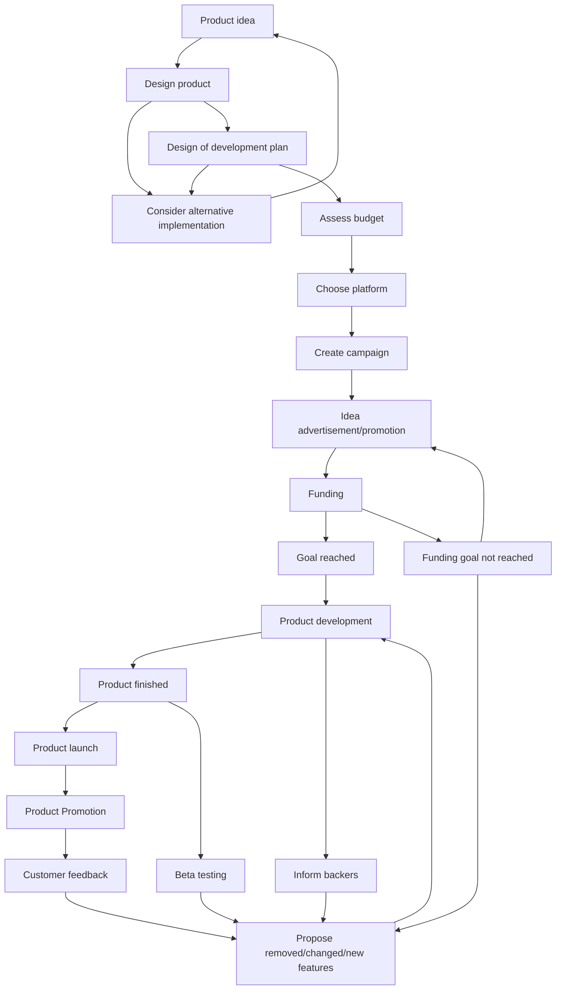

(Links:: [[Computer Organization]])
# State Diagram

- Introduction
	- detailed description of the process
	- specify the main character
- Transition State Diagram
	- Diagram 
	- What is you model M?
	- what is your set of finite state S?
	- what is your initial state So.
	- What is your set of transitions TR?
	- Explanation.
- Petri Net
	- Petri net diagram
	- Formal Description
	- Explanantion
- Reachability Graph
	- graph
	- initial state
	- terminal state
	- existence of any circular loop
	- problems
- Analysis
	- describe all the properties (terminating, boundedness, safety, deadlock freedom, dead transition, liveliness, home marking and reversibility.)
- Reflection
	- Why is the model useful?
	- Disadvantage (limitation)
	- Group Contribution.
# Petri Net
Here are some additional steps that could be part of the process for developing a new product:

1. Conducting market research: Before creating an initial idea, the team could conduct market research to identify gaps in the market or areas where there is high demand for certain types of products. This can help inform the development of a product that is more likely to be successful.
2. Creating a prototype: After the design team has developed a proposed design, they could create a prototype of the product to test its functionality and usability. This could involve creating a physical model or a digital prototype, depending on the nature of the product.
3. Testing and quality assurance: Once the development team begins developing the product, they should conduct thorough testing and quality assurance to ensure that the product is functioning properly and meets the desired specifications. This could involve testing the product under various conditions, such as different environments or user scenarios.
4. Manufacturing and distribution: Once the final product has been completed, it needs to be manufactured and distributed to retailers or directly to customers. This could involve coordinating with manufacturers and logistics companies to ensure that the product is produced and delivered efficiently and cost-effectively.
5. Post-launch monitoring and support: After the product has been launched, the team should monitor its performance and gather feedback from customers to identify any issues or areas for improvement. They should also provide ongoing support to customers, such as technical assistance or troubleshooting, to ensure that they are satisfied with the product.
## Meaning of tokens, transitions and places
In the given process of developing a new product, a Petri net system can be used to model the workflow. In this system, places, transitions, and tokens can have specific meanings:

1. Places: Places represent states or locations in the process where something happens or is stored. In the product development process, some examples of places could include:
	- Initial Idea: The place where the initial idea for the product is generated.
	- Design Proposal: The place where the proposed design is created by the design team.
	- Platform Selection: The place where the marketing team selects the crowdfunding platform.
	- Campaign Creation: The place where the marketing team creates the crowdfunding campaign.
	- Development: The place where the development team creates the final product.
2. Transitions: Transitions represent actions or events that occur in the process. In the product development process, some examples of transitions could include:
	- Design Approval: The transition that occurs when the product team approves the proposed design.
	- Funding Goal: The transition that occurs when the funding goal is set for the crowdfunding campaign.
	- Campaign Launch: The transition that occurs when the crowdfunding campaign is launched.
	- Product Release: The transition that occurs when the final product is released to the public.
3. Tokens: Tokens represent the flow of resources or information between places and transitions. In the product development process, some examples of tokens could include:
	- Idea Token: The token that flows from the Initial Idea place to the Design Proposal place.
	- Design Token: The token that flows from the Design Proposal place to the Design Approval transition.
	- Funding Token: The token that flows from the Platform Selection place to the Funding Goal transition.
	- Development Token: The token that flows from the Funding Goal transition to the Development place.
By using a Petri net system to model the product development process, the team can better understand the flow of resources and information and identify potential bottlenecks or areas for improvement.

---
References: