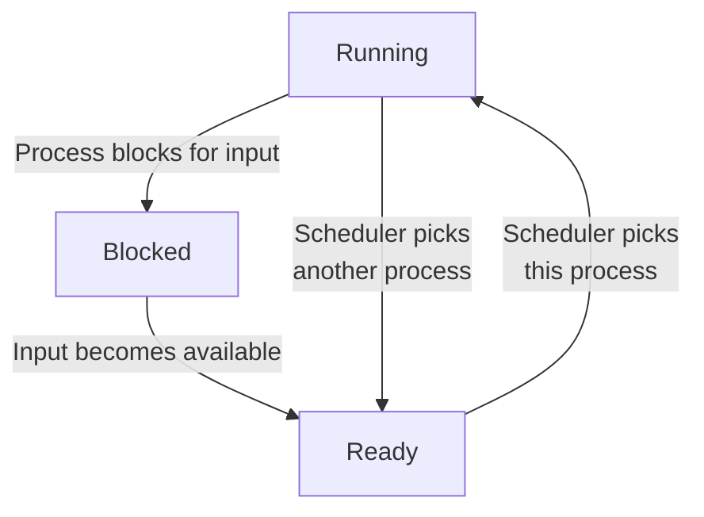

(Links:: [[Operating Systems]])
# Introduction to Processes
## The Process Model
How many processes do programs have? A fundamental part of operating systems is abstracting pieces of software, so that programs can be easier written. This allows the OS to simplify:
- Resource allocation
- Resource accounting
- Resource limiting

The operating system maintains information on the resources and the internal state of every single process in the system.
One process only ever has a single logical program counter. Each process has a unique location, and the program counter has to switch between these processes. Each time we switch processes, we save the program counter of the first process and restore the program counter of the second. All processes make progress, but only one at a time. For this, the CPU can be allocated in turns to different processes.
![[Only one program is active at once.png|500]]
In principle, multiple processes are mutually independent, but they need explicit means to interact with each other. The operating system normally offers **no timing or ordering guarantees**.

The OS typically creates only 1 `init` process, all subprocesses are created independently: 
- A **parent** process can create a **child** process
- This results in a tree-like structure and **process groups** (for example when using pipes in the shell)

There are four events that cause a process to be created:
1. System initialization
2. Execution of a process creation system call by a running process. 
3. A user request to create a new process.
4. Initiation of a batch job.

Sooner or later the process will terminate, usually due to one of the following conditions:
1. Normal exit (voluntary)
2. Error exit (voluntary)
3. Fatal error (involuntary)
4. Killed by another process (involuntary)

## Process Management
There are a few popular was of managing processes:
- `fork`: Creates a new process
	- Child is a "private" *clone* of the parent
	- Shares *some* resources with the parent
- `exec`: Execute a new process image
	- Used in combination with `fork`
- `exit`: Cause voluntary process termination
	- Exit status returned to the parent
	- Involuntary process termination?
- `kill`: Send a signal to a process (or group)
	- Can cause involuntary process termination
## Process States
A process can be in either of 3 states, as shown in the state diagram below: 
1. Running (actually using the CPU at that instant)
2. Ready (runnable; temporariyl sopped to let another process run)
3. Blocked (unable to run until some external event happens)

The lowest level of the operating system is the scheduler, it periodically **switches** processes. All interrupt handling and starting/stopping processes is hidden here. **Sequential processes** lay on the layer above, this leads to a simple process organization.
When we stop a process, all sorts of information is stored in the operating system's **process table**:
- ID (PID), User (UID), Group (GID)
- Memory address space
- Hardware registers (e.g. program counter)
- Open files
- Signals

> [!example]- 
> | Process management        | Memory management             | File management   |
> | ------------------------- | ----------------------------- | ----------------- |
> | Registers                 | Pointer to text segment info  | Root director     |
> | Program counter           | Pointer to data segment info  | Working directory |
> | Program status word       | Pointer to stack segment info | File descriptors  |
> | Stakc pointer             |                               | User ID           |
> | Process state             |                               | Group ID          |
> | Priority                  |                               |                   |
> | Scheduling parameters     |                               |                   |
> | Process ID                |                               |                   |
> | Parent process            |                               |                   |
> | Process group             |                               |                   |
> | Signals                   |                               |                   |
> | Time when process started |                               |                   |
> | CPU time used             |                               |                   |
> | Children's CPU time       |                               |                   |
> | Time of next alarm        |                               |                   |

The scheduler must some how stop a process, and therefore uses **interrupts**. When an interrupt is called, we deallocate the CPU with the help of the interrupt hardware. To do this we need control, so we allow the scheduler to periodically get control, whenever the hardware generates an interrupt. The specific interrupt service procedure is pointed to be the **interrupt vector**:
- Associated with each I/O device and interrupt line
- Part of the **interrupt descriptor table**
- Contians the start address of an OS-provided internal procedure (**interrupt handler**)
The interrupt handler continues the execution.

> [!summary] What happens when an interrupt occurs
> 1. Hardware stacks program counter, etc.
> 2. Hardware loads new program ocunter form interrupt vector
> 3. Assembly language procedure saves registers
> 4. Assembly language procedure sets up new stack.
> 5. C interrupt service runs (typically reads and buffers input)
> 6. Scheduler decides which process is to run next
> 7. C procedure returns to the assembly code
> 8. Assembly langauge procedure starts up new current process

If the average process computes only 20% of the time it is sitting in memory, then we can improve the CPU utilization by having more processes.
![[CPU utilization as a function of the number of processes in memory.png|500]]
## Signal Handling
- Signal types:
	- Hardware-induced (e.g. SIGILL)
	- Software-induced (e.g. SIGQUIT or SIGPIPE)
- Actions:
	- Term, Ign, Core, Stop, Cont
	- Default action on per-signal basis, typically overridable
	- Signals can be typically blocked and actions delayed
- Catching signals:
	- Process registers signal handler
	- OS delivers signal and allows process to run handler
	- Current execution context needs to be saved/restored
 
The kernel delivers signals:
- stops code currently executing
- saves context
- executes signal handling code
- restores original context
## Threads
- Implicit assumption so far:
	- 1 process → 1 thread of execution
- Multithreaded execution:
	- 1 process → N threads of execution
- Why allow multiple threads per process?
	- Lightweight processes
		- Allow space- and time- efficient parallelism
	- Organized in thread groups
		- Allow simple communication and synchronization

| Model                   | Characteristics                                   |
| ----------------------- | ------------------------------------------------- |
| Threads                 | Parallelism, blocking system calls                |
| Single-threaded process | No parallelism, blocking system calls             |
| Finite-state machine    | Parallelism, nonblocking system calls, interrupts |

- Threads reside in the **same address space** of a single process
- All information exchange is via **data shared between the threads**
- Threads **synchronize** via simple primitives
- Each thread has its own *stack*, hardware *registers*, *state* and *program counter*
- Thread table/switch: a lighter process table/switch
- Each thread may **call** any OS-supported system call **on behalf of the process to which it belongs**

### User Space Threads
- User-level threads package vs threads package managed by the kernel: ![[(a) A user-level threads package. (b) A threads package managed by the kernel..png|500]]

**Pros**:
- Thread switching time (no mode switch)
- Scalability, customizability (no in-kernel management)

**Cons**:
- Transparency (typically requires app cooperation)
- Parallelism (blocking syscalls are problematic)

To take advantages of both sides, we use a hyprid: We have multiple kernel threads which can have multiple user threads.

# Inter-Process Communication
## IPC Mechanisms
## Classical IPC Problems

---
References: