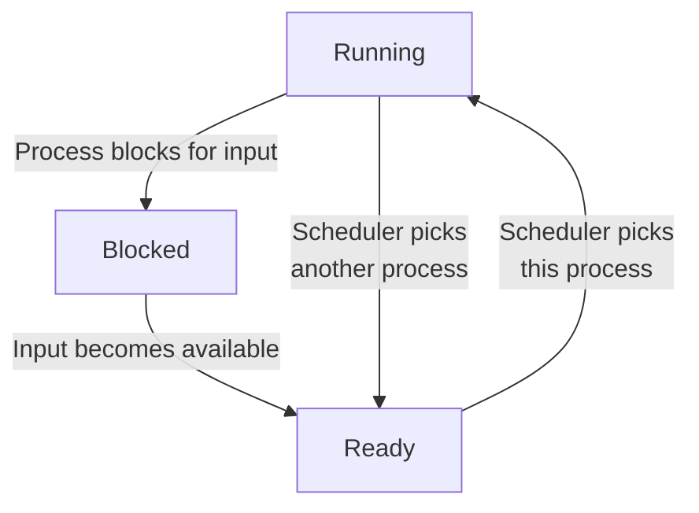

(Links:: [[Operating Systems]])
# Introduction to Processes
## The Process Model
How many processes do programs have? A fundamental part of operating systems is abstracting pieces of software, so that programs can be easier written. This allows the OS to simplify:
- Resource allocation
- Resource accounting
- Resource limiting

The operating system maintains information on the resources and the internal state of every single process in the system.
One process only ever has a single logical program counter. Each process has a unique location, and the program counter has to switch between these processes. Each time we switch processes, we save the program counter of the first process and restore the program counter of the second. All processes make progress, but only one at a time. For this, the CPU can be allocated in turns to different processes.
![[Only one program is active at once.png|500]]
In principle, multiple processes are mutually independent, but they need explicit means to interact with each other. The operating system normally offers **no timing or ordering guarantees**.

The OS typically creates only 1 `init` process, all subprocesses are created independently: 
- A **parent** process can create a **child** process
- This results in a tree-like structure and **process groups** (for example when using pipes in the shell)

There are four events that cause a process to be created:
1. System initialization
2. Execution of a process creation system call by a running process. 
3. A user request to create a new process.
4. Initiation of a batch job.

Sooner or later the process will terminate, usually due to one of the following conditions:
1. Normal exit (voluntary)
2. Error exit (voluntary)
3. Fatal error (involuntary)
4. Killed by another process (involuntary)

## Process Management
There are a few popular was of managing processes:
- `fork`: Creates a new process
	- Child is a "private" *clone* of the parent
	- Shares *some* resources with the parent
- `exec`: Execute a new process image
	- Used in combination with `fork`
- `exit`: Cause voluntary process termination
	- Exit status returned to the parent
	- Involuntary process termination?
- `kill`: Send a signal to a process (or group)
	- Can cause involuntary process termination
## Process States
A process can be in either of 3 states, as shown in the state diagram below: 
1. Running (actually using the CPU at that instant)
2. Ready (runnable; temporarily sopped to let another process run)
3. Blocked (unable to run until some external event happens)


The lowest level of the operating system is the scheduler, it periodically **switches** processes. All interrupt handling and starting/stopping processes is hidden here. **Sequential processes** lay on the layer above, this leads to a simple process organization.
When we stop a process, all sorts of information is stored in the operating system's **process table**:
- ID (PID), User (UID), Group (GID)
- Memory address space
- Hardware registers (e.g. program counter)
- Open files
- Signals

> [!example]- 
> | Process management        | Memory management             | File management   |
> | ------------------------- | ----------------------------- | ----------------- |
> | Registers                 | Pointer to text segment info  | Root director     |
> | Program counter           | Pointer to data segment info  | Working directory |
> | Program status word       | Pointer to stack segment info | File descriptors  |
> | Stakc pointer             |                               | User ID           |
> | Process state             |                               | Group ID          |
> | Priority                  |                               |                   |
> | Scheduling parameters     |                               |                   |
> | Process ID                |                               |                   |
> | Parent process            |                               |                   |
> | Process group             |                               |                   |
> | Signals                   |                               |                   |
> | Time when process started |                               |                   |
> | CPU time used             |                               |                   |
> | Children's CPU time       |                               |                   |
> | Time of next alarm        |                               |                   |

The scheduler must some how stop a process, and therefore uses **interrupts**. When an interrupt is called, we deallocate the CPU with the help of the interrupt hardware. To do this we need control, so we allow the scheduler to periodically get control, whenever the hardware generates an interrupt. The specific interrupt service procedure is pointed to be the **interrupt vector**:
- Associated with each I/O device and interrupt line
- Part of the **interrupt descriptor table**
- Contains the start address of an OS-provided internal procedure (**interrupt handler**)
The interrupt handler continues the execution.

> [!summary] What happens when an interrupt occurs
> 1. Hardware stacks program counter, etc.
> 2. Hardware loads new program counter form interrupt vector
> 3. Assembly language procedure saves registers
> 4. Assembly language procedure sets up new stack.
> 5. C interrupt service runs (typically reads and buffers input)
> 6. Scheduler decides which process is to run next
> 7. C procedure returns to the assembly code
> 8. Assembly language procedure starts up new current process

If the average process computes only 20% of the time it is sitting in memory, then we can improve the CPU utilization by having more processes.
![[CPU utilization as a function of the number of processes in memory.png|500]]
## Signal Handling
- Signal types:
	- Hardware-induced (e.g. SIGILL)
	- Software-induced (e.g. SIGQUIT or SIGPIPE)
- Actions:
	- Term, Ign, Core, Stop, Cont
	- Default action on per-signal basis, typically overridable
	- Signals can be typically blocked and actions delayed
- Catching signals:
	- Process registers signal handler
	- OS delivers signal and allows process to run handler
	- Current execution context needs to be saved/restored
 
The kernel delivers signals:
- stops code currently executing
- saves context
- executes signal handling code
- restores original context
## Threads
- Implicit assumption so far:
	- 1 process → 1 thread of execution
- Multithreaded execution:
	- 1 process → N threads of execution
- Why allow multiple threads per process?
	- Lightweight processes
		- Allow space- and time- efficient parallelism
	- Organized in thread groups
		- Allow simple communication and synchronization

| Model                   | Characteristics                                   |
| ----------------------- | ------------------------------------------------- |
| Threads                 | Parallelism, blocking system calls                |
| Single-threaded process | No parallelism, blocking system calls             |
| Finite-state machine    | Parallelism, nonblocking system calls, interrupts |

- Threads reside in the **same address space** of a single process
- All information exchange is via **data shared between the threads**
- Threads **synchronize** via simple primitives
- Each thread has its own *stack*, hardware *registers*, *state* and *program counter*
	- Since each thread will be calling different procedures, they will have different execution histories -> they need individual stacks to store local variables
- Thread table/switch: a lighter process table/switch
- Each thread may **call** any OS-supported system call **on behalf of the process to which it belongs** -> it will block a system call based on how the user space threads are designed

| Per process item            | Per thread items |
| --------------------------- | ---------------- |
| Address space               | Program counter  |
| Global variables            | Registers        |
| Open files                  | Stack            |
| Child processes             | State            |
| Pending alarms              |                  |
| Signals and signal handlers |                  |
| Accounting information      |                  |

### User Space Threads
- User-level threads package vs threads package managed by the kernel: ![[(a) A user-level threads package. (b) A threads package managed by the kernel..png|500]]

**Pros**:
- Thread switching time (no mode switch)
- Scalability, customizability (no in-kernel management)

**Cons**:
- Transparency (typically requires app cooperation)
- Parallelism (blocking syscalls are problematic)

To take advantages of both sides, we use a hybrid: We have multiple kernel threads which can have multiple user threads.

# Inter-Process Communication
Threads have the advantage of sharing a user space, so they have access to the same memory. This can cause issues if we don't set guidelines when they can access and change the data. Reading/updating should be an **atomic action**. If it is not, processes can race each other and come to wrong conclusions. A **critical region** is a code region with access to shared resources. We need requirements to avoid race conditions:
1. No two processes may be simultaneously inside their critical regions.
2. No assumptions may be made about speeds or the number of CPUs.
3. No process running outside its critical region may block other processes.
4. No process should have to wait forever to enter its critical region.

A naive approach would be to use a variable to indicate if a critical region is in use.:
```c
while(TRUE) {
	while(turn != 0){
		critical_region();
		turn = 1;
		noncritical_region();
	}
}
```
Unfortunately, this does not permit a process to enter their critical regions two times in a row. Additionally, a process outside the critical region can effectively block another one. What we can do however is go into a while loop, waiting for the lock to be reset. The while loop will then terminate, and the process knows that the critical region is free to it. This is know as **busy waiting**:
```c
#define N 2
int turn;
int interested[N];
void enter_region(int process){
	int other = 1 - process;
	interested[process] = TRUE;
	turn = process;
	while(turn==process && interested[other]==TRUE);
}
void leave_region(int process){ 
	interested[process] = FALSE;
}
```

> [!example]+ Producer-Consumer
> ```c
> # define N 100
> int count = 0;
> 
> void producer(void) {
> 	int item;
> 	while(TRUE){
> 		item = produce_item();
> 		if(count == N) sleep();
> 		insert_item(item);
> 		count++;
> 		if(count == 1) wakeup(consumer);
> 	}
> }
> 
> void consumer(void){
> 	int item;
> 	while(TRUE){
> 		if(count == 0) sleep();
> 		item = remove_item();
> 		count--;
> 		if(count == N-1) wakeup(producer);
> 		consume_item(item);
> 	}
> }
> ```
> The producer sleeps when the buffer is *full*. The consumer sleeps when the buffer is *empty*.
> > [!warning] Wake up events may get lost!

## Semaphores
- **Idea**: introduce a special `sema` integer type with 2 operations: 
	- *down*:
		- if `sema <= 0` then block the calling process
		- `sema = sema-1` otherwise
	- *up*:
		- if there is a process blocking on `sema`, wake it up
		- `sema = sema+1` otherwise
- OS guarantees all the operations are atomic by design
	- **Disable interrupts** on single processors
	- **Spin locking** on multiprocessors
## Monitors
- Semaphores have been heavily criticized for the chaos they can introduce in programs
- Monitors are a more structured approach towards process synchronization:
	- Serialize the procedure calls on a given module
	- Use condition variables to `wait`/`signal` processes
- Requires dedicated language support
- Popular in managed languages, e.g. Java:
	- synochronized methods/blocks
	- `wait`, `notify`, `notifyall` primitives
## Message passing
- Solution to both the process **synchronization** and the process **communication** problems
- Most common choice in **multiserver** OS designs
- Processes interact by sending and receiving **messages**:
	- `send(destination, &message);`
	- `receive(source, &message);`
	- `receive(ANY, &message);`
## Barriers
No process may proceed into the next phase until all processes are ready to proceed to the next phase.
## Priority Inversion
A problem can arise with higher priority tasks when sending an interrupt to a process where a different process currently holds the mutex. This can be solved with several methods:
- Disable all interrupts while in the critical region
- Priority ceiling: associate a priority with the mutex and assign that to the process holding it.
- Priority inheritance: A low-priority task holding the mutex temporarily inherits the priority of the high-priority task trying to obtain it
- Random boosting: randomly assigning mutex-holding threads a high priority until they exit the critical region
## Avoiding Locks: Read-Copy-Update
- An instance of **relativistic programming**
- Do not try to avoid conflicts between readers and writers; tolerate them and ensure a correct result regardless of the order of events
- Allow a write to update data structure even if other processes are still using it.
	- Parallel copies of a data structure
	- Ensure that each reader either reads the old or the new version, but not some weird combination of the 2.
	- Single-pointer readers/writers scheme
- Readers execute in read-side sections
- Writer operates 3 steps:
	- Atomically update pointer to new copy
	- Wait for existing readers (grace period)
	- Reclaim old copy
 
# Scheduling
On modern systems, CPU-bound processes usually take very long, while I/O-bound process are usually shorter.
![[CPU-bound vs IO-bound processes.png|600]]
Bursts of CPU usage alternate with periods of waiting for I/O. There are different types of [[#Process States]], but if there are *more* processes ready than CPUs available, the **scheduler** decides (based on the *scheduling algorithm*) which process to run next. The scheduler is called whenever:
- a process exits
- a process blocks on I/O, [[#Semaphores]], etc.
- a new process is created
- an interrupt occurs: I/O, clock, syscall, etc.

There are two different types of schedulers: ones that are *preemptive* and can **gain back control over the CPU on demand** and those that are *non-preemptive* which cannot. All systems should adhere to these rules:
- Fairness - giving each process a fair share of the CPU
- Policy enforcement - seeing that stated policy is carried out
- Balance - keeping all parts of the system busy

## Batch System
- **Throughput**: Maximize jobs per hour
- **Turnaround time**: Minimize time between submission and termination (shorter jobs first)
- **CPU utilization**: keeping the CPU busy all the time

### First-Come First Served
- Process jobs in order of their arrival
- Non-preemptive
- Single Process Queue
	- New jobs or blocking processes are added to the end of the queue
- "Convoy Effect": if only few CPU bound and many I/O bound processes -> can lead to longer turnaround time
### Shortest Job First
- Pick the job with the shortest run time
- Provably optimal: 
	- Lowest turnaround time
	- Only if all jobs are available simultaneously
	- If new jobs arrive, it may lead to starvation
- Runtimes have to be known in advance
- **Highest-response-ratio-next** -> takes waiting time into account
	- Improved version of Shortest Job First
## Interactive Systems
- **Response time**: respond to requests quickly
- **Proportionality**: meet users' expectations
### Round Robin Scheduling
- Preemptive scheduling algorithm
- Each process gets a **time slice** (or quantum)
- If process is still running at end of quantum it gets preempted and goes to end of ready queue

> [!question] How big should the quantum be?
> It is a tradeoff between CPU utilization (due to context switch) and the response time
### Priority Scheduling
![[Priority scheduling.png|600]]
- Similar to round robin but several ready queues for differently important/prioritized processes
- Next process is picked from queue with highest priority
- Static vs. dynamic priorities
### Shortest Process Next
- Idea: Use shortest "job" first and try to best predict next running time

> [!question] How do we minimize the response time for each priority queue?
> Form weighted average of previous running times of process -> **Aging** $$T_{k+1}=a\times T_{k-1}+(1-a)\times T_{k}$$
> Easy to implement when $a=0.5$
### Guaranteed Scheduling
- Idea: $N$ processes running -> each process gets $1/N$th of CPU time (also known as fair-share)
- Solution:
	- Calculate how much CPU time it might have gotten: Time since process creation divided by $N$
	- Measure actual consumed CPU time and form ratio
	- Pick process with the smallest ratio to run next
### Lottery Scheduling
- Processes get lottery tickets
- Whenever a scheduling decision has to be made the OS chooses a winning ticker randomly
- Process can possess multiple tickets -> Priorities
- Tickets can be traded between processes
- Tickets are immediately available to newly created processes
## Real Time Systems
- **Meeting deadlines**: avoid losing data
- **Predictability**: avoid quality degradation in multimedia systems
- A system with periodic tasks is *schedulable* when: $$\sum\limits_{i=1}^{m}\frac{C_{i}}{P_{i}}\leq 1$$ 
  $C_i$: time to execute process $i$
  $P_i$: frequency of process $i$

---
References: