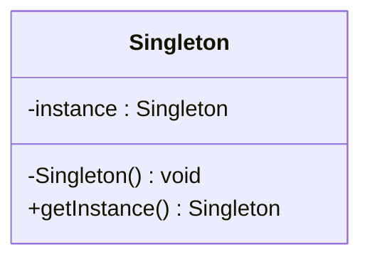
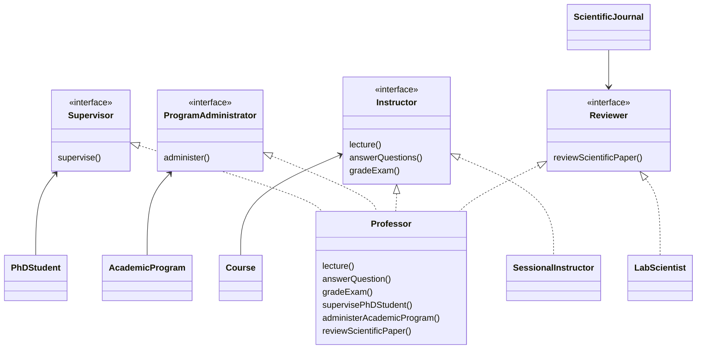
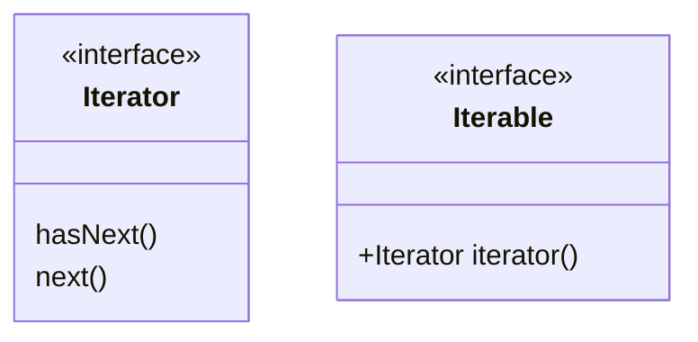
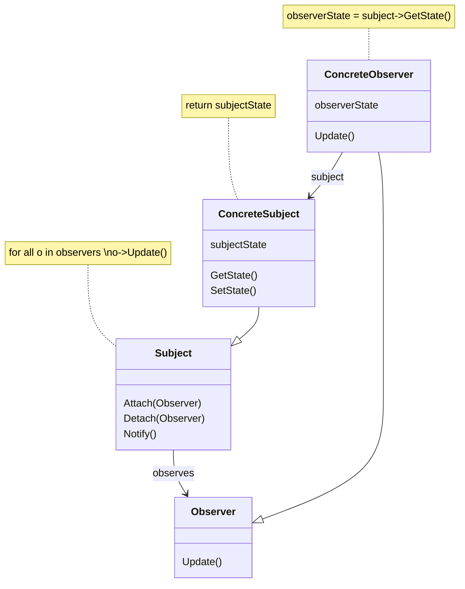

(Links:: [[Software Design]])
> [!summary]+
> - **Design patterns** = solutions to common software design problems
> - They are not prescriptive specifications for software
> - They are not always needed
> 	- Do not apply design patterns to a trivial solution à you risk to overcomplicate your code and lead to maintainability issues
> - **Inversion of control**
> 	- Your code waits for the framework to call it
> - **Observer pattern**
> 	- As soon as my internal state will change, I will notify all my observers
> 	- As an observer, I do not need to poll, I will get called as soon as "something happens"
> - **Visitor pattern**
> 	- Functionality-centric programming instead of data-centric
> 	- You "inject" new functionalities without changing the interface of your classes

> [!summary]- Design patterns in UML
> - Flyweight
>     - You can share common data across multiple objects
>     - Memory efficiency
> - Adapter pattern
>     - You can mask the complexity of libraries, external APIs, etc.
>     - Useful also when you need to work with old libraries
> - Decorator pattern
>     - You can add/remove functionalities to objects at run-time
>     - Added functionalities are transparent to client code
> - Command pattern
>     - You can do/redo/undo commands
>     - You can keep an history of executed commands
>     - You can delay/queue/batch commands
> - Template method pattern
>     - You break a fixed algorithm into fixed steps
>     - Hooks for special cases
>     - Avoid code duplication for the common part
> - Chain of responsibility pattern
> 	- you ask the service to the head of the chain
> 	- the chain will find the object for performing the service by itself

# The Law of Dementer
> [!abstract] Avoid as much as possible long chains of message calls

**Solution**:
- Intermediate classes
	- should be "deeper" and provide complete services
	- should not return references to their internal structure

More concretely, the code of a *method* should access only:
- The instance variables of `this`
- The arguments of the method
- Any new object created within the method
- (If unavoidable) globally available objects
# Introduction to object-oriented design patterns
> [!abstract] Design patterns are a reusable form of a solution to a common design problem

- a "template" for how to solve a problem
- it can be used in many different situations
- not a finished design
	- it cannot be transformed directly into source code
- helps the designer in getting to the *right* design *faster*
# Design patterns: Singleton, Factory Method, Iterator
### Types of design patterns
**Creational**: how objects can be created
- maintainability
- control
- extensibility

**Structural**: how to form larger structures
- management of complexity
- efficiency

**Behavioural**: how responsibilities can be assigned to objects
- objects decoupling
- flexibility
- better communication
## Singleton
- **Intent**: 
	- To ensure that only one instance of a class is allowed within a system
	- Controlled access to a single object is necessary



```java
public static Singleton getInstance(){
	if(instance == null)
		instance = new Singleton();
	 return instance;
}
```
- **Consequences**: 
	- Controlled access to sole instance
	- Reduced name space -> less "global variables"
	- Permits also a variable number of instances

> [!example]
> - Session object in a browser
> - Logging utility
> - A class for representing a configuration file which is read only at startup time

> [!example]- Implementation
> ```java
> public class SingleObject {
> 	//create an object of SingleObject
> 	private static SingleObject instance = new SingleObject();
> 	
> 	//make the constructor private so that this class cannot be instantiated
> 	private SingleObject(){}
> 	
> 	//Get the only object available
> 	public static SingleObject getInstance(){
> 		return instance;
> 	}
> 	
> 	public void showMessage(){
> 		System.out.println("Hello World!");
> 	}
> }
> 
> public class SingletonPatternDemo {
> 	public static void main(String[] args) {
> 		//illegal construct
> 		//Compile Time Error: The constructor SingleObject() is not visible
> 		//SingleObject object = new SingleObject();
> 		
> 		//Get the only object available
> 		SingleObject object = SingleObject.getInstance();
> 		
> 		//show the message
> 		object.showMessage();
> 	}
> }
> ```
## Factory Method
- **Intent**: 
	- to abstract the process of object creation so that the type of the created object can be determined at run-time
	- to make a design more *customizable* in terms of which objects can be created
	- you want to avoid the new operator because you do not want to *hard code* which class you want to instantiate


- **Consequences**:
	- You have a dedicated class for creating instances of objects
	- You can pass arguments to that class for controlling the features of the objects you want to create

> [!example]
> - All cases in which an object does not know what concrete classes will be required to create objects at runtime, but just wants to get a class that will do the job
> - A central entity for creating objects, but you really do not want to know exactly how they are created

> [!example]- Implementation
> ```java
> public abstract class Shape {
> 	public abstract void draw();
> }
> 
> public class Rectangle extends Shape {
> 	public void draw() {
> 		// ... draw rectangle
> 	}
> }
> 
> public class Square extends Shape {
> 	public void draw() {
> 		// ... draw square
> 	}
> }
> 
> public class Circle extends Shape {
> 	public void draw() {
> 		// ... draw circle
> 	}
> }
> 
> public class ShapeFactory {
> 	//use getShape method to get object of type shape
> 	public Shape getShape(String shapeType) {
> 		if(shapeType == null) {
> 			return null;
> 		}
> 		if(shapeType.equalsIgnoreCase("CIRCLE")){
> 			return new Circle();
> 		} else if(shapeType.equalsIgnoreCase("RECTANGLE")){
> 			return new Rectangle();
> 		} else if(shapeType.equalsIgnoreCase("SQUARE")){
> 			return new Square();
> 		}
> 		
> 		return null;
> 	}
> }
> 
> public class FactoryPatternDemo {
> 	public static void main(String[] args) {
> 		ShapeFactory shapeFactory = new ShapeFactory();
> 		
> 		//get an object of Circle and call its draw method.
> 		Shape shape1 = shapeFactory.getShape("CIRCLE");
> 		
> 		//call draw method of Circle
> 		shape1.draw();
> 		
> 		//get an object of Rectangle and call its draw method.
> 		Shape shape2 = shapeFactory.getShape("RECTANGLE");
> 		
> 		//call draw method of Rectangle
> 		shape2.draw();
> 		
> 		//get an object of Square and call its draw method.
> 		Shape shape3 = shapeFactory.getShape("SQUARE");
> 		
> 		//call draw method of circle
> 		shape3.draw();
> 	}
> }

## Interface segregation
> [!example]- Example where the principle is **not** applied
> ```mermaid
> classDiagram
> 	class Professor
> ```
> > [!warning] Problem
> > - Clients depend on services they *do not need*
> > 	- Ex. a course may depend on an object able to do reviews
> > - *Breaks extensibility* and *loose coupling*
> > 	- Ex. I cannot have other professional figures (like a TA) giving courses (different from professors)

> [!summary] Client code should not be forced to depend on interfaces it does not need

### Application of the ISP principle


- Define specialized interfaces that specify a small and coherent slice of behavior that clients can depend on
- Clients depend on interfaces that represent specific *roles* directly relevant to each client

Whenever you add an association/aggregation between two classes;
- Direct reference, if the client class needs the whole interface of the associated class
- Segregated interface, if the client depends only on a role that objects of the associated class will fulfil

> [!question]- What if one client needs more than one "slice of behaviour"?
> - The problem is that here we can assign only one type to a variable, forcing us to implement additional checks
> 
> **Solution**: inheritance between interfaces

## Iterator
- **Intent**:
	- Need to "abstract" the traversal of wildly different data structures from client code
	- Provide a way to access the element of an aggregate object sequentially without exposing its underlying representation
	- Polymorphic traversal of collections
- **Consequences**:
	- You have encapsulated the internal representation of your attributes with cardinality > 1
		- If you change their internal representation, you do not need to change their client code
	- You can use the "for each" construct over them

> [!example] 
> - You need to iterate over the objects present in a room of a videogame
> - You need to iterate over language flashcards of different types



- It formally defines what "iterating" means
- Once you implement such interface, your client code can iterate over your elements always in the same way

```java
public class Deck {
	private List<Card> cards;
	
	public Iterator<Card> getCards() {
		return this.cards.iterator();
	}
}

Deck deck = new Deck();
// initilization and population of the deck

Iterator<Card> cardsIterator = deck.getCards();

Card currentCard;
while(cardsIterator.hasNext()) {
	currentCard = cardsIterator.next();
	// here do something with the current card
}
```
```java
public class Deck {
	private List<Card> cards;
	
	public Iterator<Card> getCards() {
		return this.cards.iterator();
	}
}

Deck deck = new Deck();
// initilization and population of the deck

for(Card card : deck) {
	// here you can use card
}
```
## Overloading
> [!definition] Method overloading
> The ability to have one method with different implementations

- Two ways to overload a method in Java:
	1. By changing number of arguments
	2. By changing the data type of the arguments
- **Overriding**: Class A extends class B. Class A "reimplements" one or more methods inherited from B
- **Overloading**: Class A has multiple methods with the same name, but different input parameters
	- The returned value does not count when overloading methods
- The selection of applicable methods is based on 1. the number 2. *static* types of explicit arguments
- The selection procedure is to find all applicable methods and to select the *most specific* one
# Principles
## Object identity, equality, uniqueness
- The **identity** of an object distinguishes one object from another
- It is useful to think of an object's identity as the place where its value is stored in memory
- **Equality** refers to the fact that two distinct objects are semantically the same
- In general, equality between two objects must be defined by the programmer
	- Attribute values may be technically different, but semantically the same

> [!example]- Semantically equal
> You may consider as "equal", strings with the same characters independently of their capitalization

- You implement your own equality check by overriding the `equals(Object)` method of `Object`
- In Java, the root of the hierarchy class is `Object`

> [!info]- Template for overriding the `equals(Object)` method
> ```java
> public class Card {
> 	// ... other attributes and methods
> 	
> 	@Override
> 	public boolean equals(Objecdt o) {
> 		if (this == o) {
> 			return true;
> 		}
> 		if (o == null || this.getClass() != o.getClass()) {
> 			return false;
> 		}
> 		Card o = (Card) o;
> 		return this.rank == o.rank && this.suit == o.suit;
> 	}
> 	
> 	@Override
> 	public int hashCode() {
> 		return Objects.hash(this.suit, this.rank);
> 	}
> 
> }
> ```

- Objects of a class are **unique** if it is not possible for two distinct objects to be *equal*
	- E.g. what is the meaning of having two Cards with the same rank and suit?

> [!question]- How do you have unique objects?
> - One object -> [[#Singleton]] design pattern
> - Multiple objects -> [[#Flyweight]] design pattern

## Liskov's substitution principle
> If S is a subtype of T, then objects of type T in a program may be replaced with objects of type S without altering any of the desirable properties of that program

When you develop the client code of a class T, you are *making implicit assumptions* about how T's methods work. Those assumptions must also hold for all subclasses S of T, otherwise you risk to break all the client code using T.
- Inheritance should only be used to *extend* the behaviour of a superclass
- It is bad design to use inheritance
	1. to restrict the behaviour of a superclass
	2. when the subclass is not a proper subtype of its superclass
- Specifically, this means that methods of the subclass:
	- Cannot have stricter preconditions
	- Cannot have less strict post-conditions
	- Cannot take more specific types as parameters
	- Cannot make overridden methods less accessible (e.g. public -> protected)
	- Cannot throw more checked exceptions
	- Cannot have a less-specific return type

> [!example]
> - Design context = I want to have a new type of `Deck`, which cannot be shuffled
> - Idea (wrong) = in Deck we already have a lot of ready-to-use methods, let's extend `Deck`!
> > [!tip] 
> > Solving these kinds of design problems is context-dependent
> > -> *Restructure* your inheritance tree
## Inversion of Control
> [!example] Example where inversion of control is *not* applied
> ![[18616.png|500]]
> Limitations:
> - High coupling:
> 	- In every panel I need to remember the APIs for updating the other panel
> - Low extensibility
> 	- Adding/removing a panel -> modify all other panels
> 	- Dependencies grow quadratically!
> - High complexity
> 	- the code for updating a panel is also intermingled with the code for updating the other panels

> [!tip] Invert the usual flow of control as compared to traditional control flow

![[23636.png|500]] 
![[24345.png|500]]

- Better separation of concerns
- Loose coupling
- Better extensibility
### Libraries vs Frameworks
- Inversion of Control is a key part of what makes a library different to a framework

| Library                                                              | Framework                                                                                                                                         |
| -------------------------------------------------------------------- | ------------------------------------------------------------------------------------------------------------------------------------------------- |
| A set of functions that you can call, usually organized into classes | Embodies some abstract design, with more behavior built in                                                                                        |
| Each call does some work and returns control to the client           | In order to use it you need to insert your behavior into various places in the framework either by subclassing or by plugging in your own classes |
|                                                                      | The framework's code then calls your code at these points                                                                                                                                                  |
# Behavioral design patterns
## Observer
- **Intent**:
	- To let one or more objects be notified of state changes in other subjects within the system
	- State changes in one or more objects should trigger behavior in other objects
	- Observers do *not* check the status of the subject, but rather they just wait to receive updates from it
	- The subject does not tell to Observers *what* to do, but it just *informs* them about a state change
	- `Update()` method is called "callback"



- **Consequences**:
	- Support for broadcast communication
	- When one object changes state, all its dependents are notified and updated automatically
	- You can add or remove observers without modifying the subjects

> [!example]
> - The drum machine sequencer can issue a command to a subset of drumkit elements
> - When a language flashcard is updated, all the UI panels showing it are also updated

> [!example]- Implementation
> ```java
> public abstract class Observer {
> 	protected Subject subject;
> 	public abstract void update();
> }
>        
> class MappingRover extends Observer {
> 	// in the constructor you specify the subject it observes
> 	public MappingRover(Subject subject) {
> 		this.subject = subject;
> 		subject.attach(this);
> 	}
> 
> 	// Observers "pull" information
> 	public void update() {
> 		if(this.subject.getState() == 0) {
> 			// .. let's go to map the environment
> 		} else {
> 			// .. ohhh, I have to come back home.
> 		}
> 	}
> }
> 
> class CameraRover extends Observer {
> 	// in the constructor you specify the subject it observes
> 	public CameraRover(Subject subject) {
> 		this.subject = subject; 
> 		subject.attach(this);
> 	}
> 
> 	// Observes "pull" information
> 	public void update() {
> 		if(this.subject.getState() == 0) {
> 			// .. it's not my turn yet
> 		} else {
> 			// .. let's go to take some pictures!
> 		}
> 	}
> }
> 
> public abstract class Subject {
> 	private List\<Observer\> observers = new ArrayList\<Observer\>();
> 	public void attach(Observer observer){
> 		this.observer.add(observer);
> 	}
> 	public void detach(Observer observer){
> 		this.observers.remove(observer);
> 	}
> 	public void notifyAllObserver(){
> 		for (Observer observer : this.observers) {
> 			observer.update();
> 		}
> 	}
> }
> 
> public class CentralStation extends Subject {
> 	private int state;
> 	
> 	public int getState() {
> 		return this.state;
> 	}
> 	
> 	public void setState(int state) {
> 		this.state = state;
> 		this.notifyAllObservers();
> 	}
> }
> 
> public static void main(String[] args) {
> 	CentralStation cs = new CentralStation();
> 	cs.setState(0);
> 	
> 	MappingRover rover1 = new MappingRover(cs);
> 	CameraRover rover2 = new CameraRover(cs);
> 	CameraRover rover3 = new CameraRover(cs);
> 	
> 	cs.setState(1);
> }
> ```

- views should be updated whenever items are added/removed from the inventory
- Observer basic implementation: Inheritance vs Interface style
- Scope of the callbacks: Multiple vs single callbacks
- Control flow: Internal vs External calls to `Notify()`
- Data flow: Pull vs push strategy

| Design Decision                           | Pros                                                                                                                                      | Cons                                                                                                    | Diagram        |
| ----------------------------------------- | ----------------------------------------------------------------------------------------------------------------------------------------- | ------------------------------------------------------------------------------------------------------- | -------------- |
| Observer basic Inheritance style          | `attach`, `detach`, and `update` methods are implemented only once. If needed, subjects and observers can contain also instance variables | `Inventory`, `PieChart`, and `ListView` cannot extend other classes                                     | ![[37091.png]] |
| Observer basic Interface style            | You can still extend Item and Inventory. You are not "polluting" the "is-a" relationship                                                  | `Inventory` must implement its own methods for adding/removing observers                                | ![[29859.png]] |
| Scope of callbacks single callback        | Simple API                                                                                                                                | You need a way to understand what happened in the inventory (can add parameter in `inventoryChanged()`) | ![[99884.png]] |
| Scope of callbacks multiple callback      | Clear separation of what each callback does                                                                                               | More complex API                                                                                        | ![[72853.png]] |
| Control flow internal calls to `Notify()` | The notification is totally transparent from the client code. The business logic for notifying observers is hidden from the client code.  | If the state changes frequently, you may degrade the performance of the system.                         | ![[5889.png]]  |
| Control flow external calls to `Notify()` | Flexibility in deciding *when* notifications should be done                                                                               | You have a more complex API for the `Inventory` class. Client code must remember to notify observers    | ![[15351.png]] |
| Data flow pull strategy                   | Good for simple data items. Observers cannot access the subject -> loose coupling                                                         | You hard-code in the callbacks the types of the new data you expect -> less extensible                  | ![[36641.png]] |
| Data flow push strategy                   | More flexibility. Better encapsulation (Queries to the subject are done by the subject)                                                   | Observers need a reference to the subject -> risk of reference escaping -> Interface segregation        | ![[40467.png]] |

- Method calls represent "commands" and should be *imperative* (addItem)
- Callbacks represent events and should be written as a *past participle* (itemAdded)
## Visitor

# Design patterns in UML
## Flyweight
## Adapter
## Decorator
## Command
## Template method
## Chain of responsibility

---
References: