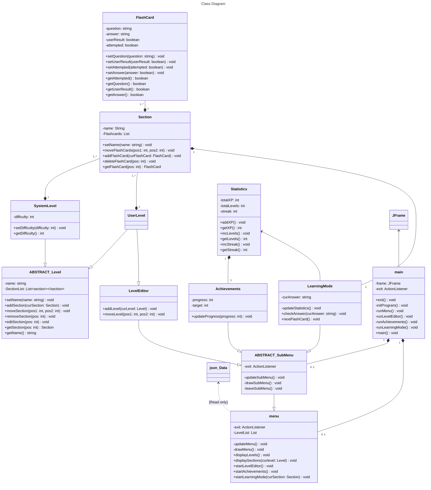

(Links:: [[Software Design]])
# Description
This project requires the implementation of software for learning a given language using flashcards. The user of this project is a person who needs to learn a new language, e.g., Dutch, interactively. You can see this project as developing an ultra-basic version of apps like Duolingo running locally on the laptop of the user. The system shows flashcards to its users according to levels. Each learning trajectory can be viewed as a workflow composed of steps, each with an associated set of flashcards and basic actions. The set of basic features of the system includes the following: 
1. manage levels: create, update, and delete levels, their (ordered) flashcards, their associated solutions, etc.
2. learning mode: the user can start levels and progress across their corresponding flashcards on a step-by-step basis with gamification elements
3. persistence: levels and flashcards are persisted as JSON files and can be imported/exported from/into a predefined folder
4. provide to the user an overview of their achievement badges based on the performed learning activities. The main technical challenge of this project is to make your system as independent as possible from the specific levels and their corresponding flashcards; in other words, it must be easy to add/configure new levels and flashcards with no changes in the models/code. 

## Ideas for a bonus: 
1. generate a printable document containing all the results obtained by the user while learning a certain language
2. integrate an engine for the semi-automatic generation of new flashcards for a given language
3. integration of a sound module for allowing the user to train also their listening and speaking skills.

---
References: