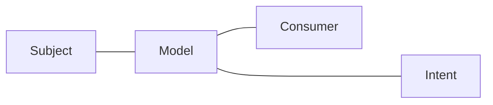

(Links:: [[Software Design]])

> [!question]
> 1. How do you ensure that the system performs always as expected?
> 2. How do you know "what is going on "?
> 3. How do you ensure certain quality attributes
> 4. How do you evolve your system over a long period of time?
> 5. How do you test billions of lines of code?
> 6. How do you work in teams across the globe?

- Engineers abstract away from a number of details that can be ignored **safely**

> [!definition] Software design
> The activity of creating (and using) models representing an abstract view of the system
> > [!definition] Abstraction
> > The activity of generalising - setting aside specific and individual features
> 
> > [!definition] Model
> > A simplified or partial representation of reality, created to support a task or to reach an agreement

- The decisions you make when designing are as important as the *models you create*!
- Software design is the **activity** of creating an architecture
- Software architecture is concerned with high-level, coarse-grained structures and decisions of a system
- Software design is concerned with **more local, fine-grained** structures and decisions

___
- **Mapping feature**: A model is based on an original (=system)
- **Reduction feature**: A model only reflects a (relevant) selection of the original's properties
- **Pragmatic feature**: A model needs to be usable in place of an original with respect to some purpose

> [!quote]
> All models are wrong, but some are useful

---
References: