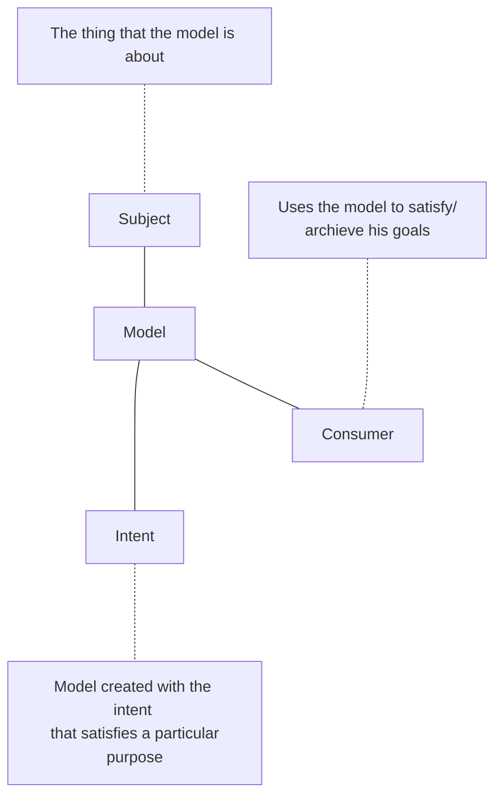

(Links:: [[Software Design]])

> [!question]
> 1. How do you ensure that the system performs always as expected?
> 2. How do you know "what is going on "?
> 3. How do you ensure certain quality attributes
> 4. How do you evolve your system over a long period of time?
> 5. How do you test billions of lines of code?
> 6. How do you work in teams across the globe?

- Engineers abstract away from a number of details that can be ignored **safely**

> [!definition] Software design
> The activity of creating (and using) models representing an abstract view of the system
> > [!definition] Abstraction
> > The activity of generalising - setting aside specific and individual features
> 
> > [!definition] Model
> > A simplified or partial representation of reality, created to support a task or to reach an agreement

- The decisions you make when designing are as important as the *models you create*!
- Software design is the **activity** of creating an architecture
- Software architecture is concerned with high-level, coarse-grained structures and decisions of a system
- Software design is concerned with **more local, fine-grained** structures and decisions

___
- **Mapping feature**: A model is based on an original (=system)
- **Reduction feature**: A model only reflects a (relevant) selection of the original's properties
- **Pragmatic feature**: A model needs to be usable in place of an original with respect to some purpose

> [!quote]
> All models are wrong, but some are useful

- A consumer may be a human, but also software
- Consumer and intent influence the model's **abstraction level**
- The importance of a model may vary during its lifetime

# Models
**Descriptive models**:
- *Sketches* and throw-away models
	- to better understand reality and to explore possible solutions
	- short lifetime (usually)
- Models of ideas and vision about the system *to be developed*
	- to exploit the model for having feedback before implementing the system
- Models *extracted* from a running system or source code
	- for example, to visualize all the calls between a set of Java classes

![[Descriptive Model of a Submarine.jpeg|500]]

**Prescriptive models**:
- They *guide* the development of the system
	- more detailed than descriptive models
	- specify constraints for the system
- The most common *consumers* of prescriptive models are code generators -> model-driving engineering (MDE)
- Prescriptive models are often used for development
	- their *importance* might decrease when the system is implemented

![[Prescriptive Model of a Submarine.jpeg|500]]

---
- Informal notations
	- Ad-hoc visualizations with no clear semantics
	- Examples: "box-and-line" or PowerPoint diagrams
- Semiformal notations
	- Standardized graphical elements and construction rules, semantics are mostly specified to allow basic analysis
	- Examples: [[UML Diagrams|UML]], SYsML
- Formal notations
	- Precise semantics based on mathematical constructs that allow full formal analysis for syntax and semantics
	- Examples: architectures description language (ADLs), e.g. Acme, AADL, AUTOSAR

> [!question] Why do we need architecture and design?
> - They enable reasoning about large systems
>   -> abstractions and hierarchies help to manage complexity
> - They are the driver for software quality (not *what* the system does, but *how* it does it)
> - They enable separating a system into parts to let teams work on them in parallel
> - They are the bridge between the requirements and the implementation

- **Abstraction** is indispensable for complex software systems
- **Models** are abstract representations of a system
	- Low-level details are safely ignored
	- Models can be used for many purposes
	- Descriptive vs. prescriptive models
	- Informal vs. (semi-)formal notations
- **Software design** is decision making while using and creating models of a system

---
References: