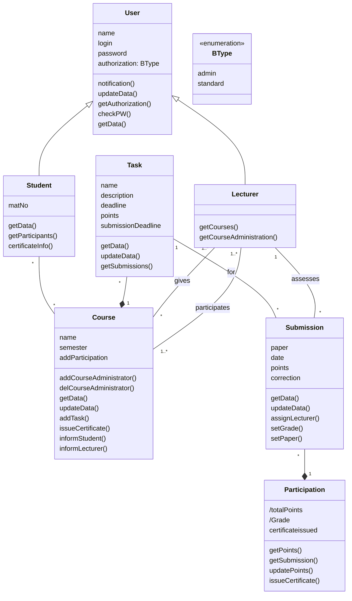
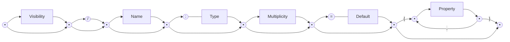
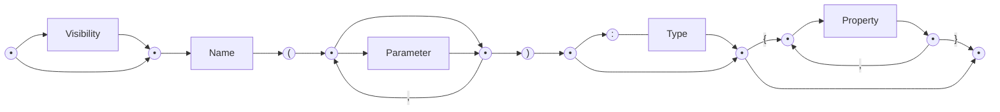
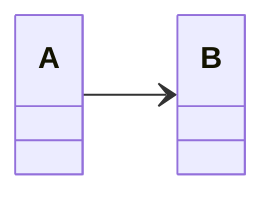
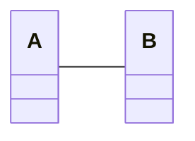
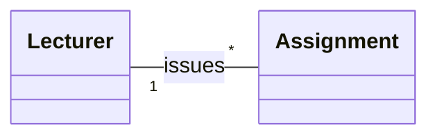
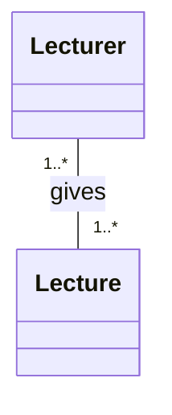
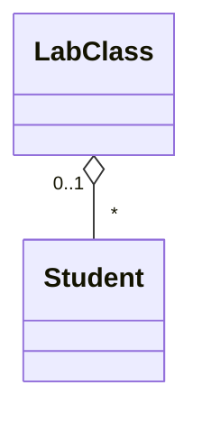
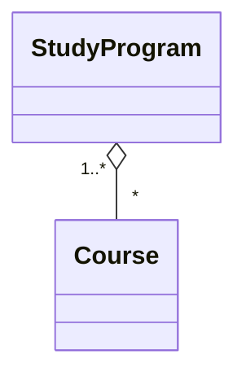

(Links:: [[Software Design]])

# Introduction
- UML = Unified Modelling Language
- Standardized software design language
- Under the umbrella of Object Management Group (OMG)
- The "Swiss Army Knife" of notations
- It is not tied to **any development process**
	- Waterfall, Scrum, Kanban, XP, etc.
- Can be **used across the whole life cycle**
	- Promotes iterative refinement of models
- It is **scalable**
	- You can zoom in with additional details when needed
- It has **different representations**
	- Graphical
	- Textual
	- Machine-readable
- It is a **general-purpose modelling language**
	- It can be used for modelling a mobile app, but also a satellite
- It is **comprehensive**
	- Different parts of a system can be described with UML
- Supports both **descriptive** models (original intention) and **prescriptive** models
	- Automatic model analysis and execution
	- Code generation
- UML is a **semi-formal modelling language**
  -> Its core concepts have well-defined **semantics**
- Emphasize the **static description** of the element of the system being modelled
- Structural elements may have an associated behaviour



- Behavior = the direct consequences of an action of at least one object
- Affects how the states of objects change over time
- Behavior can
	- Be specified through the actions of a single object
	- Result form interactions between multiple objects
- Class diagram
	- To define fine-grained structures within the system
- Object diagram [not mandatory for the assignment]
	- To describe a particular snapshot of you system
- Package diagram
	- To describe the coarse-grained implementation units
- State machine diagram
	- To define the internal behavior of objects
- Sequence diagram
	- To specify inter-object behavior and communication
- A UML model contains everything related to your system
- Diagrams are just "windows" on your model

# Basics
- A class is a **construction plan** for a set of similar objects

## Attribute Syntax


- `Visibility`: Who is permitted to access the attribute
	- `+`: public
	- `-`: private
	- `#`: protected
	- `~`: package
- `/`: Value is derived from other attributes
- `Name`: Name of attribute
- `Type` 
	- Primitive data type
		- Pre-defined: boolean, integer, string
		- User-defined: `<<primitive>>`
	- Composite data type: `datatype`
	- Enumerations: `enumeration`
- `Multiplicity`: Number of values an attribute may have. Default value is 1
	- Notation: `[min..max]`
	- No upper limit: `[*]`
- `Default`: Used if the attribute value is not set explicitly by the user
- `Property`
	- Predefined properties
		- {*readOnly*} ... value cannot be changed
		- {*unique*} ... no duplicates permitted
		- {*non-unique*} ... duplicates permitted
		- {*ordered*} ... fixed order of the values
		- {*unordered*} ... no fixed order of the values
	- Example -> Set: {unordered, unique}
## Operation Syntax



- `Parameter`
	- `in` ... input parameter
		- When the operation is used, a value is expected from this parameter
	- `out` ... output parameter
		- After the execution of the operation, the parameter has adopted a new value
	- `inout`: combined input/output parameter
- `Type`: Type of the return value
## Class variables and class operations
- Instance variable (= instance attribute): attributes defined on instance level
- Class variable (= class attribute, static attribute)
	- Defined only once per class
- Class operation (= static operation)
	- Can be used if no instance of the corresponding class was created
- Notation: underlining the name of a class variable or class operation
# Relationships
- Relationships
	- Binary Association
	- N-ary Association
	- Association Class
	- Aggregation / Composition
	- Generalization (inheritance and abstract classes)

Binary association connects instances of two classes with one another.
![[Binary Association.png|500]]

**Navigability**: an object knows its partner objects and can therefore access their visible attributes and operations
- Indicated by open arrow head

Non-navigabiltiy
- Indicated by cross, but this is also often left out

Example: 
- *A* can access the visible attributes and operations of *B*
- *B* cannot access any attributes and operations of *A*


Navigability undefined 
- Bidirectional navigability is assumed

## Multiplicity
Number of objects that may be associated with exactly one object of the opposite side.


Describes the way in which an object is involved in an association relationship

> [!example]-
> ```java
> public class Person {
> 	public ArrayList\<Person> examiner;
> 	public ArrayList\<Person> examinee;
> }
> ```
> ```mermaid
> classDiagram
> 	direction RL
> 	Person "* +examiner" -- "* +examinee" Person : examines
> ```

## Xor constraint
An object of class `Exam` is associated with an object of class `Office` *or* an object of class `LectureHall`, *but not with both*.
![[Xor constraint.png|500]]
## n-ary association
- Student, Exam -> Lecturer
	- One student takes one exam with either one or no lecturer
- Exam, Lecturer -> Student
	- One exam with one lecturer can be taken by any number of students
- Student, Lecturer -> Exam
	- One student can be graded by one lecturer for any number of exams

![[Ternary association.png|500]]
## Association Class
Assign attributes to the relationship between classes rather than to a class itself
![[Association class.png|500]]
- Mandatory when modelling `n:m` associations 

> [!example]- Association class vs. regular class
> ![[73035.png|300]]
> - A `Student` can enroll for one particular `StudyProgram` only *once*
> ![[60081.png|300]]
> - A `Student` can have *multiple* `Enrollments` for one and the same `StudyProgram`

## Aggregation
- Special form of association
- Used to express that a class *is part of* another class
- Properties of the aggregation association
	- **Transitive**: if *B* is part of *A* and *C* is part of *B*, *C* is also part of *A*
	- **Asymmetric**: it is not possible for *A* to be part of *B* and *B* to be part of *A* simultaneously
- Two types
	- (Shared) aggregation
	- Composition
### (Shared) Aggregation
- Expresses a weak belonging of the parts to a whole
	- Parts also exist independently of the whole
- Multiplicity at the aggregating end may be >1
	- One element can be part of multiple other elements simultaneously

`Student` is part of `LabClass`


`Course` is part of `StudyProgram`

### Composition
- **Existence dependency** between the composite object and its parts
- An existing part is contained in at most one composite object at one specific point in time
	- Multiplicity at the aggregating end max 1
- If the composite object is deleted, its parts are also deleted 
  -> the part usually cannot exist without the whole (exceptions are possible with multiplicity 0..1 instead of 1)

> [!example]
> ```mermaid
> classDiagram
> 	direction TB
> 	Car "0..1" *-- "4" Tire
> ```

## Inheritance
- Attributes, operations, and relationships of the general class *are passed on to its subclasses* (except private one)
- Every instance of a subclass is also an indirect instance of the superclass
- Subclasses may have further characteristics and relationships
- Generalizations are transitive
## Abstract classes
- Used to highlight common characteristics of their subclasses while ensuring *no direct instances of the superclass*
- Only its non-abstract subclasses can be instantiated
- Useful in the context of generalization relationships
# Creating UML Class Diagrams
- Usually not possible to extract classes, attributes, and associations from natural language automatically
- Guidelines
	- *Nouns* often indicate classes, but can also be attributes
	- *Adjectives* often indicate attribute values
	- *Verbs* often indicate operations or relationships

> [!example]
> - A university consists of multiple faculties, which are composed of various institutes. 
> - Each faculty and each institute has a name. 
> - An address is known for each institute.  
> - Each faculty is led by a dean, who is an employee of the university.  
> - The total number of employees is known.  
> - Employees have a social security number, a name, and an email address. There is a distinction between research and administrative personnel.  
> - Research associates are assigned to at least one institute. The field of study of each research associate is known. Furthermore, research associates can be involved in projects for a certain number of hours, and the name, starting date, and end date of the projects are known.  
> - Some research associates hold courses. Then they are called lecturers.  
> - Courses have a unique number (ID), a name, and a weekly duration in hours.
> ![[Class Diagram University example.png|600]]

---
References: 
[[02_3_class_diagrams_relationships.pdf]]
[[02_4_class_diagrams_creating.pdf]]