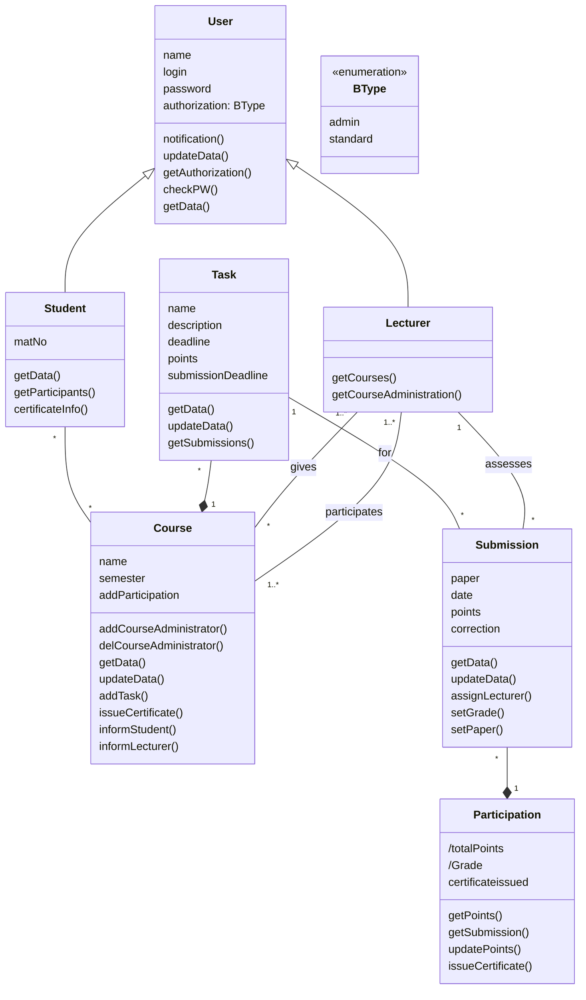
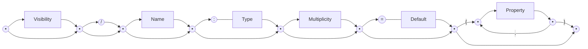
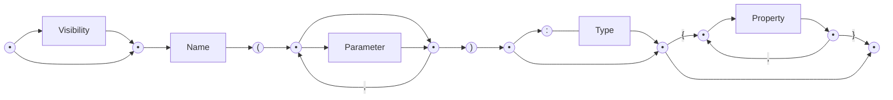

(Links:: [[Software Design]])

# Introduction
- UML = Unified Modelling Language
- Standardized software design language
- Under the umbrella of Object Management Group (OMG)
- The "Swiss Army Knife" of notations
- It is not tied to **any development process**
	- Waterfall, Scrum, Kanban, XP, etc.
- Can be **used across the whole life cycle**
	- Promotes iterative refinement of models
- It is **scalable**
	- You can zoom in with additional details when needed
- It has **different representations**
	- Graphical
	- Textual
	- Machine-readable
- It is a **general-purpose modelling language**
	- It can be used for modelling a mobile app, but also a satellite
- It is **comprehensive**
	- Different parts of a system can be described with UML
- Supports both **descriptive** models (original intention) and **prescriptive** models
	- Automatic model analysis and execution
	- Code generation
- UML is a **semi-formal modelling language**
  -> Its core concepts have well-defined **semantics**
- Emphasize the **static description** of the element of the system being modelled
- Structural elements may have an associated behaviour

- Behavior = the direct consequences of an action of at least one object
- Affects how the states of objects change over time
- Behavior can
	- Be specified through the actions of a single object
	- Result form interactions between multiple objects
- Class diagram
	- To define fine-grained structures within the system
- Object diagram [not mandatory for the assignment]
	- To describe a particular snapshot of you system
- Package diagram
	- To describe the coarse-grained implementation units
- State machine diagram
	- To define the internal behavior of objects
- Sequence diagram
	- To specify inter-object behavior and communication
- A UML model contains everything related to your system
- Diagrams are just "windows" on your model

# Basics
- A class is a **construction plan** for a set of similar objects

## Attribute Syntax

- `Visibility`: Who is permitted to access the attribute
	- `+`: public
	- `-`: private
	- `#`: protected
	- `~`: package
- `/`: Value is derived from other attributes
- `Name`: Name of attribute
- `Type` 
	- Primitive data type
		- Pre-defined: boolean, integer, string
		- User-defined: `<<primitive>>`
	- Composite data type: `datatype`
	- Enumerations: `enumeration`
- `Multiplicity`: Number of values an attribute may have. Default value is 1
	- Notation: `[min..max]`
	- No upper limit: `[*]`
- `Default`: Used if the attribute value is not set explicitly by the user
- `Property`
	- Predefined properties
		- {*readOnly*} ... value cannot be changed
		- {*unique*} ... no duplicates permitted
		- {*non-unique*} ... duplicates permitted
		- {*ordered*} ... fixed order of the values
		- {*unordered*} ... no fixed order of the values
	- Example -> Set: {unordered, unique}
## Operation Syntax

- `Parameter`
	- `in` ... input parameter
		- When the operation is used, a value is expected from this parameter
	- `out` ... output parameter
		- After the execution of the operation, the parameter has adopted a new value
	- `inout`: combined input/output parameter
- `Type`: Type of the return value
# Class variables and class operations
- Instance variable (= instance attribute): attributes defined on instance level
- Class variable (= class attribute, static attribute)
	- Defined only once per class
- Class operation (= static operation)
	- Can be used if no instance of the corresponding class was created
- Notation: underlining the name of a class variable or class operation

---
References: