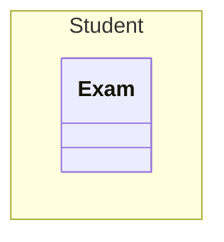

(Links:: [[Software Design]])
# Object Diagrams
- A class is a *construction plan* for a set of similar objects, i.e. objects are instances of classes
- Attributes: different value for each instance (= object)
- Operations: identical for all objects of a class
  -> not depicted in object diagram

![[UML object.png|500]]
- Object diagram:
	- Objects of a system and their relationships
	- **Snapshots of the system at a specific moment in time**

# Package Diagrams
- How to organize your classes?
- Many programming languages have *namespaces*, i.e., containers for higher-level structuring
- Java has *packages*: corresponding to file system directories
- UML provides **package diagrams**: display packages that group model elements, e.g., classes, states, other packages, etc.
- Can be used for grouping various models or model elements

## How we use package diagrams
- For modeling the package structure of our Java programs, similar to *modules* -> units of implementation
- *Descriptive* usage: design and document the higher-level structure for human consumers, e.g., software engineers
- Serves as a first entry point to understand the major building blocks of the project -> quick overview
- Short textual description per package
- Including all classes might decrease readability
- Depending on # of classes: only include the most important ones or no classes at all

## Implementation
- Use `import` connectors to indicate that functionality is used in other packages
- `import` is possible for packages or individual classe
- Other connectors: `access`, `merge`, `use`
- Suggestion: focus on `import`, ignore the rest
- **Naming**:
	- Follow common Java naming conventions!
	- Only *lowercase letter and digits*
	- No spaces, no special characters like hyphens
	- Having no word separators encourages short names
## Approaches for packaging

| Package by Layer                                                                                                                                | Package by Feature                                                                       |
| ----------------------------------------------------------------------------------------------------------------------------------------------- | ---------------------------------------------------------------------------------------- |
| Organize packages according to the types of classes and the technical responsibility they have, e.g. UI, business logic, data presistence, etc. | Organize packages according to their domain-related functionality -> functional cohesion |
| Advantage: easy to understand, easy to navigate for small projects                                                                              | Advantage: very good at isolating change                                                 |
| Disadvantage: not good at isolating change                                                                                                      | Disadvantage: only easy to navigate if you know the domain well                          |

**Strongly advised for larger projects!**

---
References:
[[02_5_object_and_package_diagrams.pdf]]