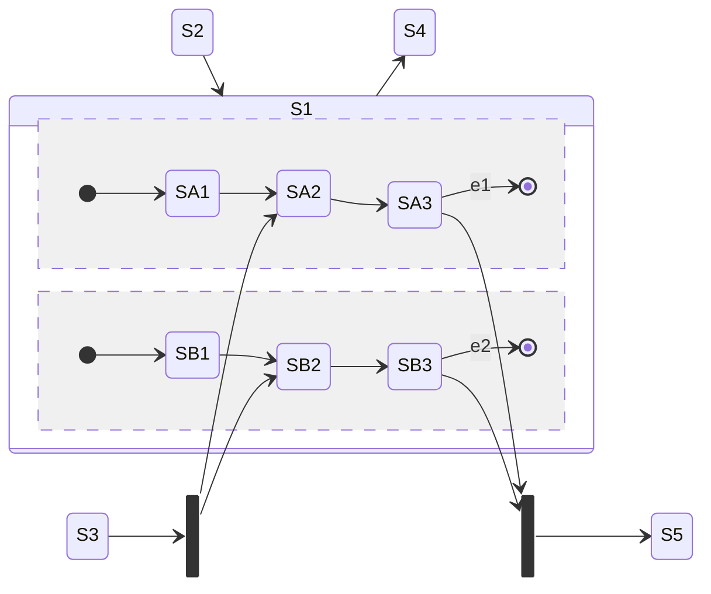

(Links:: [[Software Design]])

> [!summary]
> - Design principles:
> 	- SRP
> 	- Encapsulation & Immutability
> 	- Avoid complexity
> - State machine used for modelling the **internal states** of objects in your system

# Basic
Objects can be in concrete states:
```java
public class Door {
	private int height = 0;
	private int width = 0;
	private Color = Color.BLUE;
	private orientation = Orientation.SOUTWEST;
	private bool closed = false;
}
```
Objects can be in an *abstract state*:
- Arbitrarily-defined set of *logical* states
- Goal: to define the abstract state space of objects to better reason about the system and arrive at a suitable solution

- Every domain object has a **finite** set of states during its life
- State machines are used to 
	- reason about the *complexity* of the domain and the system
	- avoid overlooking important execution paths
- State machine diagrams
	- model the possible states of a system or object
	- show how state transitions occur as a consequence of events
	- show what behavior the system or object exhibits in each state

> [!example]- Lecture Hall
> ```mermaid
> stateDiagram-v2
	> free=true --> free=false : occupy()
	> free=false --> free=true : release()
> ```
> ```mermaid
> classDiagram
> 	class LectureHall {
> 		-free: boolean
> 		+occupy()
> 		+release()
> 	}
> ```
> ```java
> class LectureHall {
	> private boolean free;
> 
> 	public void occupy() {
> 		this.free = false;
> 	}
> 	public void release() {
> 		this.free = true;
> 	}
> }
> ```

## States
- nodes of the state machine
- When a state is active
	- The object is in the state
	- All **internal activities** specified in this state can be executed

Internal activities:
- entry / `<activity>` : Executed when the object enters the state
- exit / `<activity>` : Executed when the object leaves the state
- do / `<activity>` : Executed while the object remains in this state
## Transitions
Changing from one state to another
![[State machine transition.png|500]]
- Event(s) -> Trigger
	- Trigger a state transition
	- Can have parameters (like an operation)
- Guard -> Condition
	- Boolean expression to check if the event occurs
	- If the guard is `true`
		- All activities in the current state are terminated
		- All `exit` activities are executed
		- The transition takes place
	- If the guard is `false`, no transition happens (event is *discarded*)
- Activity -> Effect
	- Sequence of actions executed during the state transition

### Internal transition
![[34431.png\|200]]

If `event1` occurs 
- Object remains in `state1` 
- `Activity3` is executed

### External transition 
![[89604.png\|200]]

If `event1` occurs 
- Object leaves `state1` and `Activity2` is executed
- `Activity3` is executed
- Object (re-)enters `state1` and `Activity1` is executed
## Event
- Signal Event: Receipt of a signal
	- e.g. `rightMouseDown`, `sendSMS`
- Call Event: Operation call
	- e.g. `occupy(user, lectureHall)`, `register(exam)`
- Time Event: Time-based state transition
	- Relative: based on the time of the occurrence of the event
	  e.g. `after(5 seconds)`
	- Absolute: e.g. `when(time==16:00)`
- "Any receive" Event: Occurs when any event occurs that does not trigger another transition from the active state
	- Keyword `all` ![[1904.png|200]]
- Completion Event: Generated automatically when everything to be done in the current state is completed (it is implicit)
- Change Event: Permanently checking whether a condition becomes true 
  e.g. `when(x>y)`
## Initial State
- Start of a state machine diagram
- Pseudo state
	- Transient, i.e., system cannot remain in that state
	- Rather a control structure than a real state
- No incoming edges
- If $>1$ outgoing edges: Guards must be mutually exclusive and cover all possible cases to ensure that exactly one target state is reached
- If initial state becomes active, the object immediately switches to the next state: No events allowed on the outgoing edges
## Final State and Terminate node
Final state
- Real state
- Marks the end of the sequence of states
- Object can remain in a final state forever

Terminate node
- Pseudo state
- Terminates the state machine
- The modelled object ceases to exist (is deleted)
## Decision node
- Pseudo state
- Used to model alternative transitions

![[31340.png|500]]

# Advanced
## Composite State
- Contains other states called "substates"
	- Only one of its substates is active at any point in time
- Arbitrary nesting depth of substates allowed (but be careful)

![[96058.png|500]]

- Transition to the boundary to enter composite state
	- Initial node of composite state is activated
- Transition to substate
	- Substate is activated

- Exit from composite state by transitioning from 
	- a substate
	- the composite state
	- composite state from completion
## Parallelization and Synchronization node
- Parallelization Node
	- Pseudo state
	- **Splits** the control flow into multiple concurrent flows
	- 1 incoming edge and at least 2 outgoing edges
- Synchronization node
	- Pseudo state
	- **Merges** multiple concurrent flows
	- At least 2 incoming edges and 1 outgoing edge
## Orthogonal state
- Composite state is divided into two or more **regions** separated by a dashed line
- One state of each region is always active at any point in time, i.e. **concurrent substates**


## Submachine state
- Helpful for reusing parts of state machine diagrams in other state machine diagrams
- Notation: `stateName: submahcineStateName`
- As soon as the submachine state is activated, the behavior of the submachine is executed
- Similar to calling a black-box method in Java

---
References: