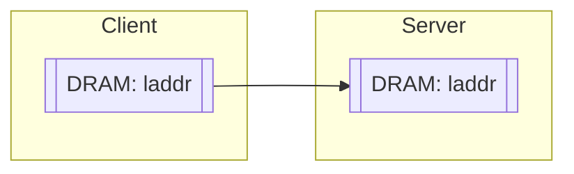

(Links:: [[Advanced Network Programming]])
The bottleneck of networking performance shifted over time from the bandwidth of the network, to the latency (the time it takes to send and receive packages). 
![[network performance bottlenecks.png|500]]

> [!question] Is latency an important factor?
> - The fan-in and fan-out effect (Micro-services)
> 	- Many web-scale, inside data center workloads touch hundreds of machines for processing a request
> 	- Latency critical processing at each step
> - Latency sensitive workloads
> 	- Big data processing, graph processing, streaming
> 	- Hundreds/Thousands of servers need to coordinate and work in union to solve a problem
> - Scientific workloads
> 	- High performance computing: Weather simulation, genomics, personalized medicine, computational chemistry
> 	- Small calculates + data access

# URL parsing...
A parser analyzes a given input (usually chars) to determine if it follows the (formal) **grammatical rules** of a **language syntax**. It breaks down the input into a **data structure**, (often an abstract syntax tree - AST), which is then used for further processing, such as compilation, interpretation, or data processing.
![[URL parsing.png|500]]
For HTTP servers, it is a huge bottleneck to process the requests and forward them based on the rules. [People are working on this as we speak](https://arxiv.org/abs/2311.10533).
[Ada](https://ada-url.github.io/ada/) is URL parser which uses SIMD (performs operations on special vector registers which contain multiple values) and branchless code (to reduce branch prediction of the CPU).
## SIMD
[PrefixSum](https://en.wikipedia.org/wiki/Prefix_sum) in C using SIMD:
```c
#include <x86intrin.h>

__m128i PrefixSum(__m128i curr) {
	__m128i Add = _mm_slli_si128(curr, 4);
	curr = _mm_add_epi32(curr, Add);  
	Add = _mm_slli_si128(curr, 8);  
	return _mm_add_epi32(curr, Add);
}
```
![[PrefixSum SIMD.png|500]]

![[Pasted image 20241022184432.png]]
![[Pasted image 20241022184441.png]]
![[Pasted image 20241022184449.png]]
![[Pasted image 20241022184458.png]]

After parsing the URL, the server has to parse in the HTTP (header), or JSON data. Apache Fury is a blazing-fast cross-language serialization framework powered by just-in-time compilation. SIMD can also be used to do [JSON parsing](https://arxiv.org/abs/1902.08318).
> [!question] Are there alternatives to JSON?
> Flatbuffers, Cap'n proto, protobuf...
> These data formats are binary optimized so that not every value in the data has to be read to get the important information.

Another way of improving parsing was to use [[Hardware Challenges & Opportunities#Scatter-Gather I/O capabilities|Scatter Gather]] to improve serialization: [Cornflakes: Zero-Copy Serialization for Microsecond-Scale Networking](https://sing.stanford.edu/site/publications/cornflakes-sosp23.pdf)
Data allocated in the application layer is injected into the NIC:
![[Cornflakes.png|500]]
Scatter Gather however does not prove to be better in all applications, thus cornflakes uses a hybrid model of scatter gather and copying.
![[copy vs scatter gather.png|500]]
# RDMA (Remote DMA)
- It is a networking “technology” to enable high-performance, low-latency network operations
- **It is not socket** - has its own programming API and abstractions
	- We have seen so far: there is a difference between the network protocol (e.g., TCP) and the programming API (e.g., sockets, mTCP, MegaPipe)  
- Very successful, has a long history with research in supercomputers
	- The goal: make network operations ~= local compute operations  
- Since early ~2010, when a need for radical improvements in latency were needed, mainstream/cloud computing picked it up  
	- Data centers were expanding, data was increasing, and we needed low latencies

1. Uses User-space networking: Let the process manage its networking resources
2. Kernel Bypass: Access hardware/NIC resources directly from the user-space
![[RDMA.png|400]]
Instead of using the socket approach, we make **control** and **data** operations explicit by separating the data from the control abstractions (needs new interfaces).
## Queue Pairs
- QPs are interfaces between the application and the (RDMA) NIC
- Different types:
     - Connection-oriented vs Datagram
    - Reliable vs unreliable
- Reliable Connected (RQ) QPs
    - Analogous to a TCP connection
    - Support all types of operations

## Connection Establishment
![[Connection Establishment RDMA.png]]

We first have to do ==memory registration== for any buffer on which we have to do I/O
- The RDMA NIC *remembers* the address and length of such buffers, and returns an **identifier**. This identifier can be used multiple times, no need to program NIC multiple times for DMA.
- This is different from normal NIC/DMA where NIC does not remember the buffer
## Work Request (WR)
- Application issues a Work request for a QP
- WR contains all metadata associated with a message transfer
- The WR gets stored as a Work Request Element in the QP's send queue
- Multiple Work Queue Elements (WQE) can be queued up in the send queue
- The RDMA NIC processes them in order

![[Work Request RDMA.png|400]]

1. Allocate memory buffers: Checks, page table translations, and pin pages
2. Allocate data and control queues: Checks and memory-mapped I/O
3. Recv a message: Memory-mapped writing of `recv` request
4. Get completion notification:
	1. Network processing
	2. DMA to the buffer `c`
	3. Notification to application
5. Close
![[User-Space Networking RDMA.png]]
## RMDA operations
1. **RDMA Write**: write data from local node to specified location at remote node
2. **RDMA Read**: Read data from specified location at remote node to local node
3. **RDMA Atomic**: Fetch-and-add and Compare-and-swap operations at specified location at remote node (atomic semantics)
4. **Send/Receive**: Send/Receive data to/from a remote node

> [!example] RDMA Write Operation
> WR/WQE metadata: local source virtual addr, local key, data length, remote sink virtual addr, remote key
> ![[RDMA Write Operation.png|500]]

> [!example] RDMA Read Operation
> WR/WQE metadata: local sink virtual addr, local key, data length, remote source virtual addr, remote key
> ![[RDMA Read Operation.png|500]]
## Architectural View

- local buffer address `laddr` passed in `send()` and `recv()`
- buffer allocation and registration with the network card

![[RDMA Architectural View.png]]
1. Client: READ remote memory address (raddr) to local address (laddr)
2. Client: posts READ request 1
3. Server: read local (raddr) - local DMA operation
4. Server: TX data back to client NIC
5. Client: local DMA to (laddr) buffer in DRAM
6. Client: interrupt the local CPU/OS to notify completion about the client’s READ operation
- **No CPU/SW involved**

> [!summary] So, this is RDMA
> - **It is very powerful idea** - no remote application/OS/CPU involvement in data transfer
> - Once you have capability to access remote memory from network you can imagine doing a lot of things without having to worry about if the remote application is ready to send or receive
> - **Program distributed systems as a single computer!**
> - Different types of operations: READ, WRITE, ATOMICS (update, CAS), even transactions (!)
> - Not limited just to system DRAM, think of DRAM in the GPU or even directly storage (hint: it’s possible)
> 	- https://developer.nvidia.com/gpudirect

> [!example] Where to use RDMA
> **Data-Center Environment/Rack-scale computing**:
> -  Shared memory
> -  Key-Value stores
> -  Caches
> -  RPCs
> -  Sync/locking
> -  File systems
> -  Services

> [!question] What should be the **work division** between
> 1. Applications: Easy of APIs and abstractions, support, and expressiveness
> 2. OS Kernel: Generability, multi-tenancy, hardware utilization
> 3. NIC: hardware complexity, cost, on-chip resources, time for development
> 
> It is **always changing** dictated by the current
> - application needs (latency, bandwidth, packets/sec)
> - hardware trends (power balance between devices and CPU)
> - interplay between OS and hardware
## Timeline
Two-sided message exchange between processes: 
![[Timeline of a send,recv exchange.png|500]]
Remember: all this interaction is directly between application and the NIC hardware
## The Idea of Remote Direct Memory Access

- Imagine, if all buffers are known up front to everyone in a cluster / data center
- A client/peer can initiate a network transfer by itself
	- “One-sided” operations (instead of two-sided where 2 peers are involved)
- An RDMA WRITE specifies:
    - Which local/client buffer data should be read from
    - Which remote/server buffer data should be written to
- An RDMA READ specifies:
    - Which remote/server buffer data should be read from
    - Which local/client buffer data should be written into

---
References: