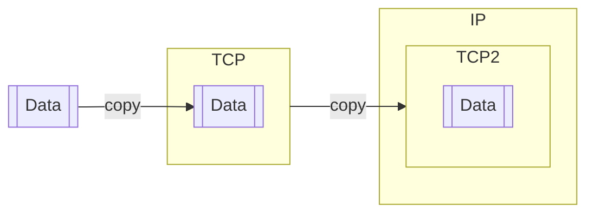

(Links:: [[Advanced Network Programming]])
# Building Packets
Typically you tell the NIC, please transmit data from `(address, length)`. The problem with this is it *needs that data in contiguous physical memory*. Data from the user is stored in memory
```c
void * addr1 = kalloc(data_size);
```
In order to store TCP, IP and ETH header we need to allocate more memory and copy. Repeat this for all other headers.
```c
void * addr2 = kalloc(data_size + TCP_header);
memcpy(addr2, addr1, data_size);
```



> [!warning]
> - Lots of data copies (you can program [[DMA]] for each segment, but defeats the purpose of DMA to have les sCPU interaction in data movement)
> - CPU occupied, and waste of CPU
> - Poor performance (more copies => low bandwidth, high latency, low ops/secs)

## Scatter-Gather I/O capabilities
Instead of one address, one length, pass a list of addresses and length to the DAM engine. In the end, all the data (that could be at random locations) is gathered by the DMA into one place at **once**. 
![[Scatter-Gather.png|500]]
## TCP packet segmentation
When moving away work from the CPU to devices (like the NIC for packet segmentation) it is called **Offloading** (the other way around is called **Onloading**). This is known as **TCP Segmentation Offloading** (TSO).
### Large Receive Offload (LRO)
There are different places you can do aggregation, ex: In the device driver (pure software, no hardware support needed). LRO is TCP/IPv4 specific and quite lenient in merging packets (issues in bridging and/or forwarding setups). [Generic Receive Offload](https://lwn.net/Articles/358910/) (GRO) is more restrictive and supports multiple protocols (is the preferred way of doing packet merging).

The advantage of this, is that less interrupts occur -> there are less hardware/software interactions with the kernel, and more is done directly in hardware.


> [!summary]
> We have seen that a NIC can 
> - transmit and receive link layer packets
> - supports doing DMA
> - supports doing scatter-gather DMA operations
> 
> We can also offload (more from the CPU to the NIC)
> - doing TCP segmentation and generate MTU sized packets
> - generating checksum
> - LRO and GRO

## Pushing to the Extreme: TCP Offload
You make ask, "Why not push to the extreme and put everything in the NIC?". This is possible, and it's called **TCP offloading**. 

> [!error] [Bad idea](https://www.usenix.org/legacy/events/hotos03/tech/full_papers/mogul/mogul.pdf)
> - It was shown that TCO processing is cheap
> - Moore's law was working against making smart, intelligent NICs
> - there were many open questions how and would to offload
> - most of the previously discussed techniques are very effective: TSO, LRO, checksum offloading, etc.

Since networking and computational performance were ever increasing, people started to look into the performance issues that TCP might bring: [An Analysis of TCP Processing Overheads](https://groups.csail.mit.edu/ana/Publications/PubPDFs/An%20Analysis%20of%20TCP%20Processing%20Overhead.pdf)
The findings show "code necessary to implement TPC **was not the major limitation** to overall performance", but more so "the throughput is close to being limited by **the memory bandwidth** of the system".
- Other parts of the OS had larger overheads than TCP
- Buffer management, process coordination, signaling, interrupts -> none of them will improve with a [TOE](https://www.wikiwand.com/en/articles/TCP_offload_engine)
## Stateless and Stateful Offloading
- **Stateless Offloading**: there is no (or limited) state that a processing element needs to remember, each packet can be processed independently (self contained)
	- Checksum offloading, TSO (LRO, GRO offloading)
	- Stateless offloading in hardware (or in driver software also possible)
	- Often is a performance optimization, that a correctness issue
- **Stateful Offloading**: What you do with the current packet depends upon some state that needs to be maintained. For example, TCP offloading means maintaining the TCP state machine in the hardware...
	- Correctness issue

> [!important] Key difference to understand
> There is a difference between: 
> 1. The basic **TCP protocol** as specified in the RFC 793
> 2. The BSD **socket implementation** and associated semantics
> 	- At no point in time while using socket you need know if you are using TCP
> 
> Unfortunately the way currently things are implemented: sockets and TCP semantics are kind of interlinked together, **but they don't have to be!**

## Overhead
| Per-packet operations                                                | Per-byte operations                                              |
| -------------------------------------------------------------------- | ---------------------------------------------------------------- |
| Generation of TCP / IP packets                                       | Data copies                                                      |
| Allocation of SKB structure                                          | Checksum generation                                              |
| TPC state machine transition                                         | DMA                                                              |
| ACK generation                                                       | IPSec (encryption/decryption)                                    |
| Queue management                                                     | zero-memory cleaning                                             |
| **Cost increases with the number of packets**: $O(\text{\#packets})$ | **Cost increases with the number of bytes**: $O(\text{\#bytes})$ |

> [!important] Key message here is
> Networking does not happen in isolation, you need to consider everything it is built upon, otherwise you may encounter bottlenecks!
> - **Memory management**: SKB, rx/tx queues, user buffers
> - **Scheduling**: softirq, kthreads, user threads
> - **Device Management**: NAPI, ethtool, MTU management
> - **Architectural implications**: DMA, alignment, system calls, interrupts
> - ... and everything happening inside an operating system
> - ... and everything happening in user space!
> 
> Sending and receiving data may have parameters that can be set and optimized for application's needs, check the man pages


# Three Phases of Evolution
1. When Moore's Law was in full effect (pre 2005)
	1. CPU was faster than the network
	2. Can (mostly) cope up with the demands of commodity network processing
	3. CPU performance doubled every ~18 months
2. When frequency scaling slowed down, manycore era (2005-2015)
	1. Ethernet continued to improve
	2. Innovation in the networking stack: *interrupt management* *stateless offloading* (all beneficial for a single core, single connection processing!)
	3. **Many core scalability efforts**
3. Now CPU performance is not increasing dramatically
	1. Performance delivery by specialization: hardware and software (SmartNICs and offloads)

# Network Concurrency
> [!warning] Manycore Network Scalability
> - **Synchronization**: all of them can read and write the same data structure concurrently
> 	- Yes, you can take locks, mutexes, but then you stall the other core
> - **Cache pollution**: A poorly designed data structure can lead to what is known as 
> 	- Cache line ping-pong
> 	- shared cache pollution
>
>   Need a careful data layout and alignment

> [!example]-
> ![[46575.png|500]]
> ![[Pasted image 20241019183906.png|500]]
> ![[Pasted image 20241019183934.png|500]]
> ![[20822.png|500]]
> ![[Pasted image 20241019184003.png|500]]

To increase multicore networking performance, we need to 
- Minimize synchronization
- Minimize cache pollution
- Minimize shared data structures

When a NIC receives or sends packets, it sends an interrupt. Typically, cpu0 is what get all the interrupts, because
- the basic assumption is that it is the CPU core that is always on
- easy to configure
- in booting cpu0 comes up first and bring other cores up

To fix this, there is **interrupt balancing**. Linux has a framework called `irqbalance`. It tries to distrbiture interrupt load accross CPU cores, you can configure it to: 
1. Balance interrupt once or periodically (static vs dynamic)
2. Tell which interrupts should go to which CPU (affinity)
3. Tell which CPUs should not handle which interrupts (affinity)
4. Which interrupts should not be balanced (manual pinning)

For every interrupt there is a file: `/proc/irq/irq_number/smp_affinity` that shows the CPU bitmask where interrupts can go. Ex: OxFF -> all CPUs can get interrupt, 0x11 -> only cpu 0 and 4 are allowed.

## What happens then?
Recall we talk about the rings (or queue) where the outgoing and incoming packets are queued while they wait for processing from the NIC
- Let's say we have mapped that all interrupts should go to all CPUs
- Now we have incoming packets

After getting interrupts all of them try to run the interrupt handler, and then? The ring data structure needs to be protected by locks. All CPUs trying to access the same data structure. Lots of lock contention -> Loss in performance.
The solution is **multi-queue NICs**
![[MultiQueue NICs]]

> [!caution] Even though 4 queues pairs for 4 CPUs are shown, in reality a NIC can have any number of TX and RX queues - 2, 4, 8, 16, os
> - Multiple CPUs can share TX and RX queue
> - Each queue (TX an RX) could work independently with their interrupts
> - Multiple TX queues might share RX queues **(n:m)** mapping

> [!question] How do we distribute the workload to the CPUs?
> # 1: Random assignment
> - Simple and easy to implement
> - Load balanced at the *packet-level*
> - Processing is distributed all over the place -> locking & poor cache management
> 
> **Not a connection based management** :( ([[Poor Cache Locality]])
> # 2: Receive Side Scaling (RSS)
> ![[70823.png|500]]
> - https://www.kernel.org/doc/Documentation/networking/scaling.txt
> - https://garycplin.blogspot.com/2017/06/linux-network-scaling-receives-packets.html
> 
> First execute a "hash" function over 4 values (`{src_ip, dest_ip, src_port, dest_port}`) to uniquely identify connection.
> The resulting hash value will be used as the number of the CPU or queue number.
> ## Advantages
> - Early decision on which CPU processing should be in hardware - early multiplexing
> - Typically that CPU will have all the other data associated with that connection in the cache as well - cache locality <- **very important**
> - That CPU also knows that no other CPU can process packets for this connection - hence, no need to take locks
> - Generally, good performance
> # 3: Receive Packet Steering (RPS)
> ![[43117.png|500]]
> RSS but in software: 
> 1. It can be used with any NIC
> 2. Software filters can easily be added to hash over new protocols
> 3. Does not increase the interrupt rate

There is however another issue: what about application processing? Applications can be scheduled on any core where they call `recv()`. They can be moved around as well.

> [!question] How to make sure packet processing respects *application locality*
> The solution is **Receive Flow Steering** (RFS). The scheduler looks up (with help of a flow lookup table) which core to schedule data processing on, to match the application to the CPU core.
> ![[47326.png|500]]
> RFS can be implemented in software or hardware (if appropriate NIC supported is there)

## XPS: Transmit Packet Steering
A similar concern arises on the transmit side, which transmit queue to choose to transmit a packet, why?

- Often there are n:m mapping between RX queue and TX queues, it makes sense to pick the TX queue, where its associated RX queue is
- Data can be transmitted in softirq processing
- General optimization for caching locality

Conceptually it works the same as RPS with a lookup data structure

# Recap
1. What are Scatter/Gather and offloading in a NIC
2. What is interrupt load balancing
3. How do you find which interrupt(s) a device is using and which CPU core(s) is servicing that interrupt(s)
4. How to map an interrupt to a single/multiple CPU cores
5. What is a multi-queue NIC, what does it help with concurrency
6. What are [[RSS, RPS, RFS, and XFS]] - and what is the difference between them?


---
References: