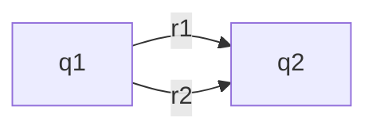
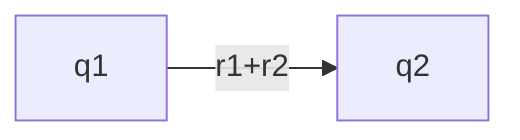
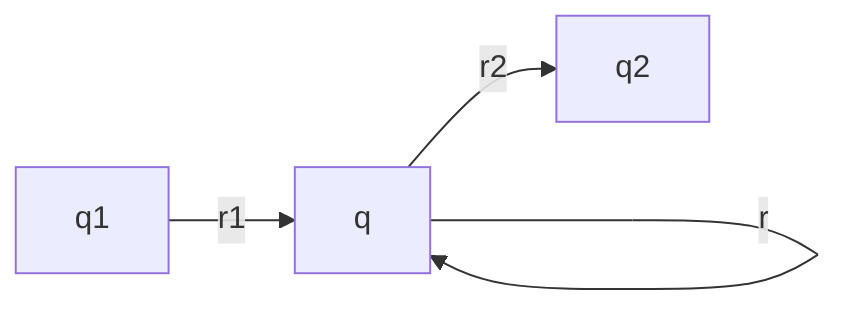
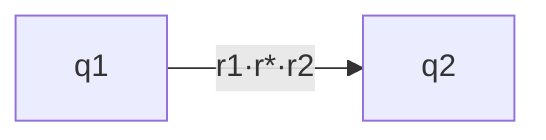

(Links:: [[Automata and Complexity]])
> [!info] Regular Expression
> We define the regular expressions over an alphabet $\Sigma$:
> - $\emptyset$ is a regular expression
> - $\lambda$ is a regular expression
> - $a$ is a regular expression for every $a \in \Sigma$
> - $r_{1}+r_{2}$ is a regular expression for all regular expr. $r_{1}$ and $r_{2}$
> - $r_{1}\cdot r_{2}$ is a regular expression for all regular expr. $r_{1}$ and $r_{2}$
> - $r^{*}$ is a regular expression for all regular expressions $r$

- Every regular expression $r$ defines a language $L(r)$
- A language $L$ is regular $\iff$ there is a regular expression $r$ with $L(r)=L$

### Construction: Regular expression -> NFA
We construct $M$ by induction (recursion) on $r$:
![[Pasted image 20250317113743.png|500]]

[!info]+ Construction regular expression from NFA
1. Transform $M$ such that there is precisely one initial and final state
2. Remove all double arrows (q1 can be equal to q2): 

<svg viewBox="0 0 200 170" width="100%" height="170" xmlns="http://www.w3.org/2000/svg">
	<circle cx="27" cy="75" r="20" style="fill:var(--color-blue);fill-opacity:0.5;stroke:var(--text-normal)"></circle>
    <text x="20" y="80" font-size="20" font-family="Arial" fill="var(--text-normal)">q<tspan font-size="10" baseline-shift="sub">2</tspan> </text>
    <text x="180" y="80" font-size="20" font-family="Arial" fill="var(--text-normal)">q<tspan font-size="10" baseline-shift="sub">1</tspan></text>
    <text x="100" y="45" font-size="20" font-family="Arial" fill="var(--text-normal)">r<tspan font-size="10" baseline-shift="sub">1</tspan></text>
    <text x="100" y="115" font-size="20" font-family="Arial" fill="var(--text-normal)">r<tspan font-size="10" baseline-shift="sub">2</tspan></text>
	<defs>
	    <marker id="arrow" markerWidth="10" markerHeight="10" refX="5" refY="5" orient="auto">  
		    <path d="M 0 0 L 10 5 L 0 10 z" fill="black" />  
	    </marker>  
	</defs>
	<path d="m 45 65 q 60 -20 120 0" marker-end='url(#arrow)' fill="none" stroke="var(--text-normal)"/>
	<path d="m 45 85 q 60 20 120 0" marker-end='url(#arrow)' fill="none" stroke="var(--text-normal)"/>
</svg>

1. Pick one state $q$ that is neither a starting nor final state. We remove $q$ as follows:

*Repeat* step 2 and 3 until there is nothing to be done.
1. If $F\neq \{q_{0}\}$, then the transition graph is finally of the form
   If an arrow $r_{i}$ with $1\leq i \leq 4$ does not exist, let $r_{i}=\emptyset$. Then the regular expression is: $$L(r_{1}^{*}\cdot r_{2}\cdot (r_{4}+r_{3}\cdot r_{1}^{*}\cdot r_{2})^{*})=L(M)$$
# Matching
- **String Matching problem**: For an input word $u$ and regular expression $r$ does $u$ contain a subword in $L(r)$?

1. Transform the regular expression $\Sigma^{*} \cdot r$ into an NFA
2. Compute *'on-the-fly'* path of $u$ in the corresponding DFA
3. Terminate as soon as a final state is reached

- Worst-case time complexity: $O(\lvert r\rvert \cdot \lvert u \rvert)$

---
References: