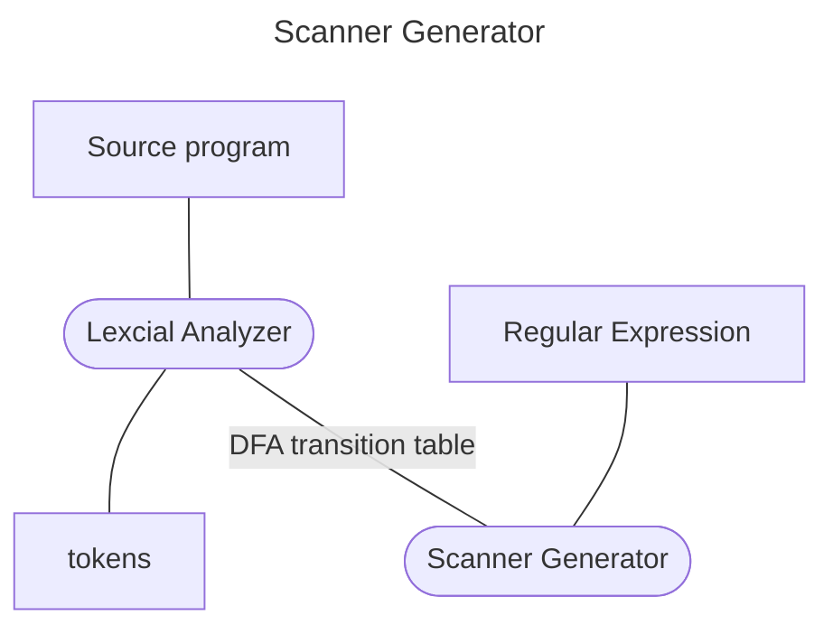

(Links:: [[Compiler Construction]])

As a compiler, we want to be able to interpret the meaning of a sentence. To do this, we create an [[Abstract Syntax Tree]] (ASL). For this we need a fixed set of rules which we look at now.
**Languages**: 
- contains a fixed finite *alphabet*: $\Sigma$
  Ex. `{"a", "b"}`
- finite length sentences (or strings) over $\Sigma$: $\Sigma^{*}$
- possibly infinitely many strings
- *Examples*: 
	- Natural numbers: $\{0,1,...,10,11,...\}$
	- English language
	- All strings over the alphabet $\{a,b\}$ ending in a single 'b': $\{\text{ab},\text{aab},\text{aaab},...\}$
	- All well-formed C programs
**Grammars**:
- Describe how languages can be formed based on well-defined rules

# Context Free Grammar
- A context-free grammar is a notation for *describing* languages
- Useful for nested structures, e.g., parentheses in programming languages
- **Non-terminals**: Language components (A,B,C)
- **Terminals**: Symbols in language $\Sigma$ (x,y,z)
	- Empty sequence (string): $\varepsilon$
- Strings of grammar symbols (Sometimes we use Greek letters)
- **Start Symbol**: Special nonterminal and LHS of first production ($S$)
- **Productions** of the form LHS -> RHS
	- LHS = a single nonterminal
	- RHS = a string of terminals and non-terminals

> [!example]- CFG
> Grammar for balanced-parentheses language:
> 1. S -> { S } S
> 2. S -> $\varepsilon$
> 
> - 1 nonterminal: $S$
> - 2 terminals "{" and "}"
> - Start symbol: $S$
> - 2 productions
> - If a grammar accepts a string, there is a derivation of that string using the productions
## Derivation
- A *derivation* is a sequence of *replacements* using productions
- A *sentential form* is a string derived from the start symbol
- A sentence is a sentential form that consists of only *terminal* symbols.
- The language of a grammar $L(G)$ is the set of all sentences derived from $S$ via production rules
- A *leftmost derivation* always replaces the leftmost non-terminal

> [!example]- Simple Arithmetic Grammar
> **Production rules**:
> 1. Exp -> "(" Exp Op Exp ")"
> 2. Exp -> "1"
> 3. Op -> "+"
> 4. Op -> "*"
> 
> In this case `Exp` an `Op` are non-terminals, and the language consists of `{(,),1,*,+}`. Our start symbol is `Exp`
> 
> > [!question]- Find a derivation of the sentence (1*(1+1))
> > 1. Exp
> > 2. "(" Exp Op Exp ")"
> > 3. "(" "1" Op Exp ")"
> > 4. "(" "1" "*" Exp ")"
> > 5. "(" "1" "*" "(" Exp Op Exp ")" ")" (using 1.)
> > 6. "(" "1" "*" "(" "1" Op Exp ")" ")"
> > 7. "(" "1" "*" "(" "1" "+" Exp ")" ")"
> > 8. "(" "1" "*" "(" "1" "+" "1" ")" ")"
> > 
> > -> ( 1 * ( 1 + 1 ) )

In context-free grammars, when there are multiple productions with the same LHS we can use shorthand notation: `S -> a S a | T` where `|` indicates multiple productions.

> [!info] Properties of Grammars
> - Left- and right-recursive production (where $\alpha$ is a string of terminals and\or non-terminals)
> 	- $N\to N\alpha$
> 	- $N\to \alpha N$
> - Nullable symbol: $N ^{*}\to \varepsilon$
> - Useless symbol never produces a string of only terminal symbols: $\text{Exp} \to \text{'+' Exp } | \text{ '-' Exp}$
> - **Ambiguous grammar**: Has two parse trees for same string
# Recognizer
- Given a string $\xi$ and a grammar $G$ the recognizer will return "yes" if $\xi \in L(G)$ (usually also want to answer "no" if $\xi \notin L(G)$)
- **Scanner**:
	- Recognizer to identify the symbols or tokens in input
	- Uses a Regular Language defined by regular expressions
- **Parser**:
	- Recognizer to identify sentences (strings of tokens) in the input
	- Uses a context-free grammar defined by context-free rules
	- **Lexer**:
		- removes whitespace/comments
		- transform into a sequence of *tokens*



> [!example]- Lexer
> ```
> int num_lines = 0, num_chars = 0;
> 
> %% 
> \n   ++num_lines; ++num_chars;
> .    ++num_chars;
> 
> %% 
> main()
> 	{  
> 	yylex();  
> 	printf( "# of lines = %d, # of chars = %d\n",
> 		num_lines, num_chars );
> 	}
> ```
> - Counts the number of characters and the number of lines in its input
> - The first line declares two globals, "num_lines" and "num_chars" which are accessible both inside `yylex()` and in the `main()` routine declared after the second "`%%`".
> - There are two rules, one which matches a newline ("\n") and increments both the line count and the character count, and one which matches any character other than a newline (indicated by the "." regular expression).

Scanners can encounter **errors** for example `X=900n;`. In such cases the scanner can either try to recover by *skipping* unaccepted characters or even try to *correct* it. 
## Lexical analyzers/scanners vs acceptors
Lexical analyzers are basically acceptors that
- Have multiple Regular Expression descriptions for multiple tokens
- Return a sequence of matching tokens as output (or an error)
- Always return the longest matching token
- For multiple longest matching tokens, use rule priorities

![[Syntax Analysis Diagram.canvas]]
## Syntax Analysis
**Goal**: determine if the input token stream satisfies the syntax of the program
What we need for syntax analysis:
- An expressive way to describe the syntax
- An acceptor mechanism that determines if the input token stream satisfies that syntax description

For lexical analysis:
- Regular expressions describe tokens
- Finite automata = acceptors for regular expressions

But this is not enough for syntax analysis (e.g., check for balanced parentheses)
> [!example]-
> ```c
> {
> 	if (b == (0)) a = b;
> 	while (a != 1) {
> 		stdio.print(a);
> 		a = a - 1;
> 	}
> }
> ```
> ```mermaid
> flowchart TD
> 	a[block] --- b[if_stmt]
> 	a --- c[while_stmt]
> 	b --- d[== ]
> 	b --- e[...]
> 	d --- f[variable] --- g[b]
> 	d --- h[constant] --- i[0]
> 	c --- j[!=]
> 	j --- k[variable] --- l[a]
> 	j --- m[constant] --- n[1]
> 	c --- o[block]
> 	o --- p[expr_stmt]
> 	o --- q[...]
> 	p --- r[call]
> 	r --- s[.]
> 	s --- t[stdio]
> 	s --- u[print]
> 	r --- v[variable] --- w[a]
> ```

---
References: