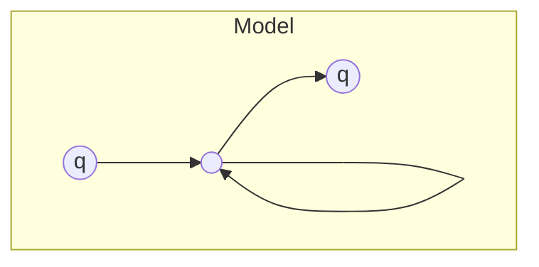
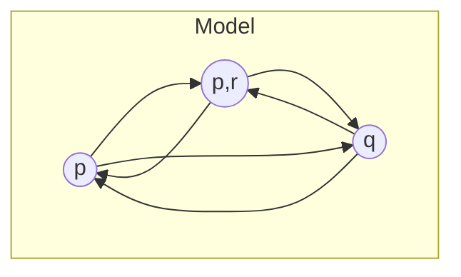
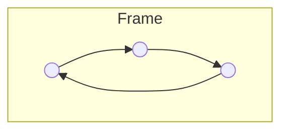
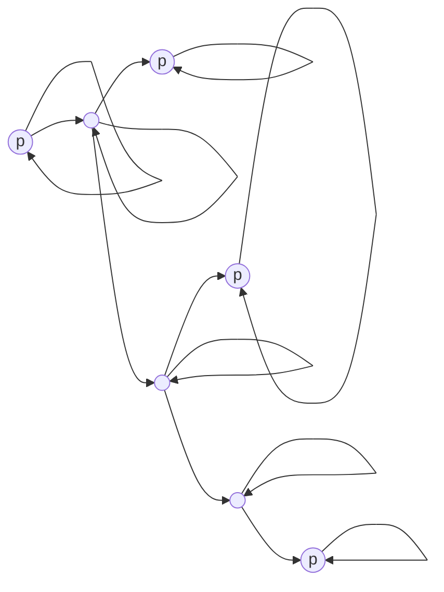

(Links:: [[Logic and Modelling]])
# Introduction

$$L(w_{1})=\{\,q\,\}$$
$$L(w_{2})=\{\,q\,\}$$
$$L(w_{3})=\{\,\,\}$$
$$\begin{align}w_{2} & \Vdash \square\diamond\, q \\
w_{3} & \Vdash q \to \square \diamond \,q \\
w_{2} & \Vdash q \\
w_{3} & \Vdash \diamond\, q \\
w_{1} & \Vdash \square\diamond\, q \\
\mathcal{M}_{1} & \vDash q \to \square\diamond\, q
\end{align}$$

> [!question]- Can you change the labeling such that $$\mathcal{M}\vDash q\to \square\diamond\, q$$ is no longer valid?
> Yes, for example, by setting $L(w_{2})=\{\;\}$

$$L(w_{1})=\{\,p\,\}$$
$$L(w_{2})=\{\,q\,\}$$
$$L(w_{3})=\{\,p,r\,\}$$
$$\begin{align}w_{1} & \Vdash \diamond\, q \\
w_{3} & \Vdash \diamond\, q \\
w_{2} & \Vdash \square\diamond\, q \\
\mathcal{M}_{3} & \vDash q \to \square\diamond\, q
\end{align}$$

> [!question]- Can you change the labeling such that $$\mathcal{M}\vDash q\to \square\diamond\, q$$ is no longer valid?
> No, that is not possible

Wherever you put the q's, $q\to \square\diamond\, q$ always holds! We can show this by checking one world ($w_{1}$), with and without $q$. 
1. Assume that $q\notin L_{?}(w_{1})$, then $$w_{1}\Vdash q\to \square\diamond \,q \quad \text{ since } \quad w_{1}\nVdash q$$
2. Assume that $q\in L_{?}(w_{1})$, then $$\begin{align}w_{1}\Vdash q\to \square\diamond \,q \quad & \text{ since } \quad w_{1}\nVdash q \\
   & \text{ since } \quad w_{2}\Vdash \diamond q \text{ and } w_{3}\Vdash \diamond q \\
   & \text{ since } \quad w_{1}\Vdash q
   \end{align}$$

Because of the arrow configuration (always back and forth), $q\to\square\diamond\, q$ is always valid wherever you put the q's.

# Frame
A frame is a [[Kripke Model]] without Labeling. A frame $\mathcal{F}=(W,R)$ consists of 
- $W$, the worlds
- $R$, the accessibility relation


- $W = \{\;w_{1},w_{2},w_{3}\;\}$
- $R = \{\langle w_{1},w_{2}\rangle, \langle w_{1},w_{3}\rangle, \langle w_{3},w_{2}\rangle\}$

A Kripke model $\mathcal{M}$ is a frame $\mathcal{F}=(W,R)$ plus a labeling $L$.
## Validity in Frames
A formula $\phi$ is **valid in frame** $\mathcal{F}=(W,R)$, denoted $$\mathcal{F}\vDash \phi,$$ if **for every labeling** $L$: $$\text{the Kripke model } \mathcal{M}=(W,R,L) \text{ makes $\phi$ true } (\mathcal{M}\vDash \phi)$$
We say that $\mathcal{M}$ is a Kripke model on $\mathcal{F}$.

> [!example]
> ```mermaid
> flowchart
> 	subgraph "Frame"
> 		 a(( )) --> b(( ))
> 		 b --> c(( ))
> 		 c --> a
> 	end
> ```
> - $W = \{\;w_{1},w_{2},w_{3}\;\}$
> - $R = \{\langle w_{1},w_{2}\rangle, \langle w_{1},w_{3}\rangle, \langle w_{3},w_{2}\rangle\}$
> $$\begin{align}
> \mathcal{F} & \vDash q\to \square\diamond\, q \\
> \mathcal{F} & \vDash p \lor \neg p \\
> \mathcal{F} & \nvDash \diamond\, p\to \square\, p \\
> \mathcal{F} & \vDash \square \, p\to \diamond\, p
> \end{align}$$
# Properties of Relations
> [!info] Properties of a relation $R$
> 
> |            |          |     |
> | ---------- | -------- | --- |
> | Reflexive  | $\forall x R(x,x)$                                                                    | $\square \, p\to p$     |
> | Symmetric  | $\forall x \forall y \bigl(R(x,y) \to R(y,x)\bigr)$                                   |  $p\to \square\diamond \,p$   |
> | Transitive | $\forall x \forall y \forall z \Bigl(\bigl(R(x,y) \to R(y,x)\bigr) \to R(x,z)\Bigr)$  | $\square \,p\to\square\square\, p$    |
> | Serial     | $\forall x\exists y R(x,y)$                                                           | $\diamond\, \top$    |
> | Functional | $\forall x \exists y \Bigl(R(x,y) \land \forall z \bigl(R(y,x) \to z = y\bigr)\Bigr)$ | $\square\, p\leftrightarrow \diamond \,p$    |

An [[Equivalence relations]] is a relation that is 
- reflexive,
- symmetric and
- transitive.

## Reflexive Frames: $\square\, p\to p$
> [!definition] Theorem
> $$\mathcal{F}\vDash \square\,p\to p\quad \Longleftrightarrow \quad \text{ the frame } \mathcal{F} \text{ is reflexive}$$
> > [!info] Proof
### A Kripke Model on a Reflexive Frame

$$\begin{align}
\mathcal{M} & =\langle W,R,L\rangle \\
\mathcal{M} & \vDash \square \,p \to p \\
\mathcal{M} & \vDash \square\diamond\, p
\end{align}$$
$$\begin{align}
\mathcal{F} & =\langle W,R\rangle \\
\mathcal{F} & \vDash \square \,p \to p \\
\mathcal{F} & \nvDash \square\diamond\, p
\end{align}$$
## Symmetric Frames: $q\to \square \diamond \, q$
We can now make precise why it is impossible to make $$q\to \square\diamond q$$ false on the frame $\mathcal{F}$. The reason is that $R$ is **symmetric**: $\forall x\forall y(R(x,y)\to R(y,x))$
> [!definition] Theorem
> $$\mathcal{F}\vDash q\to \square \diamond \, q\quad \Longleftrightarrow \quad \text{ the frame } \mathcal{F} \text{ is symmetric}$$
> > [!info] Proof


## Transitive Frames: $\diamond\diamond\,p\to\diamond\,p$
> [!definition] Theorem
> $$\mathcal{F}\vDash \diamond\diamond\,p\to \diamond\,p\quad\Longleftrightarrow\quad \text{ the frame } \mathcal{F} \text{ is transitive}$$
> > [!info] Proof $\Leftarrow$
> 
> > [!info] Proof $\Rightarrow$
## Correspondence of Formulas and Frame Properties
We now know that the formula $$\square\, p\to p$$ is valid **precisely** on the reflexive frames: $$\mathcal{F} \vDash \square\, p\to p \quad\Longleftrightarrow \quad \mathcal{F}\text{ is reflexive}$$
We say that the formula $\square\, p\to p$ corresponds with the frame property **reflexivity**. In general:
> [!info] A modal formula $\phi$ **corresponds** with a frame property $E$ if: $$\mathcal{F}\vDash\phi \quad\Longleftrightarrow\quad \mathcal{F} \text{ has property } E$$

---
References: