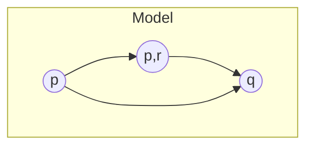

(Links:: [[Logic and Modelling]])
In propositional logic and predicate logic, the **world is static**.

Modal logic allows us to reason about dynamics:
- possible futures,
- knowledge and beliefs,
- different locations/worlds (with different properties),...

Modal logic introduces **modalities**

| box $\color{red}{\square}$ | diamond $\color{green}{\diamond}$ |
| -------------------------- | --------------------------------- |
| necessary                  | possibly                          |
| always                     | sometimes                         |
| has to be                  | maybe                             |
| knows                      | believes is possible              |
| guaranteed result          | possible result                   |

Modal logic extends propositional logic with $\color{red}{\square}$ and $\color{green}{\diamond}$ as unary (having one argument) connectives. They both have the same binding strength as $\neg$.

# Kripke Models
A **Kripke model** $\mathcal{M}=(W,R,L)$ consists of
- $W$, the *worlds*
- $R$, the *accessibility relation*
- $\color{green}{L}$, the *labeling function*


Formally:
- $W=\{w_{1},w_{2},w_{3}\}$
- $R=\{\langle w_{1},w_{2}\rangle, \langle w_{1},w_{3}\rangle, \langle w_{3},w_{2}\rangle\}$
- $L(w_{1})=\{\,p\,\}\quad L(w_{2})=\{\, q\,\}\quad L(w_{3})=\{\, p,r\,\}$

The notation $$\mathcal{M},w\Vdash \phi$$ means: formula $\phi$ is true in the world $w$ of Kripke model $\mathcal{M}$. It is often abbreviated as $$w\Vdash \phi$$ if the Kripke model $\mathcal{M}$ is clear from the context. The **labelling function** $\color{green}{L}$ tells which propositional letters are true in which world: $$w\Vdash p\Longleftrightarrow p\in L(w)$$ $L(w)$ are the propositional letters that are true in world $w$.

> [!example]-
> ```mermaid
> flowchart
> 	subgraph "Model"
> 		a((p)) --> b((p,r))
> 		b --> c((q))
> 		a --> c
> 	end
> ```
> $$L(w_{1})=\{\,p\,\}$$
> $$L(w_{2})=\{\,q\,\}$$
> $$L(w_{3})=\{\,p,r\,\}$$
> Hence 
> $$w_{1}\Vdash p\quad w_{2}\Vdash q\quad w_{3}\Vdash p\quad w_{3}\Vdash r\quad w_{3}\nVdash q$$

**Connectives** $\neg,\land,\lor,\to,\leftrightarrow$ behave as in propositional logic.
## Truth of Diamonds: $\diamond\, \phi$

The formula $\diamond\,\phi$ is true in world $w$ if there exists a world $w'$ such that $R(w,w')$ and $\phi$ is true in $w'$.

> [!example]+
> ```mermaid
> flowchart
> 	subgraph "Model"
> 		 a((p)) --> b((p,r))
> 		 b --> c((q))
> 		 a --> c
> 	end
> ```
> $$L(w_{1})=\{\,p\,\}$$
> $$L(w_{2})=\{\,q\,\}$$
> $$L(w_{3})=\{\,p,r\,\}$$
> $$w_{1}\Vdash \diamond\, p\qquad w_{3}\nVdash \diamond\, p\qquad w_{1}\Vdash \diamond\, q\qquad w_{3}\Vdash \diamond\, q$$
> - $w_{1}\Vdash \diamond\, q\quad$ since $R(w_{1},w_{2})$ and $w_{2}\Vdash q$
> - $w_{1}\Vdash \diamond\, p\quad$ since $R(w_{1},w_{3})$ and $w_{3}\Vdash p$
> - $w_{1}\Vdash \diamond\, p \land\diamond\, q\quad$ since $w_{1}\Vdash \diamond\, p$ and $w_{1}\Vdash \diamond\,q$
> - $w_{1}\nVdash \diamond\, (p\land q)\quad$ since there is no $w$ with $R(w_{1},w)$ and $w\Vdash p\land q$

## Truth of Boxes: $\square\,\phi$
The formula $\square\,\phi$ is true in world $w$ if $\phi$ is true in all worlds $w'$ with $R(w,w')$.

> [!example]+
> ```mermaid
> flowchart
> 	subgraph "Model"
> 		 a((p)) --> b((p,r))
> 		 b --> c((q))
> 		 a --> c
> 	end
> ```
> $$L(w_{1})=\{\,p\,\}$$
> $$L(w_{2})=\{\,q\,\}$$
> $$L(w_{3})=\{\,p,r\,\}$$
> $$w_{1}\nVdash \square\, p\qquad w_{1}\Vdash \square\, (q\lor r)\qquad w_{2}\Vdash \square\, \bot\qquad w_{3}\Vdash \square\, q$$
> - $w_{1}\nVdash \square\, q\qquad$ since $R(w_{1},w_{3})$ and $w_{3}\nVdash q$
> - $w_{1}\nVdash \square\, p\qquad$ since $R(w_{1},w_{2})$ and $w_{2}\nVdash p$
> - $w_{3}\Vdash \square\, q$
> - $w_{1}\Vdash \square\,(p\lor q)$
> - $w_{3}\nVdash \square\,(p\land q)$
> - $w_{3}\Vdash \square \,q\land p$
> - $w_{1}\Vdash p\land \diamond\, p\land \neg \square\, p$

## Worlds without Outgoing Arrows
 

$$L(w_{1})=\{\,p\,\}$$
$$L(w_{2})=\{\,q\,\}$$
$$L(w_{3})=\{\,p,r\,\}$$

Since $w_{2}$ has no outgoing arrows, we can state the following:
1. $w_{2}\nVdash \diamond\,\phi$
   $\diamond\,\phi$ never holds in worlds without outgoing arrows
2. $w_{2}\Vdash \square\phi$
   $\square\,\phi$ always holds in worlds without outgoing arrows

Remarkably, this holds whatever the formula $\phi$ is.
## Formal Definition of Truth in Worlds
In Kripke model $\mathcal{M}=(W,R,L)$ we first define **truth per world**.
Definition of $\mathcal{M},x\Vdash \phi$:
$$\begin{align}
x \nVdash \bot\quad & \\
x \Vdash p \quad & \Longleftrightarrow \quad p \in L(x)\\
x \Vdash \neg\phi \quad & \Longleftrightarrow \quad x \nVdash \phi \\
x \Vdash \phi \land \psi \quad & \Longleftrightarrow \quad x\Vdash \phi \text{ and } x\Vdash \psi \\
x \Vdash \phi \lor \psi \quad & \Longleftrightarrow\quad x \Vdash \phi \text{ or } x\Vdash \psi \\
x \Vdash \phi \to \psi \quad & \Longleftrightarrow \quad \text{if } x \Vdash \phi \text{ then also } x \Vdash \psi \\
x \Vdash \diamond \, \phi \quad & \Longleftrightarrow \quad \text{there exists } y \in W \text{ with } R(x,y) \text{ and } y \Vdash \phi \\
x \Vdash \square \, \phi \quad & \Longleftrightarrow \quad \text{for all } y \in W \text{ with } R(x,y) \text{ holds: } y \Vdash \phi
\end{align}$$

## Truth in Kripke Models
The formula $\phi$ is true in Kripke model $\mathcal{M}=(W,R,L)$, denoted $$\mathcal{M}\vDash \phi$$ if and only if $x\Vdash\phi$ **for every world** $x\in W$.
> [!example]
> ```mermaid
> flowchart
> 	subgraph "Model"
> 		 a((p)) --> b((p,r))
> 		 b --> c((q))
> 		 a --> c
> 	end
> ```
> $$L(w_{1})=\{\,p\,\}$$
> $$L(w_{2})=\{\,q\,\}$$
> $$L(w_{3})=\{\,p,r\,\}$$
> $$\mathcal{M}\nvDash q\qquad \mathcal{M}\vDash p\lor q\qquad \mathcal{M}\vDash q\lor \diamond \,q$$
> - $\mathcal{M}\vDash p\to \diamond \,q$
> - $\mathcal{M}\vDash \diamond\, r\to \diamond\, q$
> - $\mathcal{M}\nvDash \square\, q\to r$
> - $\mathcal{M}\vDash q\to(q\to p)$
> - $\mathcal{M}\vDash q\to \square\, p$

> [!definition] We define $\phi_1,...,\phi_n\vDash\psi$ as 
> In **every world** $w$ in **every Kripke model** $\mathcal{M}$ where $$\mathcal{M},w\Vdash \phi_{1}\text{ and }\ldots \text{ and } \mathcal{M}, w\Vdash \phi_{n}$$ it holds also $$\mathcal{M},w\Vdash \psi$$

> [!example]
> $$\begin{align}
> \square \,p &\nvDash \diamond\, p \\
> \square\, p,\diamond \, q &\vDash \diamond\, p \\
> \square\diamond\, p &\nvDash \diamond\square\,p \\
> \diamond\square\,p &\nvDash \square\diamond\, p \\
> \square (p\to q),\; \diamond p&\vDash \diamond q
> \end{align}$$

## Modal Validity
Modal validity is semantic implication with zero premises.
> [!definition] Modal validity: $\vDash \psi$ as
> In every world $w$ in every Kripke model $\mathcal{M}$ holds $\mathcal{M},w\Vdash \psi$. 

Some examples:
$$\begin{align}
& \vDash \square\,(\phi \to \psi) \to (\square \,\phi\to\square\,\psi) \\
& \vDash \neg \square\,\phi \to \diamond \neg \phi \\
& \vDash \square\,\phi \lor \neg \square \,\phi
\end{align}$$
## Modal Logic Equivalence
> [!definition] We define $\phi \equiv\psi$ as
> In every world $w$ in every Kripke model $\mathcal{M}$ $$\mathcal{M},w\Vdash \phi \Longleftrightarrow \mathcal{M}, w\Vdash \psi$$
> OR $$\phi \equiv \psi \quad\Longleftrightarrow \quad \phi \vDash \psi \text{ and } \psi \vDash \phi$$

Some examples: 
$$\begin{align}
\square\,\phi & \equiv \neg\diamond\neg\phi \\
\diamond\,\phi & \equiv \neg\square\neg\phi \\
\diamond\neg\phi & \equiv \neg \square \,\phi \\
\square(\phi\land \psi) & \equiv \square\,\phi \land \square\,\psi \\
\square(\phi\lor \psi) & \not\equiv \square\,\phi \lor \square\,\psi \\
\phi\lor \psi & \equiv \neg \phi \to \psi
\end{align}$$
> [!question]- Are the following equivalences valid?
> $$\begin{align}
> \neg \diamond \psi & \equiv \diamond \neg \phi \\
> \diamond(\phi\land\psi) & \equiv \diamond \phi \land \diamond \psi \\
> \diamond(\phi \lor \psi) & \equiv \diamond \phi \lor \diamond \psi 
> \end{align}$$
> > [!tip]- Solution
> > 1. No
> > 2. No
> > 3. Yes


---
References: