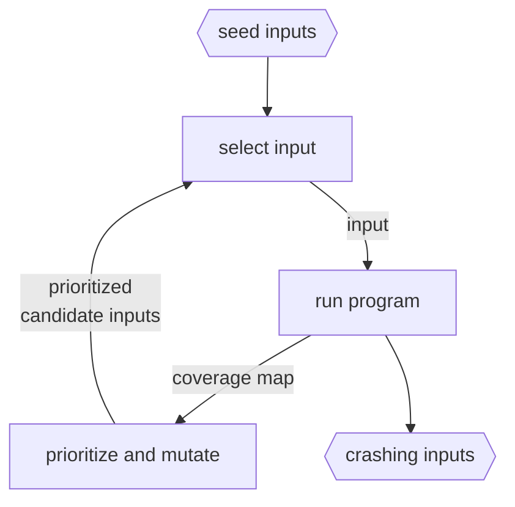

(Links:: [[Secure Programming]])
# Designing Tests
It is obvious that the more tests you have, the more likely a vulnerability is to result in a crash or error message. We aim to do the following:
1. Generate test inputs likely to trigger vulnerabilities
2. Make triggered vulnerabilities more likely to result in a crash

Regression tests make sure that changes to the project do not (re)introduce new/old bugs. We would use a bunch of already known good inputs and their corresponding output/return state. These tests are run every time new code will be committed. It is not intended to be used for security.
*Important*: when fixing bugs, don't forget to write a test for it! Since only good inputs are usually only used, we do not exhaust all possibilities, and *vulnerabilities are still common*.
- manipulate good input -> reach functions deep in program
- test boundary cases

> [!example]- Calculator Unit Test using `push`, `pop`, `is_empty`
> ```c
> Stack stack();
> assert(stack.is_empty());
> ```
> ```c
> Stack stack();
> stack.push(0);
> assert(!stack.is_empty());
> ```
> ```c
> Stack stack();
> stack.push(0);
> assert(stack.pop() == 0);
> assert(stack.is_empty());
> ```
> ```c
> Stack stack();
> stack.push(0);
> stack.push(1);
> assert(stack.pop() == 1);
> assert(!stack.is_empty());
> ```
> ```c
> Stack stack();
> stack.push(2147483648);
> assert(stack.pop() == 2147483648);
> ```
> ```c
> Stack stack();
> stack.pop();
> ```

# Coverage
We aim to test all code to find bugs. If we do not execute a line, we will *not* find bugs in it.

> [!example] Coverage
> ```c
> int parseint(const char *s) {
> 	int value = 0;  
> 	if (!s) return 0;
> 	while (*s) {
> 		if (*s >= '0' && *s <= '9')
> 			value = value * 10 + *s - '0';
> 		else
> 			return -1;
> 		s++;
> 	}
> 	return value;
> }
> ```
> To test all lines we must run: `s="0"` `s="x"`
> To test all *statements* we must run: `s="0"` `s="x"` `s=NULL`
> For full **decision** coverage we must test:
> 1. Line 3: `!s` and `s`
> 2. Line 4: `*s` and `!*s`
> 3. Line 5: `*s>='0' && *s <= '9'` and `*s < '0' || *s > '9'`

Condition coverage is necessary to cover assembly code, which is more likely to expose errors.
> [!example] Coverage
> From the previous `parseint()` function, we would need to test the following cases for full condition coverage:
> 1. Line 3: `!s` and `s` 
> 2. Line 4: `*s` and `!*s`
> 3. Line 5: `*s >= '0'` and `*s < '0'`
> 4. Line 5: `*s >= '0' && *s <= '9'` and `*s >= '0' || *s > '9'`
> 
> E.g. `s="0"` `s="x"` `s=" "` `s=NULL`
## Control Flow Graph
- Represents possible execution paths through program
- Nodes are **basic blocks**: sequences of statements always executed sequentially, with no branches in between
- A path is a sequence of all blocks that have been executed (loops create infinite amount of paths)

> [!example] 
> ```mermaid
> flowchart LR
> 	a[parseint] --> b["if(!s)"] --> c[return 0]
> 	b --> d["while(*s)"] --> e[return value]
> 	d --> f["if(...)"] --> g[return -1]
> 	f --> h[s++] --> d
> ```

# Fuzz Testing
Fuzz testing refers to give a program random "fuzz" trying to get it to hang or crash. It doesn't know if the output is correct, but only tracks coverage.
- begin with example inputs from tester
- Generational fuzzing: specify *grammar* for program to fuzz and generate random inputs
## Generational Fuzzing

> [!example] Generational fuzzing
> # Grammar
> ```
> 1. PROG -> STMT;
> 2. PROG -> STMT; PROG
> 3. STMT -> return EXPR
> 4. STMT -> VAR = EXPR
> 5. VAR -> a
> 6. EXPR -> NUM
> 7. EXPR -> EXPR + EXPR
> 8. NUM -> 1
> 9. NUM -> 2
> ```
> Example fuzz:
> ```
>    PROG;
> R1 STMT;
> R4 VAR = EXPR;
> R5 a = EXPR;
> R6 a = NUM;
> R8 a = 1;
> ```

- *Manual* creation of grammar is labour intense but pays off
- Grammar mistake reduces coverage
- Cannot find bugs for input not grammatically correct (often wanted)
## Mutational Fuzzing

- No grammar
- Select inputs that are most likely to increase coverage and mutate
	- *Promising inputs*: Improving coverage, execute quickly, change some interesting variable, get close to interesting code location
- Mutating promising inputs requires feedback from feedback. Changes can include:
	- Flip bits (those that cause new branches to be selected)
	- Arithmetic on values in input
	- Use corner cases (`UINT_MAX`, `UINT_MIN`, 0,...)
	- Combine multiple inputs
- **Dynamic Taint analysis**
	1. Mark user input as **tainted**
	2. Propagate taint: The tainted data is processed within the program and the output is tainted
	3. Track where the tainted data is used ("sink") that could be exploited, and from which byte(s) in the original data it derives
	- large runtime overhead :(

> [!warning] Implicit data flow
> Although the input is responsible for the branch taken, flag is not tainted, thus we cannot take every branch with dynamic taint analysis.
> ```c
> void fuzzme (char input[]) {
> 	int flag;
> 	if (input [42] == "x")
> 		flag = 1;
> 	else
> 		flag = 0;
> 	if (flag)
> 		vulnerable_function_we_want_to_reach (input);
> }
> ```

| Blackbox fuzzer                              | Grey/whitebox fuzzer                                  |
| -------------------------------------------- | ----------------------------------------------------- |
| No feedback                                  | Feedback from program                                 |
| works on systems where there is no control   | Typically recompile program with special compiler     |
| executes program quickly                     | Track feedback information (e.g. coverage) at runtime |
| often many inputs required for high coverage | Slower executions due to instrumentation overhead     |
|                                              | Select better input cases, needs to try fewer         |

## Symbolic Execution
The previous example program can easily create a buffer overflow. This can easily be done with unit tests, however more complex programs require constraints to reach it.
We begin by marking the inputs as *symbolic*. Throughout the program we track what the input must satisfy to reach the taint sink (`fread` that overflows `buffer`).

> [!example]
> 1. Must be `int` that `scanf` can parse
> 2. must satisfy `(length >= 0 && length < 32)`
> 3. Must trigger overflow: `length < 16`
> 4. At least `length` bytes follow for `fread` to succeed

## AFL
- Modified compiler helps identify path through program
- Starts off with seeds and modifies step-by-step
- Prefers inputs that result in new paths

# Investigating bugs
- Adding assertions throughout your code will likely turn unobservable bugs into clearly visible crashes
- tools can force program to crash on memory error
## Address Sanitizer
- Memory errors result in crash and dump that helps debug
- High performance impact -> useful for testing

> [!example]
> - Compile program: `gcc -fsanitize=address -o buffer-overflow bufer-overflow.c`
> 
> ```bash
> $ ./buffer-overflow 0123456789abcde
> hello 01234566789abcde
> $ ./buffer-overflow 0123456789abcdef
> =================================================================
> ==21504==ERROR: AddressSanitizer: stack-buffer-overflow on address 0x7ffdbf7e73a0 at pc 0x7f2165469709 bp 0x7ffdbf7e7350 sp 0x7ffdbf7e6af8
> ...
> ==21504==ABORTING
> ```

- C leaves many behaviors undefined (ex: signed integer overflow) which are exploitable
- *Undefined behaviour sanitizer* finds errors at runtime (`-fsanitize=undefined`)
## Valgrind
- Detects memory errors on *uninstrumented* binaries
- Address Sanitizer is better at detecting stack buffer overflows
- Detects uninitialized reads and memory leaks

---
References: