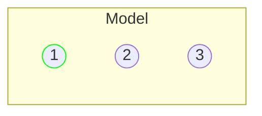
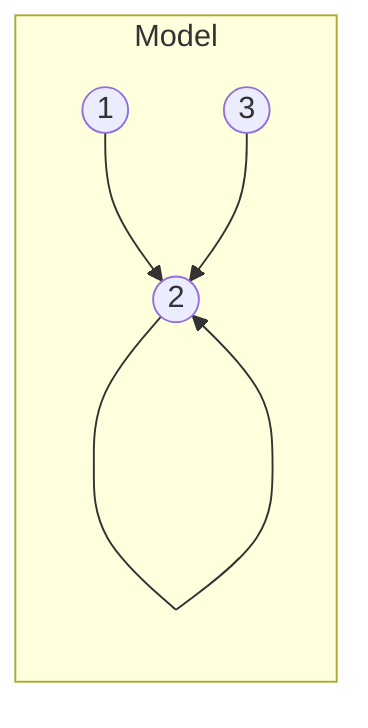
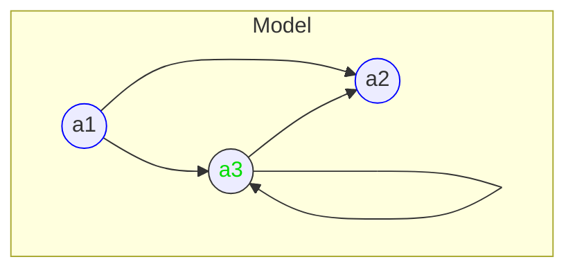

(Links:: [[Logic and Modelling]])
# Motivation of Semantics
> [!question]- Can we prove the following by natural deduction? $$p \lor q \to r, q \land r \to \neg q \vdash \neg (r \land \neg q)$$
> 
> Using the soundness and completeness theorem, we could concentrate on the equivalent semantic entailment: $$p \lor q \to r, q \land r \to \neg q \vDash \neg (r \land \neg q)$$
> and actually demonstrate: $$p \lor q \to r, q \land r \to \neg q \nvDash \neg (r \land \neg q)$$

If we want to prove the formula of being false, then the following must hold for some valuation *$v$*: 
$$v(p\lor q \to r)=T$$
$$v(q \land r \to \neg r)=T$$
$$v(\neg (r\land \neg q))=F$$

For $v(\neg (r\land \neg q))=F$, we know by **semantic reasoning** that the following must hold: $v(r)=T$, and $v(q)=F$. Every evaluation of $v(r)=T$ and $v(q)=F$ fulfils the formulas above. The valuation *$v$* is known to be a **countermodel** to $$p \lor q \to r, q \land r \to \neg q \vDash \neg (r \land \neg q)$$ and implies (via the soundness theorem), that $$p \lor q \to r, q \land r \to \neg q \nvdash \neg (r \land \neg q)$$
## Proof Theory\Syntax ($\vdash$) versus Semantics ($\vDash$)
| Proof theory with entailment $\vdash$                                                                                                                                                                                            | Semantics with entailment $\vDash$                         |
| -------------------------------------------------------------------------------------------------------------------------------------------------------------------------------------------------------------------------------- | ---------------------------------------------------------- |
| rules prove **operative** explanation to logical symbols                                                                                                                                                                         | gives **meaning** to logical symbols                       |
| gives an **existential characterisation** of the formulas that are true in a logic: $$\phi_1,...,\phi_{n}\vdash \phi\Longleftrightarrow \textrm{there exists a derivation of } \phi \textrm{ from premises } \phi_1,...,\phi_n$$ | gives a **universal characterisation** of the formulas that are true in a logic: $$\phi_1,...,\phi_{n}\vDash \phi\Longleftrightarrow \textrm{all models that satisfy } \phi_1,...,\phi_n \textrm{ also satisfy } \phi$$                                                            | 
| convenient for **positive** arguments: give a derivation                                                                                                                                                                         | convenient for **negative** arguments: give a countermodel |

# Models
Models can tell you how to *interpret* formulas such as $\forall x(P(x)\lor Q(x))$.
A formulas has a **model**. For $\exists xP(x)$ the model would look as follows:
- universe ${1,2,3}$
- $P(1), \neg P(2), \neg P(3)$

We interpret $P(x)$ as '$x$ is green' -> A *green dot* indicates that $P$ is $T$.

For the formula $\exists y\forall x R(x,y)$, we interpret the function $R(x,y)$ as 'x knows y', and can model it as follows:


> [!definition] Models
> Let 
> - $\mathcal{F}$ be a set of function symbols
> - $\mathcal{P}$ a set of predicate sumbols.
> 
> A **model** $\mathcal{M}$ for $\langle$*$\mathcal{F}$*,*$\mathcal{P}$*$\rangle$ consists of:
> - a nonempty set $A$, called **domain** or **universe**
> - an **interpretation operation** $(\;\cdot\;)^{\mathcal{M}}$ for the symbols in *$\mathcal{F}$*,*$\mathcal{P}$*.
> 	- *$f^{\mathcal{M}}:A^n\to A$* for every $n$-ary function symbol $f\in$*$\;\mathcal{F}$*
> 	- *$P^{\mathcal{M}}\subseteq A^n$* for every $n$-ary predicate symbols $P\in$*$\;\mathcal{P}$*
> 
> A symbol is *$n$-ary* if it has $n$ arguments
> - *$c^{\mathcal{M}}\in A$* for nullary function symbols (constants) $c\in$*$\;\mathcal{F}$*
> - *$f^{\mathcal{M}}:A\to A$* for 1-ary (unary) symbols $f\in$*$\;\mathcal{F}$*
> - *$f^{\mathcal{M}}:A\times A\to A$* for 2-ary (binary) symbols $f\in$*$\;\mathcal{F}$*
> - *$P^{\mathcal{M}}\subseteq A$* for 1-ary (unary) predicate symbols $P\in$*$\;\mathcal{F}$*
> - *$P^{\mathcal{M}}\subseteq A\times A$* for 2-ary (binary) predicate symbols $P\in$*$\;\mathcal{F}$*

> [!example]- $\mathcal{F}=\emptyset, \mathcal{P}=\{P_{/1}\}$
> ```mermaid
> flowchart LR
> 	subgraph "Model"
> 		a((1))
> 		b((2))
> 		c((3))
> 	end
> 	class a node2
> 	classDef node2 stroke:#0f0
> ``` 
> Formal definition of $\mathcal{M}$:
> - domain $A=\{1,2,3\}$
> - interpretation operation $(\;\cdot\;)^{\mathcal{M}}$ on $\langle\mathcal{F,P}\rangle$:
> 	- $P$ is **unary predicate**:
> 	  $P^{\mathcal{M}}=\{1\}\subseteq A$

> [!example]- $\mathcal{F}=\emptyset, \mathcal{P}=\{R_{/2}\}$
> ```mermaid
> flowchart LR
> 	subgraph "Model"
> 		a((1)) --> b((2))
> 		b --> b
> 		c((3)) --> b
> 	end
> ```
> Formal definition of $\mathcal{M}$:
> - domain $A=\{1,2,3\}$
> - interpretation operation $(\;\cdot\;)^{\mathcal{M}}$ on $\langle\mathcal{F,P}\rangle$:
> 	- $R$ is **binary predicate**:
> 	  $R^{\mathcal{M}}=\{\langle1,2\rangle,\langle2,2\rangle,\langle3,2\rangle\}\subseteq A\times A$

> [!example] $\mathcal{F}=\{e_{/0},\cdot_{/2}\}, \mathcal{P}=\{\leq_{/2}\}$
> We consider a model $\mathcal{M}$ with:
> - universe $B=\{\;s\;|\;\textrm{s is binary string}\}$
> - interpretation operation $(\;\cdot\;)^{\mathcal{M}}$:
> 	- *$e$* is interpreted as the empty string $\upepsilon$
> 		- $e^{\mathcal{M}}=$ empty string $\upepsilon$
> 	- *$\cdot$* is interpreted as concatenation of strings
> 		- $\cdot^{\mathcal{M}}$: $B\times B\to B$, $a_0\cdots a_{n}\cdot^{\mathcal{M}}b_{0}\cdots b_{m}=a_{0}\cdots a_{n}b_{0}\cdots b_{m}$ 
> 		  e.g.: $01 \cdot^{\mathcal{M}} 100 = 01100$
> 	- $s_{1}\leq s_{2}$ is interpreted as: $s_{1}$ is a prefix of $s_{2}$
> 		- $\leq ^{\mathcal{M}}=\{\langle s_{1}, s_{2}\rangle\mid s_{1} \textrm{ is a prefix of } s_{2}\}$
> 		  e.g: $01 \leq^{\mathcal{M}} 01100$

We will be interested in interpreting in $\mathcal{M}$ formulas like:
- $\exists y\forall x(y\leq x)$: there is a binary string that is a prefix of every binary string
- $\forall x(x\leq x\cdot e)$: every binary string is a prefix of itself concatenated with the empty string
# Interpretation
> [!example]- $\mathcal{F} = \{c_{/0}\},\mathcal{P}=\{P_{/1},R_{/2}\}$
> ```mermaid
> flowchart 
> 	subgraph Model
> 		a((a1)) --> b((a2)) 
> 		a --> c((a3))
> 		c --> b
> 		c --> c
> 	end
> 	class a,b node
> 	class c node2
> 	classDef node stroke:#00f
> 	classDef node2 stroke:#333, color:#0d0
> ```
> The model can be described with:
> - domain $A=\{a_{1}, a_{2}, a_{3}\}$
> - $c^{\mathcal{M}}=a_{3}$
> - $P^{\mathcal{M}}=\{a_{1},a_{2}\}$
> - $R^{\mathcal{M}}=\{\langle a_{1},a_{2}\rangle, \langle a_{1},a_{3}\rangle, \langle a_{3}, a_{2}\rangle, \langle a_{3}, a_{3}\rangle\}$
> 
> where $c^{\mathcal{M}}$ represents green points, $P^{\mathcal{M}}$ represents blue circles, and $R^{\mathcal{M}}$ represents arrows between points

## Formulas without quantifiers and free variables
**Truth** definition for a formula $\phi$ without quantifiers and [[free variable|free variables]] in a model $\mathcal{M}$ by induction on the structure of $\phi$:
$$\mathcal{M} \vDash \neg \phi \Longleftrightarrow \textrm{not } \mathcal{M} \vDash \phi \Longleftrightarrow \mathcal{M} \nvDash \phi$$

$$\mathcal{M} \vDash \phi \land \psi \Longleftrightarrow \mathcal{M} \vDash \phi \textrm{ and } \mathcal{M} \vDash \psi$$

$$\mathcal{M} \vDash \phi \lor \psi \Longleftrightarrow \mathcal{M} \vDash \phi \textrm{ or } \mathcal{M} \vDash \psi$$

$$
\begin{align}
\mathcal{M} \vDash \phi \to \psi & \Longleftrightarrow ((\mathcal{M} \vDash \phi) \Longrightarrow (\mathcal{M} \vDash \psi)) \\
& \Longleftrightarrow (\textrm{if } \mathcal{M} \vDash \phi \textrm{ then } \mathcal{M} \vDash \psi) \\
& \Longleftrightarrow \textrm{not } (\mathcal{M} \vDash \phi \textrm{ and } \mathcal{M} \nvDash \psi)
\end{align}
$$
$$\mathcal{M} \vDash P(t_{1}, ..., t_{n}) \Longleftrightarrow \langle t_{1}^{\mathcal{M}},...,t_{n}^{\mathcal{M}}\rangle \in P^{\mathcal{M}}$$

> [!example]
> ```mermaid
> flowchart 
> 	subgraph Model
> 		a((a1)) --> b((a2)) 
> 		a --> c((a3))
> 		c --> b
> 		c --> c
> 	end
> 	class a,b node
> 	class c node2
> 	classDef node stroke:#00f
> 	classDef node2 stroke:#333, color:#0d0
> ```
> > [!example]-
> > We can use the formal definition to prove whether $\mathcal{M} \vDash P(c)$ or $\mathcal{M} \nvDash P(c)$ holds:
> > $$\begin{align}
> > \mathcal{M} & \vDash P(c)\quad \color{red}{\texttimes} \\
> > & \Longleftrightarrow c^{\mathcal{M}} \in P^{\mathcal{M}} \qquad \qquad(\textrm{by definition of } \vDash)\\
> > & \Longleftrightarrow a_{3} \in \{a_{1}, a_{2}\} \quad \texttimes \quad (\textrm{by definition of }\mathcal{M})
> > \end{align}$$
> 
> > [!example]-
> > We can use the formal definition to prove whether $\mathcal{M} \vDash \neg P(c)$ holds:
> > $$\begin{align}
> > \mathcal{M} & \vDash \neg P(c) \quad\color{red}{\checkmark} \\
> > & \Longleftrightarrow \textrm{not } \mathcal{M} \vDash P(c) \qquad (\textrm{by definition of } \vDash) \\
> > & \Longleftrightarrow \textrm{not } c^{\mathcal{M}} \in P^{\mathcal{M}} \qquad (\textrm{by definition of } \vDash) \\
> > & \Longleftrightarrow c^{\mathcal{M}} \notin P^{\mathcal{M}} \\
> > & a_{3} \notin \{a_{1},a_{2}\} \quad \checkmark \qquad (\textrm{by definition of } \mathcal{M}) 
> > \end{align}$$
> > Hence we conclude: $\mathcal{M} \vDash \neg P(c)$
> 
> > [!example]-
> > We can use the formal definition to check whether $\mathcal{M} \vDash R(c,c)$ holds:
> > $$\begin{align}
> > \mathcal{M} & \vDash R(c,c) \quad \color{red}{\checkmark} \\
> > & \Longleftrightarrow \langle c^{\mathcal{M}}, c^{\mathcal{M}}\rangle \in R^{\mathcal{M}} \qquad (\textrm{by definition of } \vDash) \\
> > & \Longleftrightarrow \langle a_{3},a_{3}\rangle \in \{\langle a_{1},a_{2}\rangle,\langle a_{1},a_{3}\rangle,\langle a_{3},a_{2}\rangle,\langle a_{2},a_{3}\rangle\} \quad\checkmark \quad (\textrm{by definition of } \mathcal{M})
> > \end{align}$$
> > Hence we conclude: $\mathcal{M} \vDash R(c,c)$
> 
> > [!example]-
> > We can use the formal definition to check whether $\mathcal{M} \vDash R(c,c) \lor P(c)$ holds:
> > $$\begin{align}
> > \mathcal{M} & \vDash R(c,c) \land P(c)\quad \checkmark \\
> > & \Longleftrightarrow \mathcal{M} \vDash R(c,c) \textrm{ or } \mathcal{M} \vDash P(c) \qquad (\textrm{by definition of }\vDash) \\
> > & \Longleftrightarrow \langle c^{\mathcal{M}}, c^{\mathcal{M}}\rangle \in R^{\mathcal{M}} \textrm{ or } c^{\mathcal{M}} \in P^{\mathcal{M}} \quad\checkmark\\
> > & \Longleftrightarrow \langle a_{3},a_{3}\rangle \in \{\langle a_{1},a_{2}\rangle,\langle a_{1},a_{3}\rangle,\langle a_{3},a_{2}\rangle,\langle a_{2},a_{3}\rangle\} \quad\checkmark \\
> > &\qquad \textrm{ or } a_{3} \in \{a_{1},a_{2}\} \quad\texttimes \qquad (\textrm{by definition of }\mathcal{M})
> > \end{align}$$
> > Hence we conclude: $\mathcal{M} \vDash R(c,c) \lor P(c)$

## Formulas with quantifiers and free variables
For the following model, the given formulas depend on the interpretation of the [[free variable|free variables]] *$x$* and *$y$*.

- $\mathcal{M} \vDash P(x)$
	- $\mathcal{M} \vDash_{[x\mapsto a_{1}]} P(x)$
	- $\mathcal{M} \nvDash_{[x\mapsto a_{3}]} P(x)$
- $\mathcal{M} \vDash R(x,x)$
	- $\mathcal{M} \vDash_{[x\mapsto a_{3}]} R(x,x)$
	- $\mathcal{M} \nvDash_{[x\mapsto a_{1}]} R(x,x)$
- $\mathcal{M} \vDash R(x,y)$
	- $\mathcal{M}\nvDash_{[x\mapsto a_{2}][y\mapsto a_{3}]} R(x,y)$
- $\mathcal{M} \vDash \exists yR(x,y)$
	- $\mathcal{M} \vDash_{[x\mapsto a_{3}]} \exists y R(x,y)$
	- $\mathcal{M} \nvDash_{[x\mapsto a_{2}]} \exists y R(x,y)$

For this reason, we use an **environment** $\mathscr{l}: \mathbf{var} \to A$ (look-up function) which interprets *free* variables in the domain.

> [!example]
> We can use the example environment $\mathscr{l}(x)=a_{1}$ and $\mathscr{l}(y)=a_{3}$ to determine the formulas:
> - $\mathcal{M}\vDash_{\mathscr{l}} P(x)$
>   $\mathcal{M}\nvDash_{\mathscr{l}}P(y)$
> - $\mathcal{M}\nvDash_{\mathscr{l}} R(x,x)$
>   $\mathcal{M}\vDash_{\mathscr{l}}R(y,y)$
> - $\mathcal{M}\vDash_{\mathscr{l}} R(x,y)$
> - $\mathcal{M}\nvDash_{\mathscr{l}} R(y,x)$
> - $\mathcal{M}\vDash_{\mathscr{l}[x\mapsto a_{2}]}R(y,x)$
>   $\mathcal{M}\vDash_{\mathscr{l}} \exists xR(y,x)$

In order to determine the truth values for *$\forall x$*- en *$\exists x$*-formulas, we must be able to modify the interpretation of the variable *$x$*.

> [!definition] Modified Environment
> Let $\mathscr{l}:\mathbf{var}\to A$ be an environment, and $\mathbf{x}$ a variable.
> By $\mathscr{l}[\mathbf{x}\mapsto a]$ we denote the environment that interprets $\mathbf{x}$ as *a*, and that for all other variables acts in the same way as $\mathscr{l}$: $$\mathscr{l}[\mathbf{x}\mapsto a](\mathbf{y}) =
\begin{cases}
a,  & \text{if $\mathbf{y}=\mathbf{x}$} \\
\mathscr{l}(\mathbf{y}), & \text{if $\mathbf{y}\neq \mathbf{x}$}
\end{cases}$$
> > [!info]- More modifications
> > For $\mathscr{l}\,'=\mathscr{l}[x\mapsto a][z\mapsto b]$ we have:
> > $$\mathscr{l}\,'(\mathbf{y})=\mathscr{l}[x\mapsto a][z\mapsto b](\mathbf{y})=
> > \begin{cases}
a & \text{if } \mathbf{y}=x \\
b & \text{if } \mathbf{y}=z \\
\mathscr{l}(\mathbf{y}) & \text{if } \mathbf{y} \neq x \text{ and } \mathbf{y} \neq z
\end{cases}$$

Terms are built from variables, constants, and function symbols:
- variables are interpreted according to the environment $\mathscr{l}$
- constants are interpreted according to $(\,\cdot\,)^{\mathcal{M}}$
- function symbols are interpreted according to $(\,\cdot\,)^{\mathcal{M}}$

Let $\mathcal{M}$ be a model and $\mathscr{l}$ an environment.
> [!info] Interpretation of terms
> The interpretation $t^{\mathcal{M}\mathscr{l}}$ of a term $t$ is defined as:
> $$t^{\mathcal{M},\mathscr{l}}=
> \begin{cases}
> \mathscr{l}(x) & \text{if } t=\mathbf{x} \text{ for a variable } \mathbf{x}  \\
> \mathbf{c}^{\mathcal{M}} & \text{if } t=\mathbf{c} \text{ for a constant } \mathbf{c} \\
> f^{\mathcal{M}}(t_{1}^{\mathcal{M},\mathscr{l}},...,t_{n}^{\mathcal{M},\mathscr{l}}) & \text{if } t=f(t_{1},...,t_{n})
> \end{cases}$$

The truth of a formula $\phi$ in a model $\mathcal{M}$ with universe $A$ with respect to environment $\mathscr{l}$ is defined by induction on the structure of $\phi$:
- $\mathcal{M}\vDash_{\mathscr{l}} \neg \phi \Longleftrightarrow \mathcal{M}\nvDash_{\mathscr{l}}\phi$
- $\mathcal{M}\vDash_{\mathscr{l}}\phi\land \psi \Longleftrightarrow \mathcal{M}\vDash_{\mathscr{l}} \phi$ and $\mathcal{M}\vDash_{\mathscr{l}} \psi$
- $\mathcal{M}\vDash_{\mathscr{l}}\phi\lor \psi \Longleftrightarrow \mathcal{M}\vDash_{\mathscr{l}} \phi$ or $\mathcal{M}\vDash_{\mathscr{l}} \psi$
- $\mathcal{M}\vDash_{\mathscr{l}}\phi \to \psi \Longleftrightarrow (\text{if } \mathcal{M}\vDash_{\mathscr{l}} \phi \;\text{ then }\;\mathcal{M}\vDash_{\mathscr{l}} \psi )$
- $\mathcal{M}\vDash_{\mathscr{l}}P(t_{1},...,t_{n}) \Longleftrightarrow \langle t_{1}^{\mathcal{M},\mathscr{l}},...,t_{n}^{\mathcal{M},\mathscr{l}}\rangle\in P^{\mathcal{M}}$
- $\mathcal{M}\vDash_{\mathscr{l}} \forall x\,\phi \Longleftrightarrow \textrm{ for all } a \in A \textrm{ it holds: } \mathcal{M} \vDash_{l[x\mapsto a]} \;\phi$
- $\mathcal{M}\vDash_{\mathscr{l}} \exists x\,\phi \Longleftrightarrow \textrm{ for some } a \in A \textrm{ it holds: } \mathcal{M} \vDash_{l[x\mapsto a]} \;\phi$

> [!definition] Proposition
> If $\mathscr{l}$ and $\mathscr{l\,'}$ coincide on the free variables of $\phi$, then: $$\mathcal{M}\vDash_{\mathscr{l}}\, \phi \quad \Longleftrightarrow \quad \mathcal{M} \vDash_{\mathscr{l}\,'} \phi$$
> A formula $\phi$ is a **sentence** if $\phi$ does not have free variables.
> Let $\phi$ be a sentence. Then it holds for all environments $\mathscr{l}$ and $\mathscr{l}\,'$: $$\mathcal{M}\vDash_{\mathscr{l}} \,\phi\quad \Longleftrightarrow \quad \mathcal{M}\vDash_{\mathscr{l}\,'} \phi$$
> -> For sentences $\phi$ we can write $$\mathcal{M}\vDash \phi \quad\textrm{ for } \quad\mathcal{M}\vDash_{\mathscr{l}}\phi$$ since $\mathscr{l}$ is irrelevant

# Semantic Entailment

---
References: