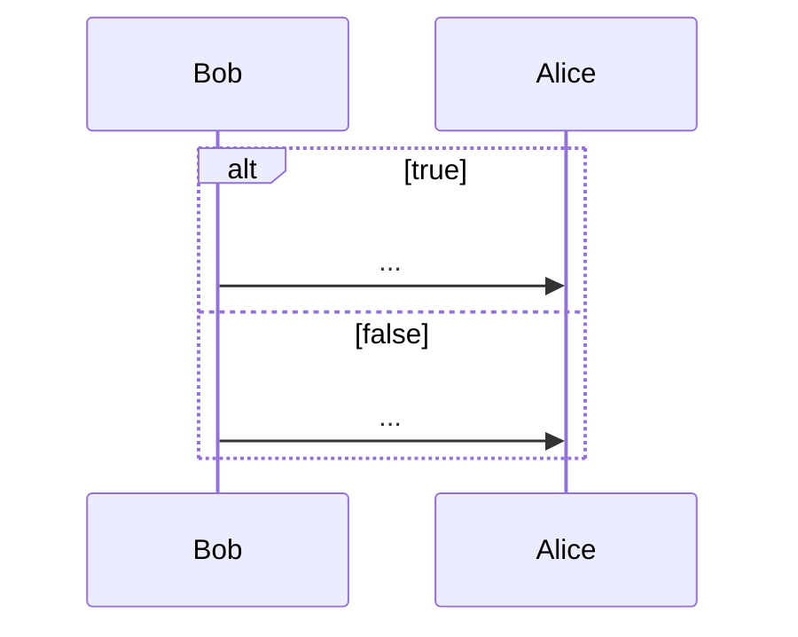
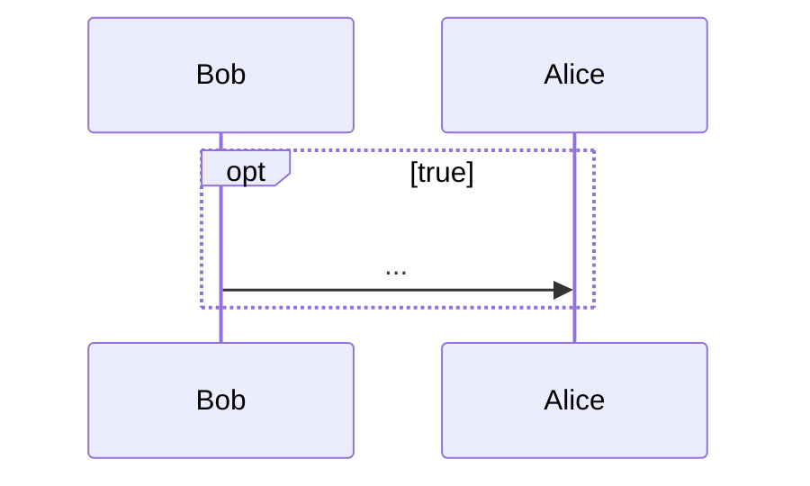

(Links:: [[Software Design]])

> [!summary]+
> - State machine diagram: Internal behavior of your objects
> - Sequence diagram
> 	- How objects interact with each other (aka external behavior)
> 	- Stakeholders of your system can also be involved
> 	- Many options to model complex control flow (**combined fragments**)

# Basics
> [!question] Why use UML sequence diagrams?
> To model interactions between partners

- Interaction: Specifies how messages and data are exchanged among partners
- Interaction partners
	- Human (lecturers, videogame players, users, administrators)
	- Non-human (servers, printers, executable software, **objects**)

> [!example]+ Example of interactions
> - Conversation between persons
> - Message exchange between humans and a software system
> - Communication protocols
> - **Sequence of method calls in a program**

- State machine diagrams: internal behavior of a single object
- Sequence diagrams: joint behavior of several objects

---
- Two-dimensional diagram
	- Horizontal axis: involved interaction partners
	- Vertical axis: chronological order of the interaction
	  ![[72595.png|500]]
- Interaction = sequence of messages
## Interaction partners
- Interaction partners are depicted as **lifelines**
- Head of the lifeline: Rectangle that contains the expression **object:Class**
- Body of the lifeline (Vertical dashed line): Represents the lifetime of the object associated with it
## Messages
- A message is defined via a **send event** and a **receive event**
- Events are optionally linked via an **execution specification**
	- Visualized as a continuous bar
	- Indicates when the receiving partner executes some behavior
- **3 Rules about order of messages**
  ![[Examples of different types of traces between lifelines.png|500]]
	1. one one lifeline
	3. on different lifelines without message exchanges (`fas:ExclamationTriangle` **non-deterministic behavior**)
	2. on different lifelines that exchange messages 

Messages can be categorized into 3 types
1. **Synchronous message**
	- Sender waits until it has received a response message before continuing
	- Syntax of message name: `msg(par`$_1$`,...)`
		- `msg`: name of the message
		- `par`$_i$: parameters separated by commas
2. **Asynchronous message**
	- Sender continues without waiting for a response message
	- Syntax of message name: `msg(par`$_1$`,...)`
3. **Response message**
	- May be *omitted* if content and location are obvious
	- Syntax: `res = msg(par`$_1$`,...):val`
		- `res`: response can optionally be assigned to a variable
		- `msg`: name of the message
		- `par`$_i$: parameters separated by commas
		- `val`: return value

- Object creation
	- Dashed arrow with keyword `new`
	- Arrowhead points to the head of the lifeline of the object to be created
- Object destruction
	- Object is deleted
	- Large cross (`ris:Close`) at the end of the lifeline
- Found message: Sender unknown or not relevant 
- Lost message: Receiver unknown or not relevant 

![[91351.png|200]]
![[45018.png|100]]
![[61591.png|100]]
![[95661.png|100]]

- Time-consuming message (Message with duration)
  ![[88987.png|500]]
	- Standard messages are transmitted instantly
	- Here: time elapses between sending and receiving

# Combined fragments
> [!question] Why use combined fragments?
> These modelling constructs are suitable for simple, linear interactions but what about more complex interaction flows?

- Allows modelling various control structures

![[5450.png|500]]

> [!info]+ Types of combined fragments
> 
|                             | Operator | Purpose                 |
| --------------------------- | -------- | ----------------------- |
| [[#Branches and loops]]     | alt      | Alternative interaction |
|                             | opt      | Optional interaction    |
|                             | loop     | Repeated interaction    |
|                             | break    | Exception interaction   |
| [[#Concurrency and Order]]  | seq      | Weak order              |
|                             | strict   | Strict order            |
|                             | par      | Concurrent interaction  |
|                             | critical | Atomic interaction      |
| [[#Filters and assertions]] | ignore   | Irrelevant interaction  |
|                             | consider | Relevant interaction    |
|                             | assert   | Asserted interaction    |
|                             | neg      | Invalid interaction     |
## Branches and Loops
### `alt` fragment
> [!abstract] Model alternative sequences

- Similar to `switch` of `if` statement in Java
- At least 2 operands
- Guards are used to select the path to be executed
	- Modelled in square brackets
	- default: `true`
	- Special guard: [else]
	- Must be mutually exclusive to avoid indeterministic behavior

### `opt` fragment
> [!abstract] Model an optional sequence

- Actual execution at runtime is dependent on a (required) guard
- Similar to `if` statement without `else` branch(es)
- Exactly one operand

### `loop` fragment

- Exactly one operand
- Minimum/maximum # of iterations
	- `(min..max)` or `(min,max)`
	- default: `(*)` -> no min and max, similar to `while(true)`
- Guard
	- Evaluated right after the minimum number of iterations
	- Checked for each subsequent iteration within the `max` limit
	- If the guard evaluates to `false`, the loop is terminated

> [!example]
> ![[59060.png|400]]
> - loop is executed at least once, then as long as $a<1$ is `true`
### `break` fragment
> [!abstract] Model exception handling

- Exactly one operand with a guard
- If the guard is `true`:
	- Interactions within this operand are executed (b->c)
	- Remaining operations of the surrounding fragment are **omitted** (d)
	- Interaction continues in the next higher level fragment (e)

![[88980.png|300]]
## Concurrency and Order
### `seq` fragment
- Weak sequencing: the default order of events

> [!question]- What are the 3 possible traces of messages? ![[31559.png|400]]
> Traces:
> 1. a -> b -> c -> d -> e
> 2. a -> c -> b -> d -> e
> 3. c -> a -> b -> d -> e

> [!example] `seq` fragment combined with `break`
> `seq` is rarely useful on its own (default order), but is often valuable in *combination* with a `break` fragment
> ![[47709.png|500]]

### `strict` fragment
> [!abstract] Model a fixed sequence of events across lifelines

- Between different operands, the event order of the vertical axis becomes deterministic **even for unconnected lifelines**
- Messages in a higher-up operand are always exchanged **before** messages in a lower operand

> [!example]- 
> ![[72792.png|400]]
> Trace: a -> b -> c -> d -> e

> [!example]- 
> ![[74979.png|500]]

### `par` fragment
> [!abstract] Relax the chronological order between messages in different operands

- Execution paths of different operands can be interleaved
- Restrictions within each operand need to be respected
- Order of the different operands is irrelevant

> [!question]- What are the all possible traces of messages? ![[19897.png|400]]
> Traces
> 1. a -> b -> c -> d -> e
> 2. a -> c -> b -> d -> e
> 3. a -> c -> d -> b -> e
> 4. a -> c -> d -> e -> b
> 5. c -> a -> b -> d -> e
> 6. c -> a -> d -> b -> e
> 7. c -> a -> d -> e -> b
> 8. c -> d -> a -> b -> e
> 9. c -> d -> a -> e -> b
> 10. c -> d -> e -> a -> b

> [!example]-
> ![[18896.png|500]]

### `critical` fragment
> [!abstract] Model atomic areas within indeterministic execution

- To make sure that certain parts of an interaction are not interrupted by unexpected events

> [!question]- What are the all possible traces of messages? ![[31003.png|400]]
> Traces:
> 1. a -> b -> **c -> d** -> e
> 2. a -> **c -> d** -> b -> e
> 3. a -> **c -> d** -> e -> b
> 4. **c -> d** -> a -> b -> e
> 5. **c -> d** -> a -> e -> b
> 6. **c -> d** -> e -> a -> b

> [!example]-
> ![[53963.png|500]]

## Filters and Assertions
### `ignore` fragment
> [!abstract] Model irrelevant messages

- Messages that occur at runtime without notable significance 
- Exactly one operand  
- Irrelevant messages in curly brackets after the keyword

> [!example]-
> ![[7787.png|400]]

### `consider` fragment
> [!abstract] Model messages with particular importance

- Exactly one operand  
- Complementary to ignore fragment  
- Considered messages in curly brackets after the keyword

> [!example]-
> ![[80344.png|400]]

### `assert` fragment
> [!abstract] Model an interaction as mandatory

- Deviations that occur in the real world but are not included in the fragment lead to an error (not permitted)
- Reinforces the completeness of the diagram part

> [!example]-
> ![[10765.png|400]]
### `neg` fragment
> [!abstract] Model important invalid interactions

- Describing situations that must not occur
- Purpose:
	- Explicitly highlighting frequently occurring errors
	- Depicting relevant, incorrect sequences

> [!example]-
> ![[38699.png|400]]

# Further modelling elements
## Time Constraints
- Time for event occurrence: Relative or Absolute
- Time between two events: {lower..upper},
  e.g. {12:00..13:00}
- Current time as `now`: assign to attribute and use in a time constraint

> [!example]-
> ![[32536.png|400]]
## Interaction reference
- Integrates one sequence diagram into another one via `ref`

> [!example]+
> ![[6759.png|500]]
## Gates
- Allow you to send and receive messages beyond the boundaries of interaction fragments or combined fragments
- Visualized by messages touching / originating from boundary

> [!example]-
> ![[67629.png|500]] 
## State Invariants
> [!abstract] Useful for linking your state machines and sequence diagrams

- Assert that a condition must be fulfilled at a certain time
- Evaluation before the subsequent event occurs
- If the state invariant is not `true`, either the model or the implementation is incorrect

> [!example]- Three alternative notations
> ![[10508.png|500]]
## How to show user interaction
![[86133.png|500]]

---
References: