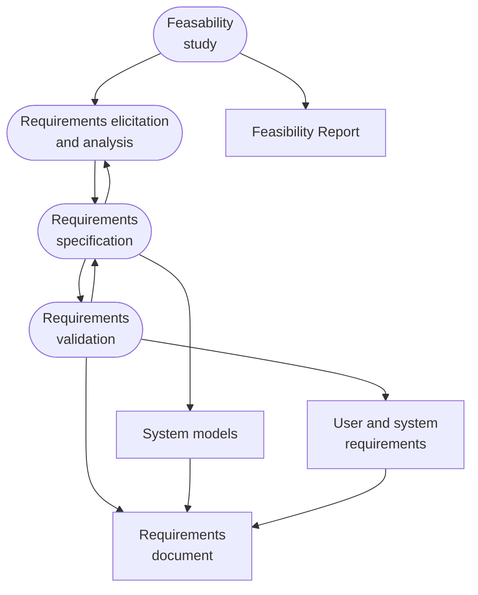
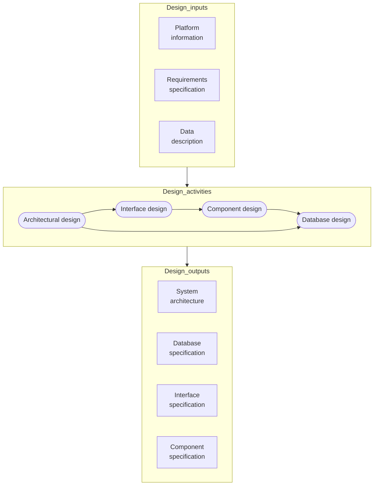
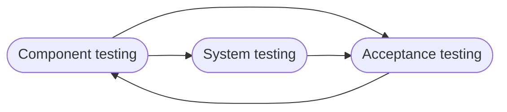
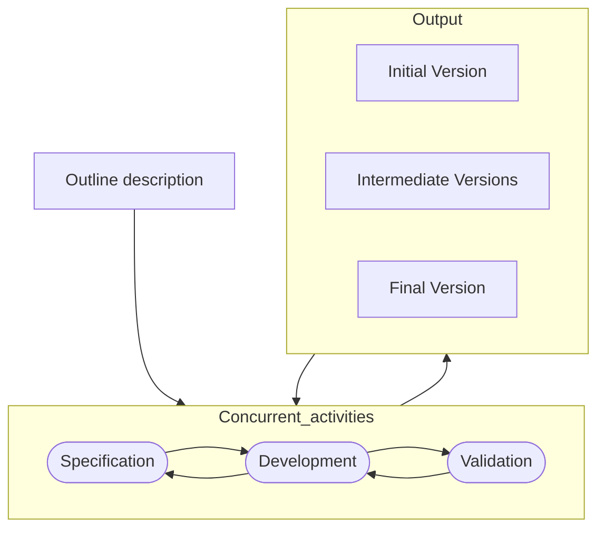
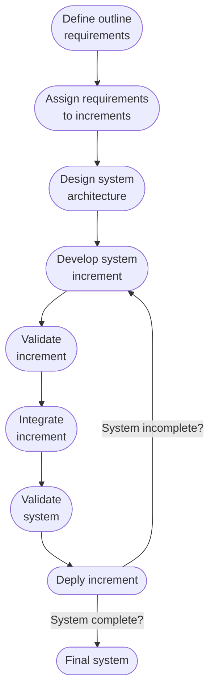
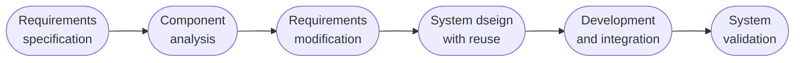

(Links:: [[Software Engineering Processes]])
# Definitions & Overview
> [!definition] Software Engineering
> Software engineering is an engineering discipline that is concerned with **all aspects of software production** from the early stages of system specification until its maintenance. SE is concerned with **professional software development**

Them main activities are:
- Software specification
- Software development
- Software validation
- Software evolution

These all belong to software engineering because it helps with the following.
- **Development** of tools, frameworks, etc. to support/easy software development
- **Management** of the software development
- **Specification** of steps, rules, processes, etc. to develop software

SE is important because
- **Software is everywhere**
- More and more individuals and society rely on software systems.
- Usually, it is cheaper (in terms of time and costs) to develop software using SE methods and techniques rather than just writing code (as in personal programming project).
  => We should produce software characterized by a high quality!

There are however still some issues with software:
- **Heterogeneity**: Software systems are distributed and include different types of computer and mobile devices.
- Business and social change: Business and society are changing quickly. Also their software needs to change quickly (i.e. change existing software and rapidly develop new software)
- Security and trust and privacy: As software is intertwined with all aspects of our lives, it is essential that we can trust that software.

## Software Engineering Fundamentals
- Software should be developed using a managed and understood development process. Of course, different processes are used for different types of software.
- *Dependability* (e.g. availability, reliability, maintainability) and *performance* are important for all types of system.
- Understanding and managing the *software specification* and *requirements* (what the software should do) are important
- Where appropriate, *reuse software* already developed rather than write new software

> [!example]- Software Design Project
> teams of 3/4 students
> Time: 2 months

> [!example]- Air Traffic Management
> Teams of 100 software engineers distributed all over the world
> Time: 2 years

# Software Engineering Processes
> [!definition] Process
> A series of actions or steps taken in order to achieve a particular end.

> [!definition] Software Engineering Process
> A **structured set of activities** required to **develop a software system**

## Common Activities to all SEP
- Specification: What should the software do?
- Design: How should the software do it?
- Implementation: Do it!
- Test and Validation: Check that the software does what the customer asked!
- Maintenance and Evolution: Changing the software over time according to customer requests
## Software Process Model
> [!definition] Software Process Model
> A software process model is an abstract representation of a process. It presents a description of a process from a particular perspective (e.g. activities in the model and their relationships)
## Software Process Descriptions
- Activities: What steps are defined by the model
- Products: Which are the outcomes of a process activity
- Roles: Which are the responsibilities of the people involved in the process
- Pre- and post-conditions: Which are the statements true before and after a process activity has been enacted or a product produced.

## Types of Software Process Models
| Plan-driven                                   | [[SEP Lecture 2 SCRUM#Agile Software Development]]                                                                                                        |
| --------------------------------------------- | ------------------------------------------------------------------------------------------------------------ |
| All process activities are planned in advance | Planning is *incremental* and it is *easier to change* the process to reflect changing customer requirements |
| Progress is measured against this plan        |                                                                                                              |

There are no right or wrong software processes! In practice, applied processes include plan-driven and agile elements
# Software Process Models
- [[#Waterfall]]
	- Plan-driven
	- Sequential activities
	- Separate and distinct activities
- [[#Incremental Development]]
	- Activities are interleaved
	- Plan-driven or agile
- [[#Reuse Oriented Software Engineering]]
	- Software is assembled from existing components
	- Plan-driven or agile
## Waterfall
1. Analysis: requirements analysis and specification
2. Design: solution proposal and description
3. Implementation and unit testing: coding and testing
4. Integration, system testing and Deployment
5. Maintenance and Evolution: problems fixing and addition of functionality
**Important**: each activity should be finished before the next one starts!
### Analysis
- Established the required functionality and constraints on the software operation and development
- Requirements engineering process
	- Feasibility study: Is it technically and financially feasible to build the system?
	- Requirements elicitation and analysis: What do the stakeholders require or expect from the software?
	- Requirements specification: Defining the requirements in detail.
	- Requirements validation: Checking the validity of the requirements

### Design
- Design a solution meeting the requirements specification
- Translate the requirements specification into a solution
- Design a software to meet the specification

### Implementation
- Translate the design into an executable program
- Observation: The activities of design and implementation are closely related and may be interleaved
### Integration, Testing and Deployment
- Verification and validation (V & V) - the software conforms to its specification and meets the requirements of the customer
- Testing involves executing the system with test cases
- Testing is the most commonly used V & V activity
### Testing

### Maintenance and Evolution
- Solve bugs and other problems
- Improve the existent functionality
- Extend the software with additional functionality
### Advantages and Limitations
| Advantages                                                                                    | Limitations                                |
| --------------------------------------------------------------------------------------------- | ------------------------------------------ |
| Applied where requirements are stable                                                         | Does not cope with changes in requirements |
| Useful for work coordination in large projects where the development is done at several sites | Not flexible                               |
| Easy to follow the progress                                                                   |                                            |

## Incremental Development
- Objective: cope with **changes**
- Develop the system in increments
- Evaluate each increment before proceeding to the next increment
- Normal approach used in agile methods
- Evaluation done by user/customer proxy
- Requirements are **prioritised**
- The **highest priority requirements** are addressed in **early increments**
- During the development of an increment, **requirements are frozen**
- Other requirements for later increments can evolve

- Deploy an increment for use by end-users
- More realistic evaluation about practical use of software
- Difficult to implement for replacement systems as increments have less functionality than the system being replaced

| Advantages                                                                               | Limitations                                                           |
| ---------------------------------------------------------------------------------------- | --------------------------------------------------------------------- |
| **Customer value** delivered with each increment                                         | The process is not visible                                            |
| **Functionality** is available **earlier**                                               | The structure/architecture tends to degrade by adding new increments  |
| Early increments seen as a **prototype** to help elicit requirements for late increments | Most systems require basic facilities used by different functionality |
| **Lower risk** of overall project **failure**                                            | The essence is that the specification is developed with the software  |
| The **highest priority functionality** receives the most **testing**                     |                                                                       |

### Boehm's Spiral Model
- Represented as a spiral
- Each loop in the spiral represents a phase in the process
- No fixed phases such as specification or design - loops in the spiral are chosen depending on what is required
- Risks are explicitly assessed and resolved throughout the process

![[Boehm's Spiral Model.jpeg|600]]
#### Sectors
- Objective setting: Specific objectives for the phase are identified
- Risk assessment and reduction: Risks are assessed and activities put in place to reduce the key risks
- Development and validation: A development model for the system is chosen which can be any of the generic models.
- Planning: The project is reviewed and the next phase is planned
#### Usage
1. Introduced **iteration** in software processes
2. Introduced the **risk-driven** approach to development
3. In practice, however, the model is rarely used as published for practical software development
## Reuse Oriented Software Engineering
- Systematic reuse of available software
- Systems are integrated from existing components or COTS (Commercial-off-the-shelf) systems
- Process steps:
	- Component analysis
	- Requirements modification/adaptation
	- System design with reuse
	- Development and integration
- Reuse is now the standard approach for building many types of business system

> [!example]
> - Web services developed according to service standards and available  for remote invocation
> - Collections of objects developed as a package to be integrated with a component framework such as .NET or J2EE
> - **Stand-alone software systems** (COTS) configured for use in particular environment

---
References:
