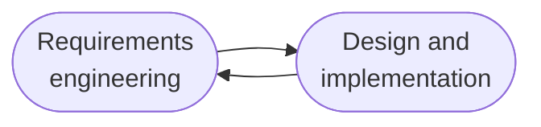

(Links:: [[Software Engineering Processes]])
# Rapid Application/Software Development (RAD)
- Objective: 
	- Produce useful software quickly
	- Based on prototyping
- Main idea:
	- Software is developed in a series of increments
	- Each increment provides new functionality
- Emerged as an alternative to Waterfall in 1980s and 1990s
- Specification, design and implementation are **interleaved**
- Software is developed as a **series of versions** with **stakeholders involved in version evaluation**
- **User interfaces** are often developed using an **IDE** and **graphical toolset**
# Agile Software Development
- Reduce overheads in the software process (e.g. by limiting documentation)
- Respond quickly to **changing requirements without excessive rework**
- Practical guidelines:
	- **Focus on the code** rather than the design
	- **Iterative approach** to software development
	- Deliver **working software quickly**
	- Evolve software quickly to **meet changing requirements**

## Principles of Agile Methods
| Principle            | Description                                                                                                                                                              |
| -------------------- | ------------------------------------------------------------------------------------------------------------------------------------------------------------------------ |
| Customer involvement | Customers should be closely involved throughout the development process. Their role is to provide and prioritize new system requirements and to evaluate the iterations. |
| Incremental delivery | Software is developed in increments with the customer specifying the requirements to be included in each increment.                                                      |
| People not process   | The skills of the development team should be recognized and exploited. Team members should be left to develop their own ways of working without prescriptive processes.  |
| Embrace change       | Expect the system requirements to change and so design the system to accommodate these changes.                                                                          |
| Maintain simplicity  | Focus on simplicity in both the software being developed and in the development process. Wherever possible, actively work to eliminate complexity from the software.     |

## Applicability
- Suitable for **small or medium size** software
- Suitable for small, tightly-integrated teams => there are **problems in scaling agile methods** to large software
- Clear commitment from the **customer** to become involved in the **development process**
- **Not a lot of external rules and regulations** that affect the software
## Issues
- Keep the **interest of customers** involved in the **development process**
- Keep the **team members collaboration high** in the development process
- **Prioritize changes** in presence of multiple stakeholders
- **Maintain simplicity** (avoid extra work)
- **Contracts** may be a problem as with other approaches to iterative development
## Agile Methods and Software Maintenance
- Key issues:
	- Are systems that are developed using an agile approach maintainable, given the emphasis in the development process of minimizing formal documentation?
	- Can agile methods be used effectively for evolving a system in response to customer change requests?
- Problems may arise if original development team cannot be maintained
# Extreme Programming
- Perhaps the best-known and most widely used agile method
- XP takes an 'extreme' approach to iterative development
	- New versions may be built several times per day
	- Increments are delivered to customers every 2 weeks
	- All tests must be run for every build and the build is only accepted if tests run successfully
## XP & Agile
- Incremental development is supported through small, frequent system releases
- Customer involvement means full-time customer engagement with the team
- Change supported through regular software releases
- Maintaining simplicity through constant refactoring of code
## XP Release Cycle

## User Stories
> A user story is an informal, general explanation of a software feature written from the perspective of the end use. Its purpose is to articulate how a software feature will provide value to the customer.

## XP Practices
| Principle or practice  | Description                                                                                                                                                                                                                                                                                     |
| ---------------------- | ----------------------------------------------------------------------------------------------------------------------------------------------------------------------------------------------------------------------------------------------------------------------------------------------- |
| Incremental planning   | Requirements are recorded on story cards and the stories to be included in a release are determined by the time available and their relative priority. The developers break these stories into development ‘Tasks’.                                                                             |
| Small releases         | The minimal useful set of functionality that provides business value is developed first. Releases of the system are frequent and incrementally add functionality to the first release.                                                                                                          |
| Simple design          | Enough design is carried out to meet the current requirements and no more.                                                                                                                                                                                                                      |
| Test-first development | An automated unit test framework is used to write tests for a new piece of functionality before that functionality itself is implemented.                                                                                                                                                       |
| Refactoring            | All developers are expected to refactor the code continuously as soon as possible code improvements are found. This keeps the code simple and maintainable                                                                                                                                      |
| Pair programming       | Developers work in pairs, checking each other’s work and providing the support to always do a good job.                                                                                                                                                                                         |
| Collective ownership   | The pairs of developers work on all areas of the system, so that no islands of expertise develop and all the developers take responsibility for all of the code. Anyone can change anything                                                                                                     |
| Continuous integration | As soon as the work on a task is complete, it is integrated into the whole system. After any such integration, all the unit tests in the system must pass                                                                                                                                       |
| Sustainable pace       | Large amounts of overtime are not considered acceptable as the net effect is often to reduce code quality and medium term productivity                                                                                                                                                          |
| On-site customer       | A representative of the end-user of the system (the customer) should be available full time for the use of the XP team. In an extreme programming process, the customer is a member of the development team and is responsible for bringing system requirements to the team for implementation. |

## Requirements Scenarios
- In XP, a customer or user is part of the CP team and is responsible for making decisions on requirements
- User requirements are expressed as scenarios or user stories
- These are written on cars and the development team break them down into implementation tasks. These tasks are the basis of schedule and cost estimates
- The customer chooses the stories for inclusion in the next release based on their priorities and the schedule estimates

# SCRUM
- Is a framework based on agile principles
- There are three phases:
	1. The **initial phase** is an outline **planning phase** where the general objectives for the project are established, and the software architecture is designed
	2. This is followed by a series of **sprint cycles**, where each cycle develops an increment of the system
	3. The project **closure phase** wraps up the project, completes required documentation such as system help frames and user manuals and assesses the lessons learned from the project

- Teams organize themselves to develop the software. 
- During this stage the team is isolated from the customer and the organization, with all communications channelled through the so-called ‘Scrum master’ 
- The role of the Scrum master is to protect the development team from external distractions 
- At the end of a sprint, the work done is reviewed and presented to stakeholders 
- The next sprint cycle then begins
- The whole team attends short daily meetings where all team members share information, describe their progress since the last meeting, problems that have arisen and what is planned for the following day. 
- **Observation**: Everyone on the team knows what is going on and, if problems arise, can re-plan short-term work to cope with them

### Scrum Master
- ‘Scrum master’ is a facilitator who: 
	- arranges daily meetings 
	- tracks the backlog of work to be done 
	- records decisions 
	- measures progress against the backlog 
	- communicates with customers and management outside of the team
## Sprint
- A short time boxed period
- It may last 1-4 weeks
- It represents an iteration in Scrum
- During a sprint a scrum team completes a set amount of work
- Sprints help teams follow the agile principle of "delivering working software frequently" and the agile value of "responding to change over following a plan"
## Key Elements
- Scrum roles: Product Owner, Scrum Master, Developers
- Scrum artifacts: product Backlog, Sprint Backlog, Increment
- Scrum events: Sprint, sprint planning, daily goal, sprint goal, sprint review, sprint retrospective
## Sprint Cycles
- Fixed length, 1–4 weeks; correspond to the development of a release of the system in XP
- The starting point for planning is the product backlog, which is the list of work to be done on the project
- The selection phase involves all of the project team who work with the customer to select the features and functionality to be developed during the sprint
## Benefits
- The product is broken down into a set of manageable and understandable chunks 
- Unstable requirements do not hold up progress 
- The whole team have visibility of everything and consequently team communication is improved 
- Customers see on-time delivery of increments and gain feedback on how the product works. 
- Trust between customers and developers is established and a positive culture is created in which everyone expects the project to succeed.
# Plan-driven VS Agile
## Technical, Human, Organizational Issues
- Most processes mix plan-driven and agile 
- Deciding on the balance depends on: 
	- Is it important to have a very detailed specification and design before moving to implementation? If so, use a *plan-driven* approach 
	- Is an incremental delivery strategy, where you deliver the software to customers and get rapid feedback from them, realistic? If so, use *agile* methods 
	- How large is the system that is being developed? *Agile* methods are most effective for software developed with a *small co-located team who can communicate informally.* *Plan driven* for large systems that require larger development teams
- What type of system is being developed? *Plan-driven* for software that require a lot of analysis before implementation (e.g., real-time system with complex timing requirements).
- What is the expected software lifetime? Long-lifetime software may require design documentation to communicate the original intentions -> *plan-driven* 
- What technologies are available to support system development? *Agile* methods rely on good tools to keep track of an evolving design 
- How is the development team organized? If the development team is distributed or if part of the development is being outsourced, then you may need to develop design documents to communicate across the development teams -> *plan-driven*
- Are there cultural or organizational issues that may affect the development? Traditional engineering organizations have a culture of *plan-driven* development 
- How good are the designers and programmers in the development team? It is sometimes argued that *agile* methods require higher skill levels than plan-based approaches in which programmers simply translate a detailed design into code 
- Is the system subject to external regulation? If a system has to be approved by an external regulator (e.g., the FAA approve software that is critical to the operation of an aircraft) then you will probably be required to produce detailed documentation as part of the system safety case -> *plan-driven*

---
References: