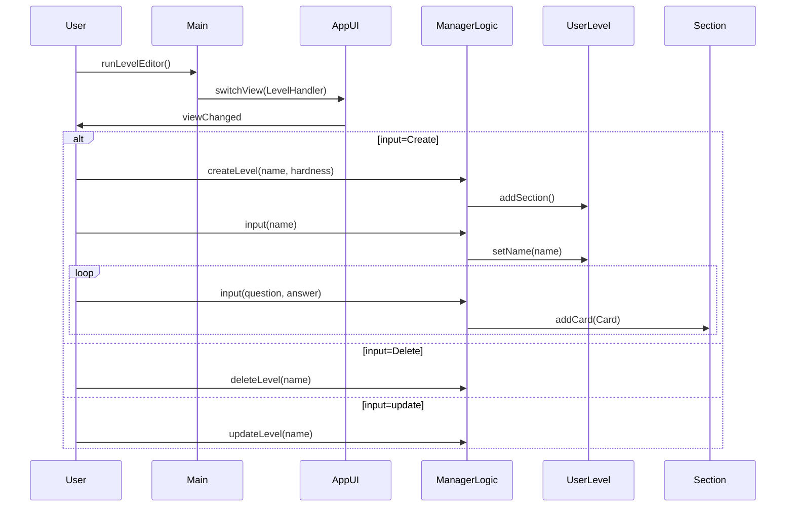
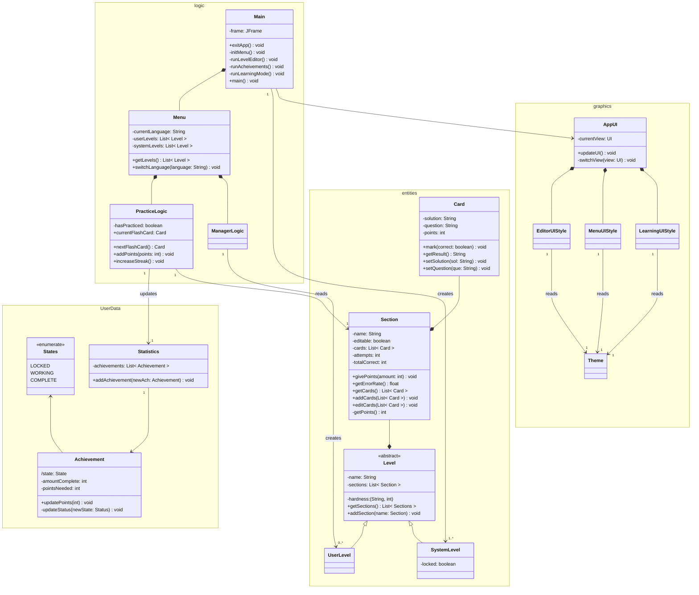

# UserData

# Graphics
- **AppUI**: Manages the rendering of the different types of views
	- *currentView*: Can be either of the three UI styles described below. 
	- *updateUI*: 
	- *switchView*
- **Theme**: Used to decide on which colors to use for different UI elements
- **EditorUIStyle**: Describes the UI design of the Editor view, including the button layout, text fields for user input, and smaller things (such as font and colors).
- **MenuUIStyle**: Similar to EditorUIStyle, describes the layout of the elements (buttons and decoration), and styling (font and color) for the Achievements and Level picker menus.
- **LearningUIStyle**: Describes how the cards will appear, and other elements required when practicing/learning flashcards.

We might decide to use a dedicated class for handling font, if we want more customization.